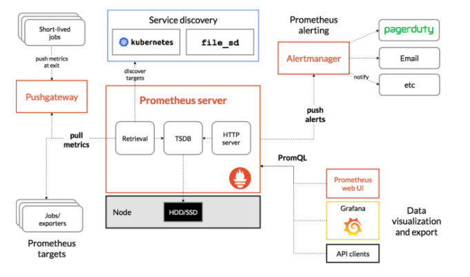

# 01장. 프로메테우스란 무엇인가

## 프로메테우스란 무엇인가

프로메테우스는 메트릭 수집, 시각화, 알림, 서비스 디스커버리 기능을 모두 제공하는 오픈 소스 모니터링 시스템이다. 처음에는 `SoundCloud`에서 만들어졌으나 2016년에는 쿠버네티스에 이어 두 번째로 `CNCF(Cloud Native Computing Foundation)` 산하 프로젝트 멤버로 들어가게 됐다. 

공식 문서에서는 특정 회사가 관리하고 있지는 않고 있다라고 적혀 있는데 `Grafana Labs`에서 유지 보수를 메인으로 전담하고 있다. 

프로메테우스의 대표적인 기능은 다음과 같다.

* 풀 방식의 메트릭 수집, 시계열 데이터 저장
* PromQL을 활용하여 저장된 시계열을 쿼리 및 집계
* 서비스 디스커버리
* 데이터 시각화

## 프로메테우스 아키텍처

프로메테우스의 아키텍처는 다음과 같다.

* 프로메테우스 서버
* 푸쉬 게이트웨이
* 클라이언트 라이브러리
* 익스포터
* 알림 매니저

먼저 프로메테우스는 시계열 데이터를 저장한다. 익스포터는 다양한 서비스/시스템의 메트릭을 수집한다. 예를 들어 "노드 익스포터"는 설치된 머신의 CPU, Memory 등의 메트릭 정보를 수집하게 된다. 클라이언트 라이브러리는 애플리케이션 코드를 계측하기 위해 쓰인다. 그리고 푸쉬 게이트웨이가 설정 파일에 추가한 잡을 통해서 익스포터와, 클라이언트 라이브러리가 수집하는 메트릭을 가져와서 프로메테우스에 저장한다. 

또한, 알림 매니저를 통해서 특정 메트릭이 임계치가 넘어가거나 경계에 잡혔을 때 이메일, 슬랙 등을 통해서 알림을 보내줄 수 가 있으며 UI 기능이 있어 데이터를 시각화할 수 있다. 하지만 자체적인 시각화 기능은 약한 편이며 보통 "그라파나"라는 오픈 소스 대시보드 툴로 프로메테우스 UI를 대체하는 편이다.

그리고 서비스 디스커버리 기능을 제공한다. 마이크로 서비스가 대중적으로 유행하는 지금 상황에서 인스턴스는 다이나믹하게 스케일 인/아웃이 된다. 이를 수동으로 관리하기는 불가능에 가깝다. 프로메테우스는 다행히 여러 서비스 디스커버리와 통합할 수 있다. 가령, 쿠버네티스 서비스 디스커버리와 통합하여, 쿠버네티스 클러스터에 존재하는 모든 노드와 팟들의 메트릭을 수집할 수가 있다.

마지막으로 프로메테우스는 애초에 "스케일 아웃"을 고려하지 않고 설계되었다. 그래서 데이터가 많으면 많을수록 이를 어떻게 해결해야 할까라는 고민 때문에, 도입하기가 쉽지 않았다. 하지만, 프로메테우스 클러스터링을 위한 "타노스"라는 오픈 소스가 개발되면서 이 문제가 상당 수 해결되었다. 다만 성능은 2~10배 정도 느려질 수 있다고 한다.

## 프로메테우스에 적합한 일, 적합하지 않은 일

프로메테우스는 "메트릭"을 저장하기 위한 모니터링 시스템이다. 커널 스케줄링이나 데이터 수집 실패 같은 요소로 인해 약간의 부정확성과 레이스 컨디션을 피할 수 없는 운영 모니터링 환경을 위해 설계되었다. 따라서 프로메테우스에 적합한 일은 다음과 같다.

* 메트릭 기반의 시계열 데이터 저장를 저장하는 일
* 동적인 혹은 마이크로 서비스의 인스턴스에 대한 메트릭을 수집하는 일

반면 프로메테우스에 적합하지 않은 일도 있다. 이런 일은 다른 도구를 사용하여 해결해야 한다.

* 이벤트 로그나 개별 이벤트를 저장하는 일
* 이메일 주소/사용자 이름과 같이 카디널리티가 높은 데이터를 저장하는 일
* 100%의 정확성이 요구되는 일