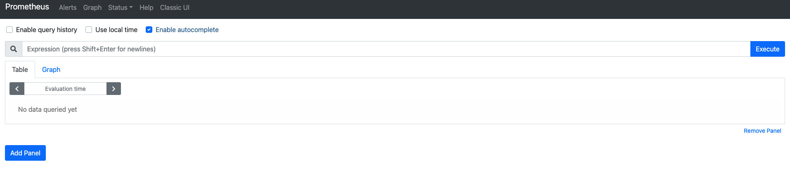

# Prometheus란 무엇인가


## 개요

이 문서에서는 `Prometheus`가 무엇인지, 대략적으로 살펴본다. 다음의 내용을 다루고 있다.

* Prometheus란 무엇인가
* Prometheus 아키텍처 구성
* Prometheus가 적합한 상황, 적합하지 않은 상황
* Prometheus 설치

## Prometheus란 무엇인가

`Prometheus`는 메트릭 수집, 시각화, 알림, 서비스 디스커버리 기능을 모두 제공하는 오픈 소스 모니터링 시스템이다. 처음에는 `SoundCloud`에서 만들어졌으나 2016년에는 쿠버네티스에 이어 두 번째로 `CNCF(Cloud Native Computing Foundation)` 산하 프로젝트 멤버로 들어가게 됐다. 

공식 문서에서는 특정 회사가 관리하고 있지는 않고 있다라고 적혀 있는데 `Grafana Labs`에서 유지 보수를 메인으로 전담하고 있다. 

`Prometheus`의 대표적인 기능은 다음과 같다.

* 풀 방식의 메트릭 수집, 시계열 데이터 저장
* PromQL을 활용하여 저장된 시계열을 쿼리 및 집계
* 서비스 디스커버리
* 데이터 시각화

## Prometheus 아키텍처

`Prometheus`의 아키텍처는 다음과 같다.


* Prometheus 
* Pushgateway
* Client Library
* Exporter
* Alertmanager

먼저 `Prometheus`는 시계열 데이터를 저장한다. `Exporter`는 다양한 서비스/시스템의 메트릭을 수집한다. 예를 들어 `Node Exporter`는 설치된 머신의 CPU, Memory 등의 메트릭 정보를 수집하게 된다. `Client Library`는 애플리케이션 코드를 계측하기 위해 쓰인다. `Pushgateway`는 앞에 두 개의 컴포넌트가 수집하기 어려운 배치 데이터 등을 수집할 때 사용된다. `Prometheus`는 설정 파일(`prometheus.yml`)에 작성된 "Job"을 통해서 이들이 수집하는 메트릭을 가져와서 저장한다. 

또한, `Alertmanager`를 통해서 특정 메트릭이 임계치가 넘어가거나 경계에 잡혔을 때 이메일, 슬랙 등을 통해서 알림을 보내줄 수 가 있으며 UI 기능이 있어 데이터를 시각화할 수 있다. 하지만 자체적인 시각화 기능은 약한 편이며 보통 `Grafana`라는 오픈 소스 대시보드 툴로 `Prometheus` UI를 대체하는 편이다.

그리고 서비스 디스커버리 기능을 제공한다. 마이크로 서비스가 대중적으로 유행하는 지금 상황에서 인스턴스는 다이나믹하게 스케일 인/아웃이 된다. 이를 수동으로 관리하기는 불가능에 가깝다. `Prometheus`는 다행히 여러 서비스 디스커버리와 통합할 수 있다. 가령, 쿠버네티스 서비스 디스커버리와 통합하여, 쿠버네티스 클러스터에 존재하는 모든 노드와 팟들의 메트릭을 수집할 수가 있다.

마지막으로 `Prometheus`는 애초에 "스케일 아웃"을 고려하지 않고 설계되었다. 그래서 데이터가 많으면 많을수록 이를 어떻게 해결해야 할까라는 고민 때문에, 도입하기가 쉽지 않았다. 하지만, `Prometheus` 클러스터링을 위한 `Thanos`, `Cortex`등 여러  오픈 소스가 개발되면서 이 문제가 상당 수 해결되었다.

## Prometheus를 사용하기에 적합한 일, 적합하지 않은 일

`Prometheus`는 "메트릭"을 저장하기 위한 모니터링 시스템이다. 커널 스케줄링이나 데이터 수집 실패 같은 요소로 인해 약간의 부정확성과 레이스 컨디션을 피할 수 없는 운영 모니터링 환경을 위해 설계되었다. 따라서 `Prometheus`에 적합한 일은 다음과 같다.

* 메트릭 기반의 시계열 데이터 저장를 저장하는 일
* 동적인 혹은 마이크로 서비스의 인스턴스에 대한 메트릭을 수집하는 일

반면 `Prometheus`에 적합하지 않은 일도 있다. 이런 일은 다른 도구를 사용하여 해결해야 한다.

* 이벤트 로그나 개별 이벤트를 저장하는 일
* 이메일 주소/사용자 이름과 같이 카디널리티가 높은 데이터를 저장하는 일
* 100%의 정확성이 요구되는 일

## Prometheus 설치 (로컬)

로컬에서는 도커 기반으로 설치한다. 터미널에 다음을 입력한다.

```bash
$ docker run -p 9090:9090 prom/prometheus
```

끝이다. "localhost:9090"에서 다음 UI를 확인할 수 있다.



## Prometheus 설치 (서버)

> 참고! 클라우드는 어떤 것을 선택해야 하나요?
>
> 현재 문서에서는 GCP 환경에서, 설치를 진행합니다. AWS, Azure 등 어떤 클라우드에서 진행해도 상관 없으며, RedHat 계열, CentOS 서버를 선택해야 합니다. 또한, Security Group, Firewall 등으로 9090번 포트에 대한 방화벽 해제가 필요합니다.

먼저 `ssh`를 통해서 EC2에 접속해보자. 일단 여기서는 EC2 기준으로 설명을 한다. 다음 명령어들을 입력해서 프로메우스 설치 및 실행을 한다. 

```bash
# EC2 인스턴스 처음 접속했을 때 경로.
$ pwd
/home/sidelineowl
 
# 설치하는 컴포넌트들의 관리를 더 쉽게 하기 위해서 디렉토리 생성
$ mkdir apps

# 디렉토리 이동
$ cd apps
 
# Prometheus 바이너리 파일이 들어 있는 압축 파일 설치
# GCP의 경우는 wget 설치가 필요하다.
$ wget https://github.com/prometheus/prometheus/releases/download/v2.22.0/prometheus-2.22.0.linux-amd64.tar.gz
 
# 압축 파일 해제
$ tar zxvf prometheus-2.22.0.linux-amd64.tar.gz

# 압축 파일 삭제
$ rm prometheus-2.22.0.linux-amd64.tar.gz
 
# Prometheus 디렉토리 경로 간소화
$ mv prometheus-2.22.0.linux-amd64 prometheus
 
# Prometheus 디렉토리 이동
$ cd prometheus
 
# Prometheus 실행
$ ./prometheus
```

이제 클라우드 인스턴스의 "public IP주소:9090"에 접속하면 역시 다음 UI를 확인할 수 있다.


현재 상황에서의 문제점은, 접속하고 있는 터미널이 종료되면 `Prometheus` 역시 같이 종료된다는 것이다. 이를 해결하기 위해 `Prometheus`를 "리눅스 서비스"로 등록할 것이다. 먼저 터미널에 다음을 입력한다.

```bash
# 현재 위치 확인
$ pwd
/home/sidelineowl/apps/prometheus

# 디렉토리 프로비저닝
$ sudo useradd --no-create-home --shell /bin/false prometheus
$ sudo mkdir /etc/prometheus
$ sudo mkdir /var/lib/prometheus
$ sudo cp ./prometheus /usr/local/bin/
$ sudo cp ./promtool /usr/local/bin/
$ sudo cp -r ./consoles /etc/prometheus
$ sudo cp -r ./console_libraries /etc/prometheus

# 유저:그룹 설정
$ sudo chown prometheus:prometheus /etc/prometheus
$ sudo chown prometheus:prometheus /var/lib/prometheus
$ sudo chown prometheus:prometheus /usr/local/bin/prometheus
$ sudo chown prometheus:prometheus /usr/local/bin/promtool
$ sudo chown -R prometheus:prometheus /etc/prometheus/consoles
$ sudo chown -R prometheus:prometheus /etc/prometheus/console_libraries

# 서비스 파일 등록
$ sudo tee /etc/systemd/system/prometheus.service << EOF
[Unit]
Description=Prometheus Server
Wants=network-online.target
After=network-online.target
[Service]
User=prometheus
Group=prometheus
Type=simple
ExecStart=/usr/local/bin/prometheus \
    --config.file /etc/prometheus/prometheus.yml \
    --storage.tsdb.path /var/lib/prometheus/ \
    --web.console.templates=/etc/prometheus/consoles \
    --web.console.libraries=/etc/prometheus/console_libraries
[Install]
WantedBy=multi-user.target
EOF

# 서비스 데몬 리로딩
$ sudo systemctl daemon-reload
 
# prometheus 서비스 시작
$ sudo systemctl start prometheus
 
# prometheus 서비스 상태 확인
$ sudo systemctl status prometheus
● prometheus.service - Prometheus Server
   Loaded: loaded (/etc/systemd/system/prometheus.service; disabled; vendor preset: disabled)
   Active: active (running) since 수 2020-11-04 09:04:14 UTC; 4s ago
...
```

이제 다시 인스턴스의 "public IP:9090"에 접속하면 역시 다음 UI를 확인할 수 있다.

