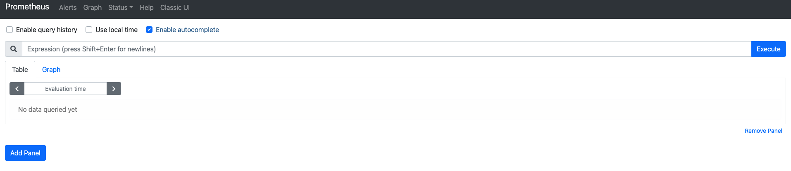

# 02장. 프로메테우스 설치

이 장에서는 프로메테우스를 설치하는 방법에 대해서 알아본다. 로컬 환경에서는 도커 기반으로 설치함으로, `Docker`가 이미 설치되어 있어야 한다. 또한 이후 실습에서, 로컬 환경에서 여러 컴포넌트들을 관리하기 위해서 `docker-compose`가 필요하다. 설치가 안 되어있다면 다음 문서를 통해서 설치할 수 있다.

* [Docker 설치](https://docs.docker.com/get-docker/)
* [docker-compose 설치](https://docs.docker.com/compose/install/)

또한, `AWS` 클라우드 환경에서 프로메테우스 실습을 진행할 예정이다. `AWS` 가입이 필요하다.

* [AWS 가입](https://aws.amazon.com/ko/)

각각 결제 정보를 넣어줘야 하는데 걱정하지 말라. 이 실습에서는 `AWS`에서 제공하는 무료 기능만 사용할 것이다. 참고로 `AWS`는 신규 가입 사용자에게 여러 기능들을 둘러볼 수 있도록 무료 크레딧을 지급하고 있어서 처음 가입하는 사람이라면, 이 책의 실습을 진행하는데 무리가 없을 것이다.

## 로컬에서 프로메테우스 설치

로컬에서는 도커 기반으로 설치한다. 터미널에 다음을 입력한다.

```bash
$ docker run -p 9090:9090 prom/prometheus
```

끝이다. "localhost:9090"에서 다음 UI를 확인할 수 있다.



## AWS에서 프로메테우스 설치

> 클라우드 환경에서 각 VM들은 public IP를 할당 받고, port도 9090, 3000 은 열려 있어야 합니다.

먼저 `ssh`를 통해서 EC2에 접속해보자. 일단 여기서는 EC2 기준으로 설명을 한다. 다음 명령어들을 입력해서 프로메우스 설치 및 실행을 한다. 

```bash
# EC2 인스턴스 처음 접속했을 때 경로.
$ pwd
/home/ec2-user
 
# 설치하는 컴포넌트들의 관리를 더 쉽게 하기 위해서 디렉토리 생성
$ mkdir apps

# 디렉토리 이동
$ cd apps
 
# 프로메테우스 바이너리 파일이 들어 있는 압축 파일 설치
# GCP의 경우는 wget 설치가 필요하다.
$ wget https://github.com/prometheus/prometheus/releases/download/v2.22.0/prometheus-2.22.0.linux-amd64.tar.gz
 
# 압축 파일 해제
$ tar zxvf prometheus-2.22.0.linux-amd64.tar.gz
 
# 프로메테우스 디렉토리 경로 간소화
$ mv prometheus-2.22.0.linux-amd64 prometheus
 
# 프로메테우스 디렉토리 이동
$ cd prometheus
 
# 프로메테우스 실행
$ ./prometheus
```

이제 클라우드 인스턴스의 "public IP주소:9090"에 접속하면 역시 다음 UI를 확인할 수 있다.


## 프로메테우스 서비스 등록

현재 AWS 상황에서의 문제점은, 접속하고 있는 터미널이 종료되면 프로메테우스 역시 같이 종료된다는 것이다. 이를 해결하기 위해 프로메테우스를 "리눅스 서비스"로 등록할 것이다. 먼저 vim 터미널로 다음 파일을 생성하여 연다.

```bash
$ sudo vim /etc/systemd/system/prometheus.service
```

그 후 `/etc/systemd/system/prometheus.service`에 다음 내용을 등록한다.

```
[Unit]
Description=Prometheus Server
 
[Service]
Restart=on-failure
 
#Change this line if you download the
#Prometheus on different path user
ExecStart=/home/ec2-user/apps/prometheus/prometheus \
  --config.file=/home/ec2-user/apps/prometheus/prometheus.yml \
  --storage.tsdb.path=/home/ec2-user/apps/prometheus/data
 
[Install]
WantedBy=multi-user.target
```

이 때 "ExecStart" 부분에 옵션 `--config.file`은 프로메테우스 설정 파일의 경로, `prometheus.yml`이 저장된 경로를 사용해야 한다. 또한, `--storage.tsdb.path` 옵션에는 프로메테우스가 데이터를 저장할 디렉토리 경로를 넣어주어야 한다. 

이제 터미널에 다음을 입력한다.

```bash
# 서비스 데몬 리로딩
$ sudo systemctl daemon-reload
 
# prometheus 서비스 시작
$ sudo systemctl start prometheus
 
# prometheus 서비스 상태 확인
$ sudo systemctl status prometheus
● prometheus.service - Prometheus Server
   Loaded: loaded (/etc/systemd/system/prometheus.service; disabled; vendor preset: disabled)
   Active: active (running) since 수 2020-11-04 09:04:14 UTC; 4s ago
...
```

이제 다시 인스턴스의 "public IP주소:9090"에 접속하면 역시 다음 UI를 확인할 수 있다.

