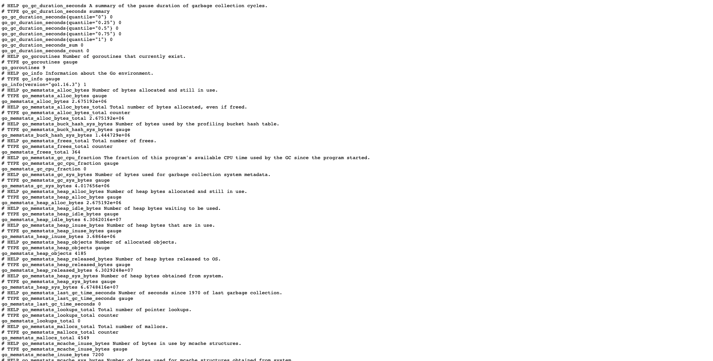
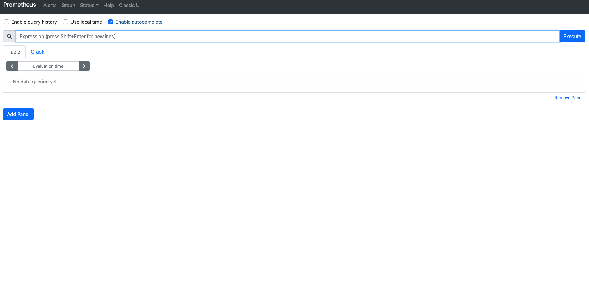
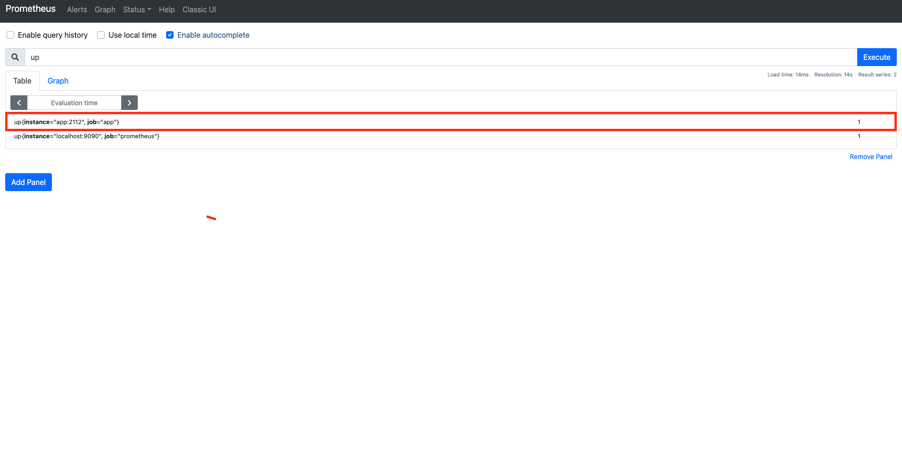
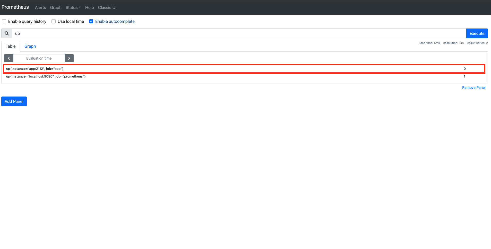
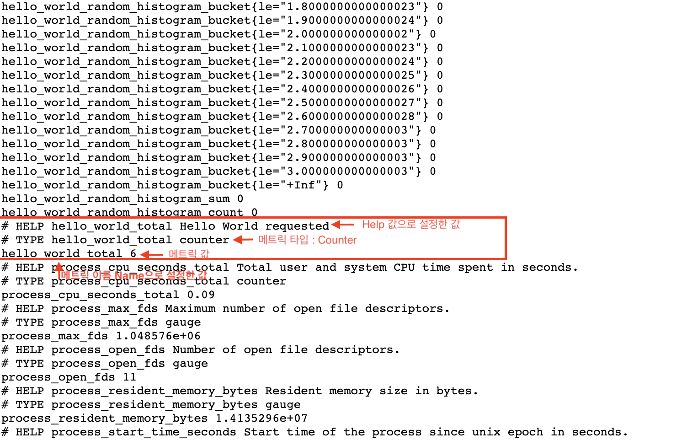
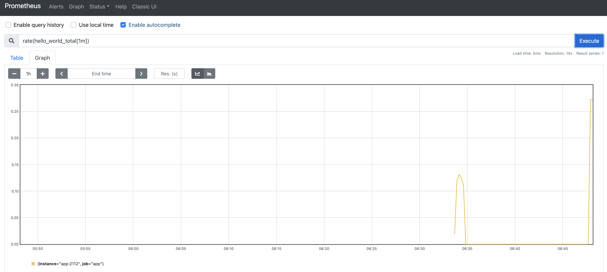
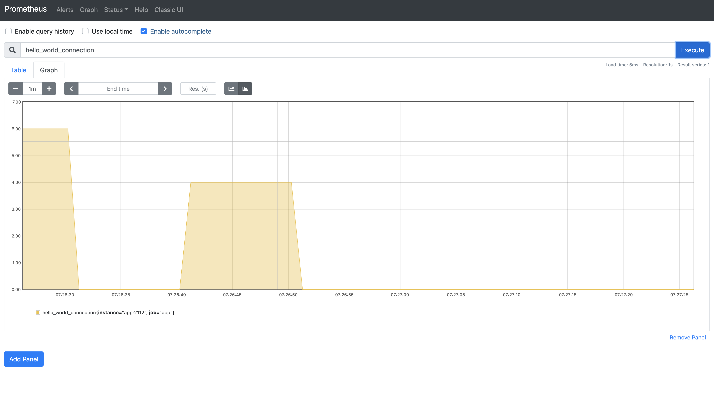
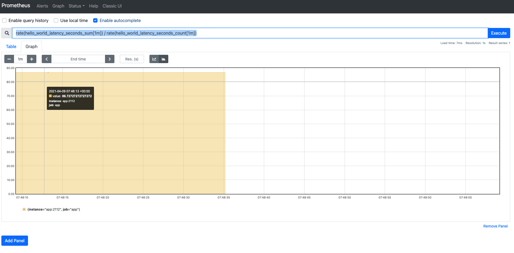
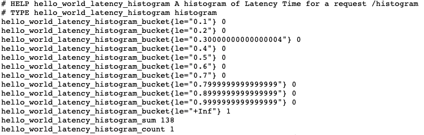
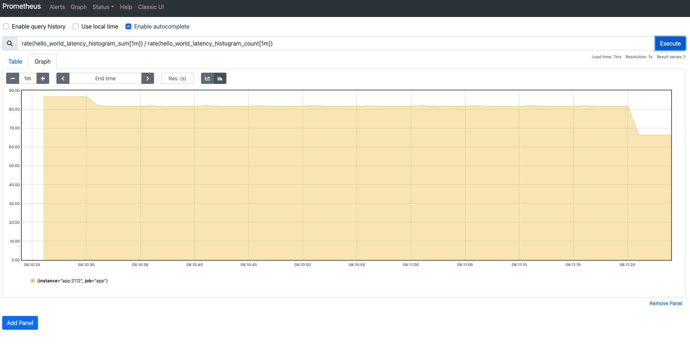

# 03장. Prometheus Metric Type

## 3.1 개요

`Prometheus`에서 메트릭을 수집하는 방법은 대표적으로 크게 2가지가 있다.

> 참고! 메트릭이란?
> 
> 메트릭이란 수집하는 시계열 데이터를 일컫는 말이라고 보시면 됩니다. 

* Client Library를 통한 메트릭 수집
* Exporter를 통한 메트릭 수집

위 2가지 방법 모두, 결국 `Prometheus`에서 지원하는 다음의 4가지 타입의 메트릭들을 저장하게 된다.

1. Counter
2. Gauge
3. Summary
4. Histogram

보통 모니터링 상황에서는 `Exporter`를 이용해서, 각 메트릭을 수집하는 것이 일반적이지만, 이번 장에서는 `Prometheus`의 메트릭 타입을 살펴보기 위해서, `Golang` 기반의 `Client Library`를 이용하여, 메트릭을 수집해 볼 것이다.

코드는 다음에서 확인할 수 있다.

* 3장 코드 : [https://github.com/gurumee92/gurumee-prometheus-code/tree/master/part1/ch03](https://github.com/gurumee92/gurumee-prometheus-code/tree/master/part1/ch03)

> 참고! 이 장을 시작하기 전에...
> 
> 이 장을 시작하기 전에, Docker와 docker-compose가 로컬 머신에 반드시 설치가 필요합니다!

## 3.2 프로젝트 구조와 설정

프로젝트의 구조는 다음과 같다.

```
|- ch03
    |- config
        |- prometheus.yml
    |- .gitignore
    |- Dockerfile
    |- docker-compose.yml
    |- go.mod
    |- go.sum
    |- main.go 
```

먼저 `Golang` 기반의 간단한 애플리케이션이 작성된 것을 확인할 수 있다.

part1/ch03/main.go
```go
package main

import (
	"fmt"
	"html"
	"net/http"
	"time"

	"github.com/prometheus/client_golang/prometheus"
	"github.com/prometheus/client_golang/prometheus/promauto"
	"github.com/prometheus/client_golang/prometheus/promhttp"
)

var (
	COUNTER = promauto.NewCounter(prometheus.CounterOpts{
		Name: "hello_world_total",
		Help: "Hello World requested",
	})

	GAUGE = promauto.NewGauge(prometheus.GaugeOpts{
		Name: "hello_world_connection",
		Help: "Number of /gauge in progress",
	})

	SUMMARY = promauto.NewSummary(prometheus.SummaryOpts{
		Name: "hello_world_latency_seconds",
		Help: "Latency Time for a request /summary",
	})

	HISTOGRAM = promauto.NewHistogram(prometheus.HistogramOpts{
		Name:    "hello_world_latency_histogram",
		Help:    "A histogram of Latency Time for a request /histogram",
		Buckets: prometheus.LinearBuckets(0.1, 0.1, 10),
	})
)

func index(w http.ResponseWriter, r *http.Request) {
	COUNTER.Inc()
	fmt.Fprintf(w, "Hello, %q", html.EscapeString(r.URL.Path))
}

func gauge(w http.ResponseWriter, r *http.Request) {
	GAUGE.Inc()
	defer GAUGE.Dec()
	time.Sleep(10 * time.Second)
	fmt.Fprintf(w, "Gauge, %q", html.EscapeString(r.URL.Path))
}

func summary(w http.ResponseWriter, r *http.Request) {
	start := time.Now()
	defer SUMMARY.Observe(float64(time.Now().Sub(start)))
	fmt.Fprintf(w, "Summary, %q", html.EscapeString(r.URL.Path))
}

func histogram(w http.ResponseWriter, r *http.Request) {
	start := time.Now()
	defer HISTOGRAM.Observe(float64(time.Now().Sub(start)))
	fmt.Fprintf(w, "Histogram, %q", html.EscapeString(r.URL.Path))
}

func main() {
	http.HandleFunc("/", index)
	http.HandleFunc("/gauge", gauge)
	http.HandleFunc("/summary", summary)
	http.HandleFunc("/histogram", histogram)
	http.Handle("/metrics", promhttp.Handler())
	http.ListenAndServe(":2112", nil)
}
```

코드 설명은 차차 하기로 하고, 여기서 중요한 것은 이 `Golang` 코드는 `Prometheus Client Library` 의존성이 있다는 것이다. 이를 위해서, `go.mod`, `go.sum`이 생성되어 있으며, `Dockerfile`을 통해서, 이 애플리케이션이 도커 이미지로 만들어진다.

그리고, `docker-compose.yml`을 보자.

part1/ch03/docker-compose.yml
```yml
version: "3"

services:
  app:
    container_name: app
    build: .
    ports:
      - 2112:2112
  
  prometheus:
    container_name: prometheus
    image: prom/prometheus:latest
    ports:
      - 9090:9090
    command:
      - '--config.file=/etc/prometheus/prometheus.yml'
      - '--storage.tsdb.path=/prometheus'
      - '--web.console.libraries=/usr/share/prometheus/console_libraries'
      - '--web.console.templates=/usr/share/prometheus/consoles'
    volumes:
      - ./config/prometheus.yml:/etc/prometheus/prometheus.yml
```

여기서 작성된 도커 이미지 기반으로 `app`이라는 컨테이너를 1개 생성하고 로컬 머신에 포트 2112번에 매핑시킨다. 또한 `Proemtheus` 컨테이너도 1개 생성한 후, `config/prometheus.yml` 기반으로 `Prometheus`가 동작할 수 있도록 설정되어 있다. 역시 9090번에 매핑되어 있다.

`Prometheus` 설정을 잠깐 살펴보자.

part1/ch03/config/prometheus.yml
```yml
# my global config
global:
  scrape_interval:     15s # By default, scrape targets every 15 seconds.
  evaluation_interval: 15s # By default, scrape targets every 15 seconds.
  
  external_labels:
    monitor: 'my-project'

rule_files:
  # ...
scrape_configs:
  - job_name: 'prometheus'
    scrape_interval: 5s

    static_configs:
      - targets: ['localhost:9090']

  - job_name: 'app'
    scrape_interval: 5s

    static_configs:
      - targets: ['app:2112']
```

위 설정 파일은 `Prometheus`로 하여금 자신과, `app`의 "/metrics" 엔드포인트에서 수집할 수 있는 메트릭을 5초에 1번씩 수집하게 한다. `Proemtheus`에서는 `scrape_interval` 주기로 메트릭을 수집하는 단위를 `job`이라고 한다. 

이제 잘 구성이 되어 있나 확인해보자. 먼저 터미널에 다음을 입력하여, 도커 컨테이너들을 만든다.

```bash
# 현재 위치 확인 ch03이 있는 곳으로 가야 함.
$ pwd
/Users/gurumee/Workspace/gurumee-prometheus-code/part1/ch03

# docker 컨테이너 구동
$ docker-compose up --build -d
```

약간의 시간 후 브라우저에서 "localhost:2112/metrics"를 접속해본다. 그럼 다음 화면이 보인다.



위 화면은 우리가 `Golang` 기반의 애플리케이션으로, `Prometheus Client Library`를 이용하여, "/metrics" 경로에 수집할 수 있는 여러 메트릭들을 노출시키고 있다.

`Prometheus`는 이 경로를 통해서 노출된 메트릭을 수집하는 것이다. 이제 "localhost:9090"에 접속해보자.



검색 쿼리 창에 "up"이란 명령어를 쳐보자. 그럼 다음 결과가 보일 것이다.



"up" 쿼리는 `Prometeus`에서 설정한 `job`이 잘 돌고 있는지 확인할 수 있는 쿼리이다. 위에서 보면 우리가 설정한 `job` 2개였던 "app", "prometheus"가 1임을 확인할 수 있다. 

이제 아래 명령어를 실행하여서 "app" 컨테이너를 죽여보자.

```bash
$ docker-compose stop app
```

그 후 다시 브라우저에서 "up" 쿼리를 실행해보자. "app"이 0이 됨을 확인할 수 있다. 즉 "up" 쿼리는 `job`이 정상적으로 동작하고 있으면 1을 비정상적이면 0을 결과로 보여준다.



## 3.3 코드를 작성하며 알아보는 Prometheus 메트릭 타입

앞 절에서 언급했 듯이, `Prometheus`에서는 `Counter`, `Gauge`, `Summary`, `Histogram` 이라는 4가지 메트릭 타입이 존재한다. 코드와 함께 살펴보면서, 어떤 특성들이 있는지 확인해보자.

### Counter

`Counter` 타입은 가장 많이 수집되는 유형의 메트릭 타입이다. 이 타입은 모니터링하는 이벤트의 누적 개수 혹은 크기를 표현한다. 일반적으로 이 타입은 `rate` 함수와 같이 사용하여, 다음 이벤트를 추적하는데 많이 사용된다.

* 초당 요청 개수
* 초당 상태 코드 개수
* 초당 요청 실패율
* 초당 요청 성공률

위 애플리케이션에서 `Counter` 타입에 대한 부분은 다음과 같다.

part1/ch03/main.go
```go
package main

import (
	// ...

	"github.com/prometheus/client_golang/prometheus"
	"github.com/prometheus/client_golang/prometheus/promauto"
	"github.com/prometheus/client_golang/prometheus/promhttp"
)

var (
	COUNTER = promauto.NewCounter(prometheus.CounterOpts{
		Name: "hello_world_total",
		Help: "Hello World requested",
	})
	// ...
)

func index(w http.ResponseWriter, r *http.Request) {
	COUNTER.Inc()
	fmt.Fprintf(w, "Hello, %q", html.EscapeString(r.URL.Path))
}

// ...

func main() {
	http.HandleFunc("/", index)
	// ...
}
```

간단히 애플리케이션에 대해 말하자면, 애플리케이션에서 "/"가 호출될 때마다 "index" 함수가 호출되어 전역 변수 `COUNTER`의 개수가 증가하게 된다. 



위 그림을 잘 보면, 코드에서 설정했던 `Name`, `Help`가 메트릭 이름과 주석에 대한 설명으로 값이 할당 된 것을 확인할 수 있다. 또한 이름 옆에 숫자가 보이는데, 이것이 바로 메트릭의 값이다. 이것은 누적 숫자로써, "/" 경로를 타고 들어오면, 개수가 계속 증가한다. 

> 참고! "/metrics"로 해도 증가하던데요?
> 
> 이거는 URL 매칭이랑 관련이 있는건데, 간단하게 말하면 특정 코드 작업이 없으면 "/"로 시작하는 URL 모두 호출되면 "index" 함수가 호출된다고 보시면 됩니다. 즉, "/abc", "/foo" 이렇게 호출해도 "index"는 호출해서 "COUNTER" 값은 증가됩니다. 원래는 이런 경우에 "label"을 붙여서 호출된 uri 전체를 나누는게 일반적입니다.

위에서 언급했듯이 보통 `Counter`는 `rate`라는 내장 함수를 이용해서 많이 쓰인다. `rate`는 `Counter` 타입의 메트릭에 대해서 특정 시간 범위에 대해서 초당 평균 개수를 나타내는 함수이다. 만약 1분간 "/"에 대한 RPS를 알고 싶다면 다음과 같이 쿼리할 수 있다.

```
rate(hello_world_total[1m])
```

위 쿼리 결과를 `Prometheus UI`에서 그래프로 시각화하면 다음과 같은 그림이 보인다.



> 참고! RPS란
> 
> Request Per Second의 약자로써, 초당 요청 개수를 뜻합니다. 일반적으로 RPS 외에 상태 코드 개수 등의 메트릭을 추적하는데, Counter 타입을 쓰게 됩니다.

`Counter` 타입을 쓸 때 주의 사항은 다음과 같다.

* 누적 개수로써 이벤트 개수에 대해서 오로지 증가만 가능하다.
* 애플리케이션이 재구동되면 0이된다. (사실 이건 Prometheus 모든 타입에 적용되는 사항이다.)

### Gauge

`Gauge` 타입은 "현재 상태"를 표현하는 메트릭 타입이다. `Counter` 타입과 달리 증가도 가능하고 감소도 가능하다. 이 타입의 예는 다음과 같다.

* 현재 커넥션 개수
* 현재 동작하는 스레드 개수
* 현재 메모리 사용량
* 업타임 시간

관련 코드는 다음과 같다.

part1/ch03/main.go
```go
package main

import (
	// ...
	"time"
	// ...
	"github.com/prometheus/client_golang/prometheus"
	"github.com/prometheus/client_golang/prometheus/promauto"
	"github.com/prometheus/client_golang/prometheus/promhttp"
)

var (
	// ...

	GAUGE = promauto.NewGauge(prometheus.GaugeOpts{
		Name: "hello_world_connection",
		Help: "Number of /gauge in progress",
	})

	// ...
)

// ...

func gauge(w http.ResponseWriter, r *http.Request) {
	GAUGE.Inc()
	defer GAUGE.Dec()
	time.Sleep(10 * time.Second)
	fmt.Fprintf(w, "Gauge, %q", html.EscapeString(r.URL.Path))
}

// ...

func main() {
	// ...
	http.HandleFunc("/gauge", gauge)
	// ...
}
```

역시 간단하게 설명하자면 "/gauge" 엔드포인트 접속 시, `GAUGE`를 1 늘린다. 그 후 10초동안 잠들고, 요청 처리가 끝나면,`GAUGE`를 1 감소 시킨다. 즉, 10초동안 `GAUGE`가 유지될 것이며 동시에 여러 명에게 요청된다면 현재 요청 처리되는 개수를 알 수 있을 것이다. 

실제로 "localhost:2112/gauge"를 여러번 요청 후에 `Prometheus UI`에서 다음 쿼리를 쳐보자.

```
hello_world_connection
```

위 쿼리를 그래프로 보면 다음과 같다.



실제로 `hello_world_inprogress`가 10초 정도 값이 유지되다가 떨어지는 것을 확인할 수 있다. 보통 `Gauge` 타입은 위처럼 그래프로 시각화하기보단 게이지 타입으로 시각화하는 것이 일반적이다. 하지만 `Prometeus UI`에서는 이를 지원하지 않는다. 추후 진행되는 모니터링 실습에서 `Grafana`라는 시각화 도구를 보게 될 것이다. 그 때, 한번 더 살펴보기로 하자.

또한 `Gauge`는 현재 상태를 표현하기에 일반적으로 그냥 메트릭 이름으로 쿼리하게 된다. 대표적으로 "up" 같은 메트릭이 이 타입이다. 참고적으로 `Counter` 타입에 `rate` 함수를 적용하면 `Gauge` 타입으로 변환된다는 것을 알아두자. 

### Summary

`Summary` 타입은 시스템 성능을 이해할 때 필요한 메트릭들을 표현한다. 이 타입의 예는 다음과 같다.

* 지연 시간
* 응답 시간 

> 참고! 지연 시간(latency time) vs 응답 시간(response time)?
> 
> latency time과 response time은 시스템 성능 관련 대표적인 메트릭들입니다. 일반적으로는 동의어로 취급되지만 response time이 조금 더 포괄적인 의미로 많이 사용됨을 알아주셨으면 좋겠습니다. 
> 
> 참고 문헌
> [https://www.cirrusdata.com/latency-and-response-time/](https://www.cirrusdata.com/latency-and-response-time/) 

관련 코드는 다음과 같다.

part1/ch03/main.go
```go
package main

import (
	// ...
	"time"
	// ...
	"github.com/prometheus/client_golang/prometheus"
	"github.com/prometheus/client_golang/prometheus/promauto"
	"github.com/prometheus/client_golang/prometheus/promhttp"
)

var (
	// ...

	SUMMARY = promauto.NewSummary(prometheus.SummaryOpts{
		Name: "hello_world_latency_seconds",
		Help: "Time for a request /summary",
	})

	// ...
)

// ...

func summary(w http.ResponseWriter, r *http.Request) {
	start := time.Now()
	defer SUMMARY.Observe(float64(time.Now().Sub(start)))
	fmt.Fprintf(w, "Summary, %q", html.EscapeString(r.URL.Path))
}

// ...

func main() {
	// ...
	http.HandleFunc("/summary", summary)
	// ...
}
```

간단하게 설명하면, "/summary" 호출 시점부터 처리 시점까지 시간을 재서, 메트릭을 수집한다. `Summary` 타입은 메트릭에 `_count`, `_sum` 이라는 접미어 붙는다.

이름처럼, 시간동안 발생한 개수와 총합을 구한다. 이를 통해 평균 지연 시간을 구할 수 있다. `Prometheus UI`에서, 다음 쿼리를 입력해보자.

```
rate(hello_world_latency_seconds_sum[1m]) / rate(hello_world_latency_seconds_count[1m])
```

이를 그래프로 시각화하면 다음과 같다.



1분 동안 평균 86ms 정도 지연 시간이 걸린 것을 확인할 수 있다. 일반적으로 `Summary` 타입은 뒤에 나올 `Histogram`과 매우 유사한데 이 둘을 잘 구분해서 사용해야 한다.

### Histogram

`Histogram`은 `Summary`랑 비슷한데, "분위수"에 대한 개념이 추가된다. 이는 각 사용자 경험에 대해 추론할 때 매우 유용하게 쓰인다. (예는 `Summary`와 같다.)

관련 코드는 다음과 같다.

part1/ch03/main.go
```go
package main

import (
	// ...
	"math/rand"
	// ...

	"github.com/prometheus/client_golang/prometheus"
	"github.com/prometheus/client_golang/prometheus/promauto"
	"github.com/prometheus/client_golang/prometheus/promhttp"
)

var (
	// ...
	HISTOGRAM = promauto.NewHistogram(prometheus.HistogramOpts{
		Name:    "hello_world_latency_histogram",
		Help:    "A histogram of Latency Time for a request /histogram",
		Buckets: prometheus.LinearBuckets(0.1, 0.1, 10),
	})
)

// ...

func histogram(w http.ResponseWriter, r *http.Request) {
	start := time.Now()
	defer HISTOGRAM.Observe(float64(time.Now().Sub(start)))
	fmt.Fprintf(w, "Histogram, %q", html.EscapeString(r.URL.Path))
}

func main() {
	// ...
	http.HandleFunc("/histogram", histogram)
	// ...
}
```

코드 역시 `Summary` 타입과 비슷하다. 다만 결과값으로 분위수에 해당하는 `_bucket`이라는 접미어가 붙은 메트릭이 추가적으로 수집된다.



역시 `Prometheus UI`에서 다음 쿼리를 입력해서, 평균적인 지연 시간을 계산할 수 있다.

```
rate(hello_world_latency_histogram_sum[1m]) / rate(hello_world_latency_histogram_count[1m])
```

시각화하면 평균적으로 81ms로 거의 비슷한 지연시간을 얻을 수 있다.



그렇다면, `Summary`와 `Histogram` 중 어떤 것을 선택해야 할까? 공식 문서에 따르면 다음을 따르도록 권장하고 있다.

1. 만약 집계가 필요하다면, `Histogram` 타입을 써라.
2. 또한 관찰 될 값의 범위와 분포에 대한 아이디어가 있으면 `Histogram`을 써라.
3. 그 외에는 `Summary` 타입을 써라.