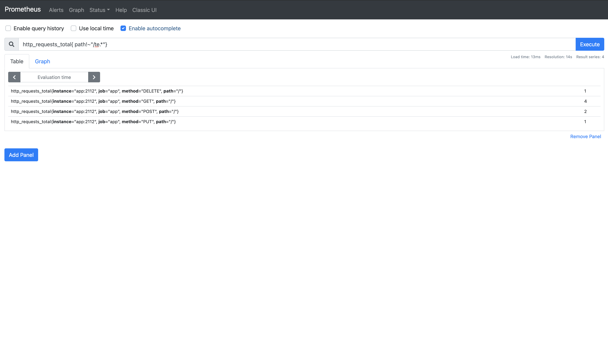

# 04장. Prometheus Label

## 4.1 개요

`Label`은 `Prometheus`의 아주 강력한 기능 중 하나이다. `Label`은 키-값 쌍으로 이루어져 있으며, `Prometheus`가 시계열 데이터를 식별하는데 "메트릭 이름"과 더불어서 사용한다. 예를 들어보자. 모니터링 세계에서 HTTP 요청에 대한 상태 코드는 주로 다음과 같이 수집한다.

* 2xx (응답 성공)
* 3xx (응답 성공 - 리다이렉션)
* 4xx (응답 실패 - 사용자 오류)
* 5xx (응답 실패 - 서버 오류)

어떻게 메트릭 이름을 지을 것인가? 아주 간단하게 다음과 같이 지을 수 있을 것이다.

```
http_request_status_code_2xx
http_request_status_code_3xx
http_request_status_code_4xx
http_request_status_code_5xx
```

만약에, 2xx, 3xx가 아니라 각 상태 코드 별로 모아야 한다고 해보자. 현재 표준에 따르면 30개가 넘는 상태 코드가 존재한다. (실제로는 다 쓰이진 않더라도...) 이를 다 만들 것인가? `Prometheus`에서는 저런 패턴을 지양할 것을 강력하게 권고한다. 저런 패턴을 일컬어 "안티 패턴"이라고도 한다. `Prometheus`는 보통 상태 코드의 값에 대한 메트릭을 다음과 같이 수집한다.

```
http_request{ status_code="200" }
http_request{ status_code="201" }
http_request{ status_code="301" }
http_request{ status_code="404" }
http_request{ status_code="400" }
http_request{ status_code="500" }
```

여기서 `http_request`가 메트릭 이름이고, `status_code`가 `Label`이다. 위의 6개의 시계열 데이터는 각각 다른 데이터라고 보면 된다. 그럼 여기서 드는 질문이 하나 있을 것이다. 왜 `Label`이 강력한 기능일까?

`Label`을 이용해서, 메트릭에 대한 집계를 할 수 있기 때문이다. 상태코드 2xx에 대한 개수를 보고 싶으면 다음과 같이 쿼리를 만들 수 있다.

```
sum(rate(http_request{status_code=~"2.."}[5m]))
```

"2.."이라고 표현함으로써, `Label`의 키 `status_code`의 값이 2xx(200, 201 등의 2로 시작하는 3자리 숫자)인 모든 데이터를 집계할 수 있다.

## 4.2 Label 만들어보기

이번에도 간단한, 애플리케이션을 만들어보면서 `Label`을 조금 더 알아보자. 코드는 다음 URL에서 얻을 수 있다.

* 4장 코드 : [https://github.com/gurumee92/gurumee-prometheus-code/tree/master/part1/ch04](https://github.com/gurumee92/gurumee-prometheus-code/tree/master/part1/ch04) 

프로젝트의 구조와 설정은 [지난 장](../03_prometheus_metric_type/03_prometheus_metric_type.md)과 동일하다. 다만 웹 애플리케이션 코드인 `main.go`만 다르다. `main.go`의 전체 코드는 다음과 같다.

part1/ch04/main.go
```go
package main

import (
	"fmt"
	"html"
	"net/http"

	"github.com/prometheus/client_golang/prometheus"
	"github.com/prometheus/client_golang/prometheus/promhttp"
)

var (
	REQUEST = prometheus.NewCounterVec(
		prometheus.CounterOpts{
			Name: "http_requests_total",
			Help: "How many HTTP requests processed, partitioned by status code and HTTP method.",
		},
		[]string{"path", "method"},
	)
)

func init() {
	prometheus.MustRegister(REQUEST)
}

func index(w http.ResponseWriter, r *http.Request) {
	REQUEST.WithLabelValues(r.URL.Path, r.Method).Inc()
	fmt.Fprintf(w, "Hello, %q", html.EscapeString(r.URL.Path))
}

func main() {
	http.HandleFunc("/", index)
	http.Handle("/metrics", promhttp.Handler())
	http.ListenAndServe(":2112", nil)
}
```

이 애플리케이션에 대해 간단하게 설명하자면 해당 URL과 HTTP Method 별로 누적 요청 개수를 수집한다. 여기서 알 수 있는 점은 `Label`은 한 메트릭 이름 당 여러 개를 지정할 수 있다는 것이다. 먼저 전역 변수인 `REQUEST`를 살펴보자.

part1/ch04/main.go
```go
// ...
var (
	REQUEST = prometheus.NewCounterVec(
		prometheus.CounterOpts{
			Name: "http_requests_total",
			Help: "How many HTTP requests processed, partitioned by status code and HTTP method.",
		},
		[]string{"path", "method"},
	)
)
// ...
```

수집하고 싶은 메트릭에서 `Label`을 설정하고 싶다면 `prometheus.New[Metric]Vec`을 함수를 써야 한다. 여기서는 URP과 HTTP Method에 따른 요청 누적 개수이기 때문에 `Counter` 타입을 수집해야 한다. 따라서 위의 코드처럼 `NewCounterVec` 함수를 사용했다. 여기서는 조금 더 깊이 실제 코드를 살펴 보자. 

github.com/prometheus/client_golang/blob/master/prometheus/counter.go
```go
func NewCounterVec(opts CounterOpts, labelNames []string) *CounterVec {
	desc := NewDesc(
		BuildFQName(opts.Namespace, opts.Subsystem, opts.Name),
		opts.Help,
		labelNames,
		opts.ConstLabels,
	)
	return &CounterVec{
		MetricVec: NewMetricVec(desc, func(lvs ...string) Metric {
			if len(lvs) != len(desc.variableLabels) {
				panic(makeInconsistentCardinalityError(desc.fqName, desc.variableLabels, lvs))
			}
			result := &counter{desc: desc, labelPairs: MakeLabelPairs(desc, lvs), now: time.Now}
			result.init(result) // Init self-collection.
			return result
		}),
	}
}
```

`NewCounterVec` 함수는 `CounterOpts`와 `Label`이름의 목록들을 전달 받아서 `CounterVec`이라는 구조체를 만들어서 그 주소를 반환하는 함수이다.

github.com/prometheus/client_golang/blob/master/prometheus/counter.go
```go
// ...
type CounterVec struct {
	*MetricVec
}
// ...
```

`CounterVec` 구조체는 필드 이름 없이 `*MetricVec` 타입이 설정된 것을 확인할 수 있는데, 이는 `MetricVec`의 필드를 모조리 물려 받는 것을 뜻한다. 

> 참고! Golang의 상속
> 
> 엄격하게 말하면 Golang은 상속 개념이 없습니다. 위는 "컴포지션"이라는 것을 이용해서, 다른 구조체의 필드를 모조리 가져오는 것입니다. 상속을 흉내낸 것이라고 볼 수 있습니다.

즉 `CounterVec`은 다음 `MetricVec`의 필드들을 사용할 수 있다.

github.com/prometheus/client_golang/blob/master/prometheus/vec.go
```go
// ...
type MetricVec struct {
	*metricMap

	curry []curriedLabelValue

	// hashAdd and hashAddByte can be replaced for testing collision handling.
	hashAdd     func(h uint64, s string) uint64
	hashAddByte func(h uint64, b byte) uint64
}
// ...
```

결국 `NewCounterVec`은 `CounterOpts`와 `Label` 목록을 전달 받아서 `MetricVec` 구조체를 적절하게 초기화시키는 것이라고 보면 된다. 

part1/ch04/main.go
```go
// ...
func main() {
	http.HandleFunc("/", index)
	http.Handle("/metrics", promhttp.Handler())
	http.ListenAndServe(":2112", nil)
}
```

`main` 함수를 보면 "/"에 `index` 함수가 바인딩 된 것을 볼 수 있다.

part1/ch04/main.go
```go
// ...
func index(w http.ResponseWriter, r *http.Request) {
	REQUEST.WithLabelValues(r.URL.Path, r.Method).Inc()
	fmt.Fprintf(w, "Hello, %q", html.EscapeString(r.URL.Path))
}
// ...
```

`index` 함수를 보면, URL "/" 아래에서 요청이 일어날 때마다 그 Path와 Http Method를 `Label` 값으로 넘겨주어서, 1씩 누적 시키는 것을 확인할 수 있다. 이 때 중요한 것은 `NewCounterVec` 함수에서 전달할 때, `Label` 목록의 순서를 맞춰야 한다는 것이다. 따라서 Path, Http Method를 순서대로 값을 넣어준다.

이제 제대로 수집하는지 확인해보자. `docker-compose`를 이용해 애플리케이션과 `Prometheus`를 실행한다.

```bash
$ pwd
# docker-compose.yml이 있는 곳.
/Users/gurumee/Workspace/gurumee-prometheus-code/part1/ch04

$ docker-compose up --build -d
```

몇 초 후 다음 명령어를 입력하여 http 요청을 만든다. 

```bash
$ source request.sh
```

`requast.sh`는 다음과 같은 요청을 한다.

* Path: "/", HTTP Method: "GET" x4
* Path: "/", HTTP Method: "POST" x2
* Path: "/", HTTP Method: "PUT" x1
* Path: "/", HTTP Method: "DELETE" x1
* Path: "/test1", HTTP Method: "GET" x2
* Path: "/test2", HTTP Method: "POST" x2
* Path: "/test3", HTTP Method: "PUT" x2
* Path: "/test4", HTTP Method: "DELETE" x2

한 번 브라우저에서 "localhost:2112/metrics"를 접속해서 한 번 확인해보자. 다음과 같이 메트릭이 수집되었다면 성공이다.


## 4.3 Label을 이용한 쿼리 및 집계

이번엔 `PromQL`을 이용해서 수집된 메트릭을 집계해보자. 여기서는 간단한 `PromQL`을 다룰 것이며 추후, 이어지는 장에서 더 깊게 배우게 될 것이다. 지금은 그냥 간단히 훑는 느낌으로 살펴보자. 먼저 `Prometheus UI`(localhost:9090)를 접속하자. 먼저 path가 "/"면서, method가 "GET"인 `http_requests_total`를 쿼리해보자. 다음 쿼리를 입력한다.

```
http_requests_total{ path="/", method="GET" }
```

결과는 다음과 같다. 


`Prometheus`는 임의의 메트릭에 대해서 가지고 있는 `Label` 개수 이하만큼 지정을 해서 필터링 후 집계가 가능하다. 또한 `=` 연산자를 이용해서 `Label`의 값이 일치하는 메트릭에 대해서 쿼리가 가능하다. 이번엔 다음 쿼리를 입력하여 path는 "/", method는 "GET"이 아닌 `http_requests_total`를 쿼리해본다.

```
http_requests_total{ path="/", method!="GET" }
```

결과는 다음과 같다.


`!=` 연산자를 이용하면 값이 일치하지 않은 메트릭들에 대해서 쿼리가 가능하다. 또한 `Prometheus`의 강력한 기능은 `Label`의 값들을 이용해서 집계가 가능하다는 것이다. 위는 쿼리는 3개의 시계열 데이터를 쿼리(검색)한 것이다. 이를 합쳐보자. 다음 쿼리를 입력한다.

```
sum(http_requests_total{ path="/", method!="GET" })
```

결과는 다음과 같다.


위 그림에서 확인할 수 있듯이 path가 "/"이면서 method가 "GET"이 아닌 `http_requests_total`의 합계는 총 4개이다. 

또한, `Label`이 강력한 이유는 앞에서 언급 했듯이 정규 표현식을 통해서도 쿼리 및 집계가 가능하다는 것이다. 다음 쿼리를 입력해서 `http_requests_total`의 method가 "POST" 혹은 "PUT"인 총 개수를 집계해보자.

```
sum(http_requests_total{ method=~"POST|PUT"})
```

결과는 다음과 같다.


`=~` 연산자는 `Label`의 값에 대해서 정규표현식이 맞는 메트릭들에 대해서 쿼리할 수 있게 한다. 이번에는 path가 "/te"로 시작하는 `http_requests_total`를 쿼리해보자.

```
http_requests_total{ path=~"/te.*"}
```

결과는 다음과 같다.


여기서 "/te.*"은 정규표현식으로써 "/te"로 시작하는 것들을 찾아낼 수 있다. 이번에는 path가 "/te"로 시작하지 않는 `http_requests_total`를 쿼리해보자.

```
http_requests_total{ path!~"/te.*"}
```

결과는 다음과 같다.



`!~` 연산자는 `=~` 반대로 정규표현식이 맞지 않는 메트릭들을 쿼리할 수 있게 한다. 역시 이렇게 쿼리한 메트릭들도 `sum`등의 함수를 통해서 집계가 가능하다

## 4.4 Label 사용 시 Tip

`Label` 사용 시 매우 주의할 점이 있다. 한 메트릭에 대한 `Label`의 개수가 증가할수록 `Cardinality`가 증가한다. `Cardinality`란 `Prometheus`가 수집한 고유한 시계열 개수라고 보면 된다. 앞서 메트릭 이름과 `Label`에 따라서 시계열이 식별된다고 언급했었다. 

```
http_requests_total{ method="GET", path="/" } 2
http_requests_total{ method="GET", path="/test" } 1
```

즉 위의 시계열 데이터는 메트릭 이름은 같으나 다른 데이터라고 보면 된다. 이렇게 메트릭 이름에 대한 `Label` 개수가 증가할수록 `Cardinality`는 폭발적으로 증가하게 된다. 각각 서로 다른 method가 4개, path가 10개라면 `http_requests_total` 메트릭에 대한 `Cardinality`는 40(4 * 10)이 된다. 이렇게 높은 `Cardinality`는 데이터가 적을 때는 문제가 안되지만 많아지면 많아질수록 `Prometheus`에 치명적인 성능 문제를 야기할 수 있다.

이에 대해서 책 "Prometheus Up & Running(번역판 : 프로메테우스 오픈소스 모니터링 시스템)"에서는 임의의 메트릭에 대한 `Cardinality`는 10 이하로 되도록 만들 것을 권장하고 있다.