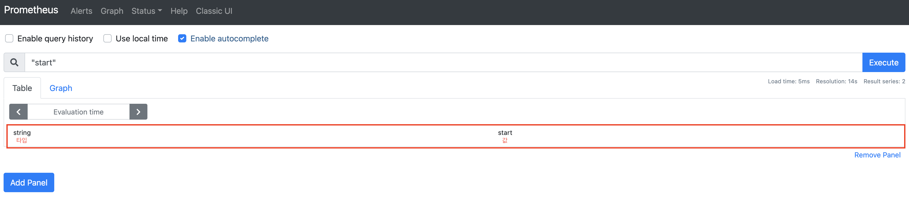

# 05장. Prometheus Query (1) PromQL 기본

## 5.1 개요

`Prometheus`에 저장된 데이터를 쿼리하는 방법은 크게 다음의 2가지가 있다.

* PromQL
* HTTP API

이 장에서는 일반적으로 쿼리하는데 사용되는 `PromQL`의 "기본"이라 할 수 있는 `Scalar`, `Selector`, `Matcher`, `Instant Vector`, `Range Vector`, `Time Duration`, `offset` 등에 대해 살펴본다.
 
이 장에서는 쉽고 빠르게 데이터를 수집하도록 `node-exporter`와 `Prometheus`를 연동할 것이다. `node-exporter`와 `Prometheus` 연동 및 모니터링 시 필요한 내용들에 대해서는 "2부 모니터링 편"에서 깊이 다룰 예정이다. 여기서는, 실행하는 방법만 살펴보도록 하자. 코드는 다음 URL에서 얻을 수 있다.

* 5장 코드 : [https://github.com/gurumee92/gurumee-prometheus-code/tree/master/part1/ch05](https://github.com/gurumee92/gurumee-prometheus-code/tree/master/part1/ch05) 

다운을 받았다면 터미널에 다음을 입력한다.

```bash
# 현재 위치 확인
$ pwd
/Users/gurumee/Workspace/gurumee-prometheus-code

# 디렉토리 이동
$ cd part1/ch05/

# prometheus, node-exporter 설치 및 구동
$ docker-compose up -d
```

브라우저에서 `localhost:9090`에 접속한 후 쿼리 입력 창에 `up`을 입력했을 때 다음 화면이 보인다면, 잘 구동된 것이다.


## 5.2 String과 Scalar

`PromQL`에서는 다음의 `Expression Language Data Type`이 있다.

* String
* Scalar
* Instant Vector
* Range Vector

그 중 `Literal`로 표현될 수 있는 타입이 `String`과 `Scalar`이다. 먼저 `String` 타입을 쿼리해보자. `Prometheus UI`에서 `start`를 입력해보자.



왼쪽에는 타입인 `String` 오른쪽엔 값인 `start`가 보인다. `Prometheus`는 `Go`로 만들어진만큼 탈출 문자 규칙도 `Go`의 규칙을 따른다. 예를 들어 `i say "love you"`를 표현하고 싶다면 다음과 같이 작성할 수 있다.

```
'i say "love you"'     (O)
"i say \"love you\""   (O)
'i say \"love you\"'   (X) '로 시작하면 \"를 하면 안된다.
```

반대도 마찬가지다. 혼용해서 사용할 수는 있지만, 혼용했을 때는 백슬래시를 쓰면 안된다. 이번엔 `Scalar` 타입을 쿼리해보자. `1.25`을 입력해본다.


역시 왼쪽에는 타입인 `Scalar`가 오른쪽엔 값인 `1.25`가 보인다. `Scalar` 타입은 실수를 포함하는 숫자라고 보면 된다. 실수, 숫자, 지수, 16진수, Inf, -Inf, NaN이 될 수 있다.

## 5.3 Instant Vector

`Instant Vector`는 쿼리 평가 시점 전 가장 최근 샘플의 데이터이며 자신의 모든 값에 대해 타임스탬프를 갖고 있다. `Prometheus UI`에 다음을 입력해보자.

```
process_resident_memory_bytes{job="node-exporter"}
```

쿼리 결과는 다음과 같다.


역시 왼쪽은 타입, 오른쪽은 값이다. 쿼리문 자체가 `Instant Vector` 타입을 나타낸다. 여기서 메트릭 이름에 `{}`가 붙어 있는 것을 볼 수 있는데, 이를 `Selector`라고 부른다. `Selector`는 보통 `Instant Vector` 타입을 반환하게 된다. 또한 `{}` 안에 `job="node-exporter"`를 볼 수 있는데, 이 때 `=`는 `Matcher`의 일종이다. `Mather`는 메트릭이 가지고 있는 `Label`에 대해서 필터링 기능을 제공한다. 

`Mathcer`의 종류는 다음과 같다.

* = : `Label` 값이 정확히 일치하는 데이터를 추출
* != : `Label` 값이 정확히 일치하지 않는 데이터를 추출
* =~ : `Label` 값에 대해서 정규표현식이 일치하는 데이터를 추출
* !~ : `Label` 값에 대해서 정규표현식이 일치하는 않는 데이터를 추출

위에서 `Instant Vector`는 모든 값에 대해서 타임스탬프를 가지고 있다고 했다. 이는 그래프를 그릴 수 있음을 뜻한다. "Graph" 탭을 클릭해보자.


다음과 같이 `Instant Vector`에 대해서 시각화가 가능하다. 참고로 이 타입만 그래프를 그릴 수 있다.

## 5.4 Range Vector

`Range Vector`는 쿼리 시점까지 `Time Duration`에 대해 일치하는 모든 시계열을 가지고 있다. 간단하게 말하면 `Instant Vector`에 `[]`라는 `Range Vector Selector`를 사용한 데이터라고 보면 된다. 다음을 쿼리해보자.

```
process_resident_memory_bytes{job="node-exporter"}[1m]
```

쿼리 결과는 다음과 같다.


이는 `Instant Vector`인 `process_resident_memory_bytes{job="node-exporter"}`를 쿼리한 시점 1분까지의 모든 시계열을 가지는 `Range Vector`를 반환한다. 오른쪽 값을 보면 12개가 나오는데, 이는 5초 주기로 `Prometheus`가 `node-exporter`를 통해서 데이터를 수집하기 때문이다. 사실 `Range Vector` 타입 혼자서 쓰이지는 않고 보통은 `rate()` 함수랑 같이 쓰인다. 다음을 쿼리해보자.

```
rate(process_resident_memory_bytes{job="node-exporter"}[1m])
```

쿼리 결과는 다음과 같다.


타입에 메트릭 이름이 빠진 것 말고는 뭐가 바뀐지 잘 모르겠다. 한 번 Graph 탭을 눌러보자. 


그렇다. `rate()` 함수는 `Range Vector`를 `Instant Vector`로 바꿔주는 역할을 한다. 정확하게는 `process_resident_memory_bytes{job="node-exporter"}[1m]`의 초당 평균 값을 보여준다.

## 5.5 Time Duration과 Offset

`Prometheus`에서 지원하는 `Time Duration`은 다음과 같다.

* ms - milliseconds
* s - seconds
* m - minutes
* h - hours
* d - days - 항상 24h
* w - weeks - 항상 7d
* y - years - 항상 365d

`Time Duration`은 보통 위와 같이 `Range Vector`를 구할 때 쓰거나, `Instant Vector` 혹은 `Range Vector`에 대해서 `offset`을 이용하여 지난 시간의 데이터를 얻을 때 사용한다. 한 번 지난 1분 전의 데이터를 얻어보자.

```
process_resident_memory_bytes{job="node-exporter"} offset 1m
```

쿼리 결과는 다음과 같다.


`offset 1m`을 제거하면 다른 데이터가 보이는 것을 확인할 수 있다. `Time Duration`과 `offset`을 사용할 때는 주의할 점이 크게 2가지가 있다.

1. Time Duration은 정수만 가능하다.
2. offset은 지난 시간에 대해서만 가능하다.

만약 1시간 30분이 지난 데이터를 얻고자 한다면, 다음처럼 써야 한다.

```
process_resident_memory_bytes{job="node-exporter"} offset 90m     (O)
process_resident_memory_bytes{job="node-exporter"} offset 1h 30m  (X) 이건 안된다.
```

또한 `offset`을 이용해서 미래 시간은 쓸 수 없다.