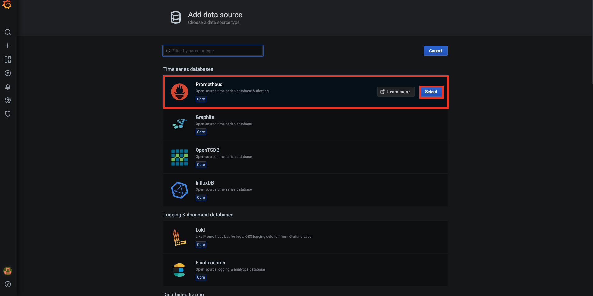
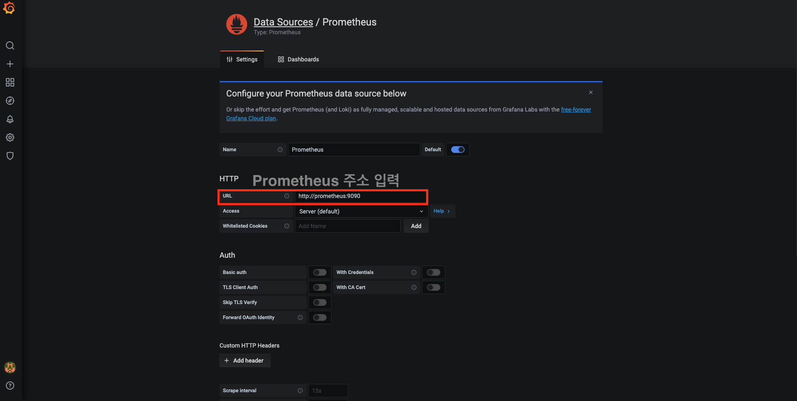
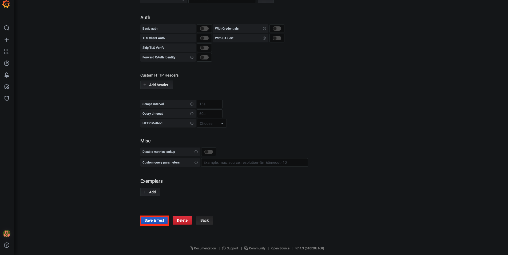
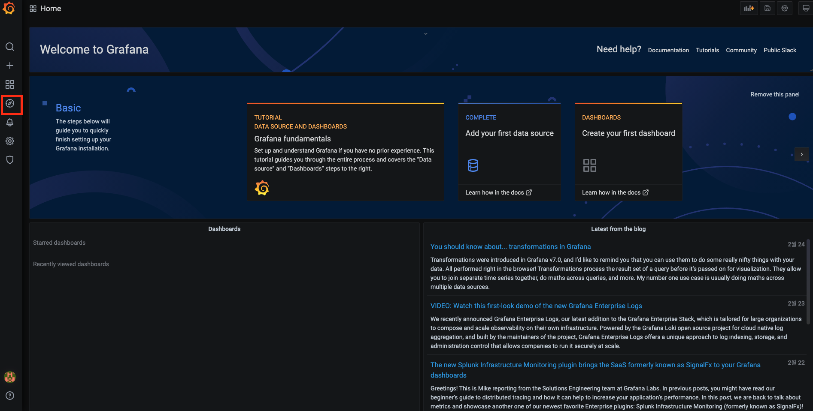
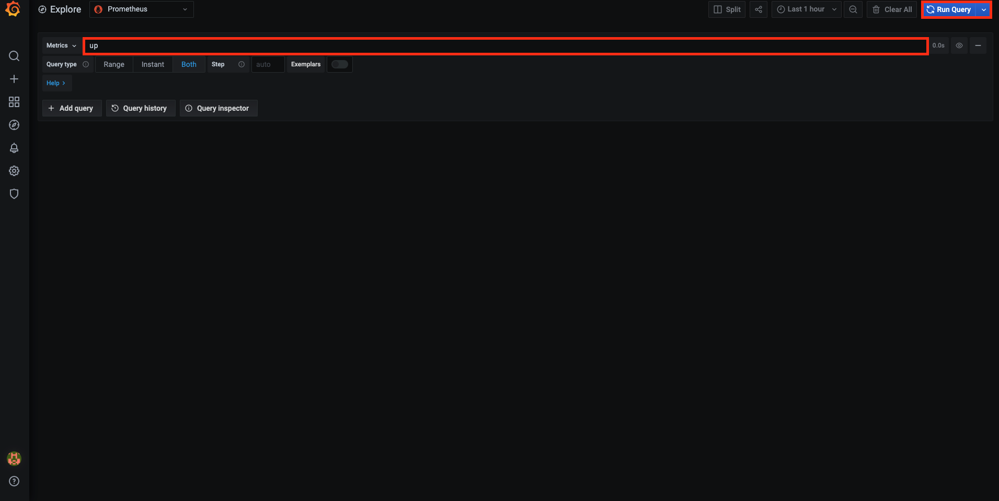

# Grafana란 무엇인가

이 문서에서는 `Grafana`가 무엇인지에 대해서 대략적으로 살펴본다. 다음과 같은 내용을 다룬다.

* Grafana란 무엇인가
* Grafana 설치
* Grafana - Prometheus 연동

이번 장의 코드는 다음 링크에서 확인할 수 있다.

* 이번 장 코드 : []()

## Grafana란 무엇인가

먼저 설치 전에 왜 우리가 `Grafana`를 설치해야 하는지, `Grafana`가 무엇인지 알아두면 좋을 것 같다. `Grafana`란, `Grafana Labs`에서 관리하고 있는 오픈 소스 시각화 및 분석 도구이다. `Prometheus` 물론 `InfluxDB`, `Elasticsearch` 등 여러 데이터 소스와 통합이 가능하다.

물론 이전 장에서 잠깐 봤듯이 `Prometheus` 역시 자체적으로 UI를 제공하고 있다. 쿼리도 가능하고 심지어 여러 패널을 만들어서 대시보드 구성도 가능하다. 하지만, 그 기능이 너무나도 빈약해서 혹은 불편해서 보통 상용 환경에서는 `Grafana`와 함께 연동해서 사용하는 것이 일반적이다. `Grafana`는 여러 데이터 소스에 대한 대시보드 템플릿을 제공하기 때문에, `Prometheus` 등의 데이터 소스의 쿼리 방법을 잘 모른다 하더라도 기본적인 대시보드 구성이 가능하다.

기본적으로 `Prometheus`와 `Grafana`는 모두 `Grafana Labs`에서 관리하고 있기 때문에, 궁합이 어떤 데이터 소스와 비교하더라도 매우 좋은 편이다. 이것만으로 우리가 `Grafana`를 설치하는 이유는 충분하다.

## Grafana 설치 (로컬)

먼저 로컬 환경에서 `Grafana`를 설치한다. 역시 `Docker` 기반으로 설치를 할 것이다. 터미널에 다음을 입력하면 바로 설치를 할 수 있다.

```bash
$ docker run --name=grafana -p 3000:3000 grafana/grafana
```

끝이다. 이후 이어지는 절에서, `docker-compose`를 통해서 `Prometheus`와 `Grafana`를 다음과 같이 코드로 구성한다.

```yml
version: "3"

services:
  prometheus:
    container_name: prometheus
    image: prom/prometheus:latest
    ports:
      - 9090:9090

  grafana:
    container_name: grafana
    image: grafana/grafana:latest
    ports:
      - "3000:3000"
```

로컬에서 `docker-compose`로 구성되는 인프라스트럭를 관리하려면 터미널에 다음을 입력하면 된다.

```bash
# 현재 위치
$ pwd
# docker-compose.yml이 있는 위치
/Users/gurumee/Workspace/gurumee-book-prometheus/src/part2/ch01

# 컴포넌트 실행
$  docker compose up -d
[+] Running 2/2
⠿ Container prometheus  Started                                                                                                                                                                                                   0.9s
⠿ Container grafana     Started         

# 컴포넌트 상태 확인
$ docker ps
CONTAINER ID   IMAGE                    COMMAND                  CREATED          STATUS          PORTS                                       NAMES
3a0b00ceb302   e511606aee56             "/run.sh"                16 seconds ago   Up 15 seconds   0.0.0.0:3000->3000/tcp, :::3000->3000/tcp   grafana
f3ba27ef35a8   9dfc442be98c             "/bin/prometheus --c…"   23 secons ago   Up 15 seconds   0.0.0.0:9090->9090/tcp, :::9090->9090/tcp   prometheus

# 컴포넌트 중지
$ docker compose down -v
[+] Running 3/3
 ⠿ Container prometheus  Removed                                                                                                                                                                                                   0.3s
 ⠿ Container grafana     Removed                                                                                                                                                                                                   0.2s
 ⠿ Network ch01_default  Removed    
```

## Grafana 설치 (서버)

서버에서 `Grafana`는 다음과 같이 설치할 수 있다.

```bash
# rpm install
$ sudo tee /etc/yum.repos.d/grafa.repo <<EOF
[grafana]
name=grafana
baseurl=https://packages.grafana.com/oss/rpm
repo_gpgcheck=1
enabled=1
gpgcheck=1
gpgkey=https://packages.grafana.com/gpg.key
sslverify=1
sslcacert=/etc/pki/tls/certs/ca-bundle.crt
EOF

# grafana install
$ sudo yum install grafana -y
```

그럼 자동으로 `Grafana`가 설치되고 `grafana-server`라는 이름으로 서비스가 등록된다. 이제 터미널에 다음을 입력해서 `Grafana`를 실행하면 된다.

```bash
$ sudo systemctl start grafana-server
 
# 그라파나 상태 확인
$ sudo systemctl status grafana-server
● grafana-server.service - Grafana instance
Loaded: loaded (/usr/lib/systemd/system/grafana-server.service; enabled; vendor preset: disabled)
Active: active (running) since 목 2021-01-14 07:04:46 UTC; 3 days ago
Docs: http://docs.grafana.org
....
```

> 참고!
> 
> 물론 Prometheus와 Grafana 각기 다른 서버에 설치해서 연동해도 됩니다. 다만 그에 따른 AWS 서버 설정이 필요하기 때문에 프로메테우스를 다루는 범위를 넘어간다고 생각합니다. 따라서 이에 대한 내용은 설명하지 않습니다. 이후에 진행되는 실습도 두 컴포넌트가 같은 서버에 설치되었다고 가정하고 진행할 것입니다. 실습을 따라하는 사람들은 최대한 같은 환경을 맞춰주시길 바랍니다.

## Prometheus와의 연동

이제 `Prometheus`와 `Grafana`를 연동해 볼 것이다. 로컬 기준으로 자세하게 알아볼 것이다. 서버 작업은 먼저 방화벽 정책으로 3000번 포트가 외부에 개방되어야 한다. 이 후 설정 파일에서 "IP:PORT"만 잘 지정해두면 된다. 이외에는 모두 동일하다. `docker-compose`로 `Grafana`와 `Prometheus`를 실행한다.

```bash
# 현재 위치
$ pwd
# docker-compose.yml이 있는 위치
/Users/gurumee/gurumee-prometheus/code/part1/ch03

# 컴포넌트 실행
$ docker-compose up -d
```

그 후 브라우저에서 "localhost:3000"을 접속한다. 그럼 다음 화면이 뜨느데, Email과 Password 입력란에 "admin"을 입력한다.

* Email : admin
* Password : admin
  


입력하고 나면 다음 화면이 뜨는데 좌측 하단에 "Skip"을 클릭한다. 물론 원하는 Email/Password가 있다면 입력하고 넘어가도 무방하다. 

> 참고!
> 
> 실제 서버 환경에서는 Email/Password를 보안을 위해서 재 설정하는 것이 좋습니다.


그럼 다음 메인 UI로 이동하게 된다. 좌측 메뉴바에 6번째 메뉴 "톱니바퀴" 메뉴를 클릭하면, "Datasources"라는 메뉴가 보인다. 이를 클릭한다.


그럼 다음 화면이 보이는데 "Add data sources"를 클릭한다.


그럼 다음 화면이 보인다. 맨 첫 번째 보이는 `Prometheus`를 클릭한다. 오른쪽에 "Select"를 누르면 된다.



그럼 다음 화면에서 `Prometheus` URL을 적어주면 된다. 현재는 도커 컨테이너 기반이니까 "컨테이너 이름:포트"로 접속이 가능하다. 따라서 현재는 "prometheus:9090"으로 접속하면 된다.



그 후 아래에 "Save & Test"를 누르면 된다.



성공적으로 연결되면 아래 화면처럼 성공했다는 문구가 보인다. 


이제 다시 메인 메뉴로 돌아간다. 쿼리가 되는지 확인해보자. 좌측 탭의 4번째 "Explore"를 선택한다.



쿼리 입력란에 "up"이라는 `Prometheus` 쿼리를 입력한다. 그 후 "Run Query"를 누른다.

> 참고!
> 
> up 쿼리는 프로메테우스가 수집하는 인스턴스 상태를 보여주는 쿼리입니다. 자세한 내용은 추후에 더 깊이 다뤄보도록 하겠습니다.



그럼 아래 화면처럼 그래프와 테이블을 확인할 수 있다.

