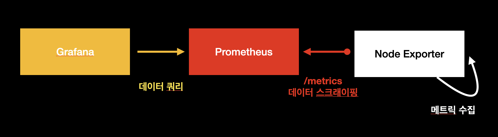
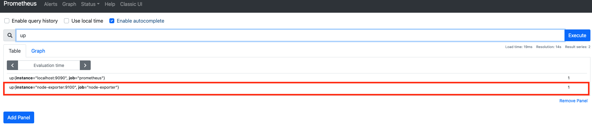
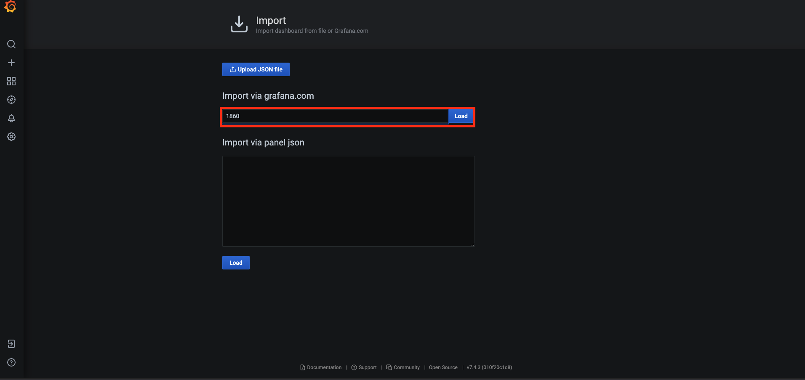
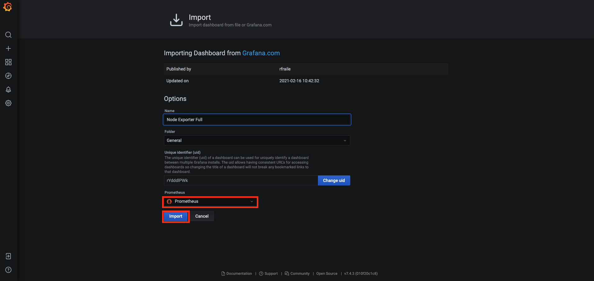

# 시스템 메트릭 모니터링하기 (1) node-exporter


## 개요

이 문서에서는 `Grafana`, `Prometheus`, `node-exporter`를 이용해서 시스템 메트릭을 모니터링할 수 있는 대시보드를 구축하는 것에 대하여 다룬다. 자세한 내용은 다음과 같다.

* node-exporter란 무엇인가
* node-exporter 설치
* node-exporter, Prometheus 연동
* 시스템 메트릭 모니터링을 위한 Grafana 대시보드 구축

이 문서에서 진행되는 실습 코드는 편의성을 위해 로컬 `Docker` 환경에서 진행되나, 실세 서버 환경에서도 거의 동일하게 적용할 수 있도록 작성되었다. 이번 장의 코드는 다음 링크에서 확인할 수 있다.

* 이번 장 코드 : [https://github.com/gurumee92/gurumee-book-prometheus/tree/master/src/part2/ch02](https://github.com/gurumee92/gurumee-book-prometheus/tree/master/src/part2/ch02)

이 문서에서 구성하는 인프라스트럭처는 다음과 같다.



## node-exporter란 무엇인가

`node-exporter`란 UNIX 계열 커널을 가진 하드웨어와 OS릭 등 "시스템 메트릭"을 수집하는 `Exporter`이다. `Prometheus` 재단이 공식적으로 지원하고 있는 `Exporter` 중 하나이며 `Prometheus`로 모니터링 시스템을 구축 시 시스템 메트릭 수집을 위해 가장 우선적으로 고려되는 `Exporter`이기도 하다. 

> 참고! Exporter가 무엇인가요?
> 
> Exporter란 특정 메트릭을 수집해서 엔드포인트에 노출시키는 소프트웨어 혹은 에이전트라고 보시면 됩니다. node-exporter가 UNIX 계열 서버의 cpu, memory 등의 메트릭을 수집할 수 있는 것처럼, DB, 하드웨어, 메세지 시스템, 저장소 등 여러 시스템에 대한 익스포터가 존재하며, CollectD 등 기존의 서버 모니터링에 사용되는 에이전트들과 통합할 수 있는 익스포터도 존재합니다.

## node-exporter 설치 (로컬)

로컬 환경에서는 `Docker`로 설치를 진행한다. 터미널에 다음을 입력하여 설치할 수 있다.

```bash
$ docker run --rm -p 9100:9100 prom/node-exporter 
```

그 후 새로운 터미널을 열어 다음 명령어를 입력해서 수집되는 데이터가 있는지 확인한다.

```bash
$ curl localhost:9100/metrics
# HELP go_gc_duration_seconds A summary of the pause duration of garbage collection cycles.
# TYPE go_gc_duration_seconds summary
go_gc_duration_seconds{quantile="0"} 0
go_gc_duration_seconds{quantile="0.25"} 0
go_gc_duration_seconds{quantile="0.5"} 0
go_gc_duration_seconds{quantile="0.75"} 0
go_gc_duration_seconds{quantile="1"} 0
go_gc_duration_seconds_sum 0
go_gc_duration_seconds_count 0
...
```

역시 `docker-compose.yml`로 실행이 가능하다.

```bash
$ pwd
/Users/gurumee/Workspace/gurumee-book-prometheus/src/part2/ch02

$ docker compose up -d node-exporter
...

$ docker ps
CONTAINER ID   IMAGE                    COMMAND                  CREATED          STATUS          PORTS      NAMES
c8480fc6f79c   b8a614cef113             "/bin/node_exporter"     3 seconds ago    Up 2 seconds    9100/tcp   node-exporter
```

## node-exporter 설치 (서버)

서버 환경에서는 다음과 같이 명령어를 입력하여 `node-exporter`를 설치할 수 있다.

```bash
# 현재 위치 확인
$ pwd
/home/sidelineowl

# 압축 파일 다운로드
$ wget https://github.com/prometheus/node_exporter/releases/download/v1.2.0/node_exporter-1.2.0.linux-amd64.tar.gz

# 압축 파일 해제
$ tar -xvf node_exporter-1.2.0.linux-amd64.tar.gz

# 압축 파일 삭제
$ rm node_exporter-1.2.0.linux-amd64.tar.gz 

# 압축 해제된 디렉토리 ~/apps/node_exporter 경로 변경
$ mv node_exporter-1.2.0.linux-amd64 ~/apps/node_exporter

# node_exporter 설치된 디렉토리로 이동
$ cd apps/node_exporter/

# node_exporter 실행
$ ./node_exporter 
...
```

이제 리눅스 서비스로 등록하자.

```bash 
$ pwd
/home/sidelineowl/apps/node_exporter

# user 추가
$ sudo useradd -M -r -s /bin/false node_exporter

# 실행 파일 /usr/local/bin/으로 경로 이동
$ sudo cp ./node_exporter /usr/local/bin

# /usr/local/bin/node_exporter node_exporter 유저, 그룹 권한 주기
$ sudo chown node_exporter:node_exporter /usr/local/bin/node_exporter

# 서비스 파일 등록
$ sudo tee /etc/systemd/system/node_exporter.service << EOF
[Unit]
Description=Node Exporter
Wants=network-online.target
After=network-online.target

[Service]
User=node_exporter
Group=node_exporter
Type=simple
ExecStart=/usr/local/bin/node_exporter

[Install]
WantedBy=multi-user.target
EOF

# 데몬 리로드
# sudo systemctl daemon-reload
```

이후 터미널에 다음을 입력하면 `node-exporter`를 구동시킬 수 있다.

```bash
# 서비스 가동
$ sudo systemctl restart node_exporter

# 서비스 상태 확
$ sudo systemctl status node_exporter
● node_exporter.service - Node Exporter
   Loaded: loaded (/etc/systemd/system/node_exporter.service; disabled; vendor pr>
   Active: active (running) since Tue 2021-07-20 09:32:38 UTC; 5s ago
 Main PID: 48153 (node_exporter)인
...
```

그 후 새로운 터미널을 열어 다음 명령어를 입력해서 수집되는 데이터가 있는지 확인한다.

```bash
$ curl localhost:9100/metrics
# HELP go_gc_duration_seconds A summary of the pause duration of garbage collection cycles.
# TYPE go_gc_duration_seconds summary
go_gc_duration_seconds{quantile="0"} 0
go_gc_duration_seconds{quantile="0.25"} 0
go_gc_duration_seconds{quantile="0.5"} 0
go_gc_duration_seconds{quantile="0.75"} 0
go_gc_duration_seconds{quantile="1"} 0
go_gc_duration_seconds_sum 0
go_gc_duration_seconds_count 0
...
```

## Prometheus 연동

이제 `Prometheus`에서 `node-exporter`가 수집하고 있는 메트릭을 스크래이핑 해보자. `Prometheus` 설정 파일을 보면 `scrape_config` 밑에 다음과 같이 `node-exporter` 관련 `job`이 등록 된 것을 확인할 수 있다. 

[src/part2/ch02/prometheus/prometheus.yml](https://github.com/gurumee92/gurumee-book-prometheus/blob/master/src/part2/ch02/prometheus/prometheus.yml)
```yml
# ...
scrape_configs:
  # ...

  - job_name: 'node-exporter'
    scrape_interval: 5s

    static_configs:
      - targets: ['node-exporter:9100']
```

`static_configs` 밑에 `targets`에서 `node-exporter`가 구동된 인슨턴스들의 "IP:9100"을 적어주면, `Prometheus`가 `scrape_interval`에 설정된 주기마다 각 인스턴스들에서 수집되는 메트릭을 스크래이핑하여 저장한다. 이제  Prometheus`를 구동시켜보자.

```bash
# local
$ docker compose up -d prometheus

# server
$ sudo systecmctl restart prometheus
```

`Prometheus UI`에서 다음 쿼리를 입력해보자.

```
up
```


그럼 다음과 같이 우리가 설정한 `node-exporter`란 `job_name`으로 수집되고 있는 인스턴스들의 개수를 확인할 수 있다.


 
## Grafana 대시보드 구축 

이제 `Grafana`에서 대시보드를 구축해보자. 먼저 터미널에 다음을 입력한다.

```bash
# local
$ docker compose up -d grafana

# server
$ sudo systecmctl restart grafana-server
``` 

`Grafana`로 대시보드를 구축할 때 정말 좋은 점은 `node-exporter`같이 많이 사용하는 `Exporter`에 대한 대시보드가 이미 공유되어서 그것을 손쉽게 사용할 수 있다는 것이다. 먼저 다음 경로로 이동한다.

* [node-exporter 그라파나 대시보드](https://grafana.com/grafana/dashboards/1860)
  
그러면 아래 화면이 보이는데 다음을 복사한다.


그 후 대시보드로 이동한 후, 왼쪽 탭의 두 번째 "+"의 "Import" 메뉴를 클릭한다.


그러면 다음 화면에서 아까 복사한 대시보드 ID를 입력하고 "Load" 버튼을 누른다.



그 후 "Datasource"에서 "Prometheus"를 선택한 뒤 "Import"를 누른다.



그럼 다음 화면이 보인다.


기본 설정된 값으로는 잘 안보일 수 있으니 우측 상단 메뉴에서 "Last 5 Minutes"를 설정하고, 리프레시 간격을 5s로 바꾸는 것이 좋다. 실 서버에서는 서버 부하가 걸릴 수 있으니 15분에 10초가 적당하겠다. 

이 대시보드에서 우리가 확인할 수 있는 지표들은 크게 다음과 같다.

* CPU
* Memory
* Disk
* Network
* File System
* System Daemon
* Node Exporter

이는 대시보드에서 확인할 수 있으니 한 번 확인해보길 바란다. 각 패널마다 `edit`을 누르면, `Grafana`에서 `Prometheus`를 어떻게 쿼리하는지 살펴볼 수 있다. 눈에 익도록 한 번씩 살펴두는 것이 좋다. 지금은 이해가 안가더라도 이 쿼리로 이런 지표를 땡겨온다 정도만 알고 있으면 된다.