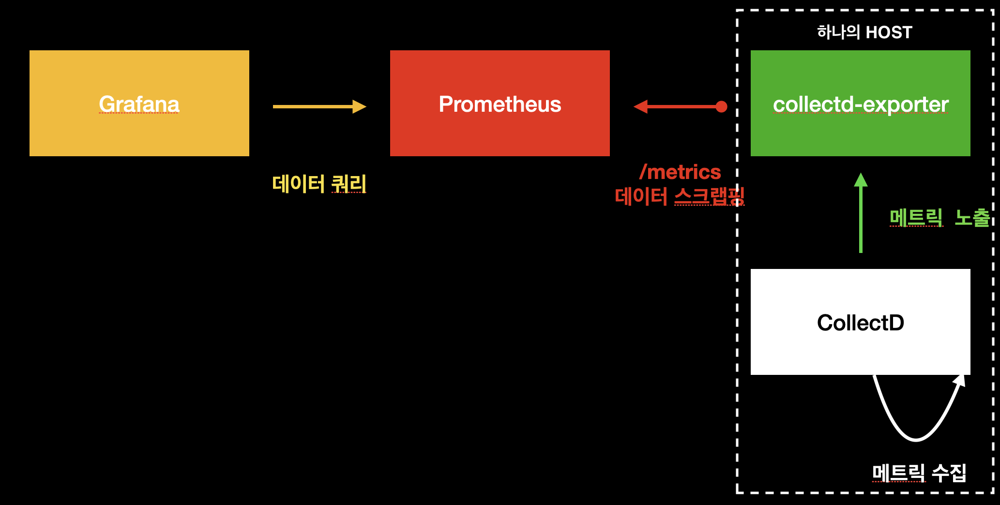
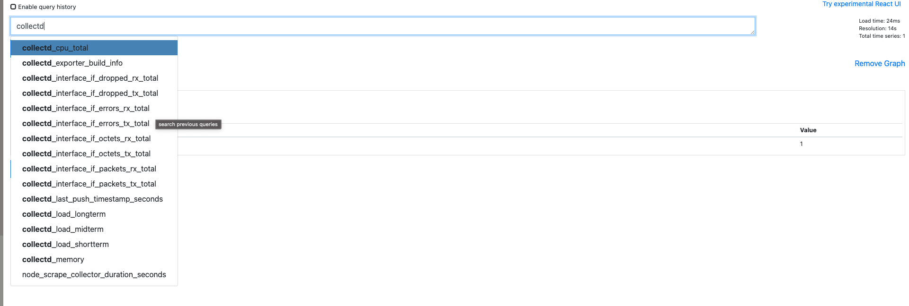
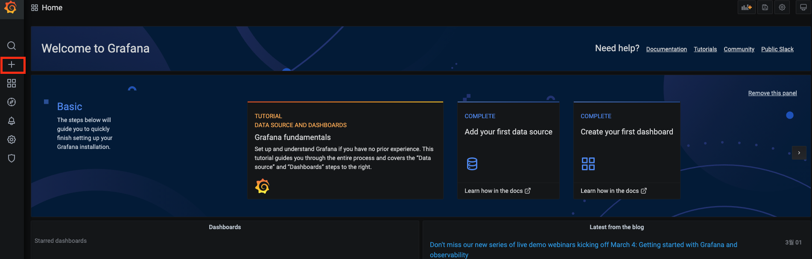
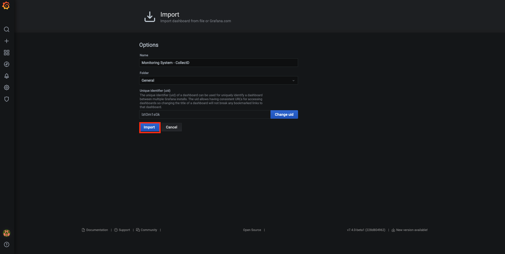

# 시스템 메트릭 모니터링하기 (2) collectd-exporter


## 개요

이 문서에서는 `Grafana`, `Prometheus`, `CollectD`, `collectd-exporter`를 이용해서 시스템 메트릭을 모니터링할 수 있는 대시보드를 구축하는 것에 대하여 다룬다. 자세한 내용은 다음과 같다.

* CollectD와 설치
* collectd-exporter와 설치
* 메트릭 수집을 위한 각 컴포넌트 설정
* 시스템 메트릭 모니터링을 위한 Grafana 대시보드 구축

이 문서에서 진행되는 실습 코드는 편의성을 위해 로컬 `Docker` 환경에서 진행되나, 실세 서버 환경에서도 거의 동일하게 적용할 수 있도록 작성되었다. 이번 장의 코드는 다음 링크에서 확인할 수 있다.

* 이번 장 코드 : [https://github.com/gurumee92/gurumee-book-prometheus/tree/master/src/part2/ch03](https://github.com/gurumee92/gurumee-book-prometheus/tree/master/src/part2/ch03)

이 문서에서 구성하는 인프라스트럭처는 다음과 같다.



## CollectD와 설치

`CollectD`는 전통적인 시스템 메트릭 모니터링 도구 중 하나이다. Agent 형태의 도구이며 시스템 뿐 아니라 애플리케이션 성능 관련 메트릭을 수집할 수 있다. `C`로 작성되어서 가볍고 빠르며 오래된 만큼 수 많은 플러그인들을 제공하여, 이를 통해서 다양한 메트릭 수집은 물론 시각화도 가능하다.

또한, 제공되는 플러그인을 활용하여 `Prometheus`, `Graphite` 등의 최신 모니터링 시스템과의 통합도 가능하다. 

이제 설치를 해보자. 로컬 환경에서는 역시 `Docker`로 설치한다. 아쉬운 점은 공식적으로 제공하는 `CollectD` 이미지는 없다. 하지만 어떤 착한 개발자가 최신 버전은 아니지만 이미지를 사용할 수 있도록 배포를 해 두었다. 터미널에 다음을 입력한다.

```bash
$ docker run chimeradev/collectd:5.5.0-3
```  

역시 이번 장의 코드를 다운 받으면 `docker-compose.yml`을 통해서 손쉽게 구동시킬 수 있다.

```bash
# 현재 위치
$ pwd
/Users/gurumee/Workspace/gurumee-book-prometheus/src/part2/ch03

$ docker compose up -d collectd
```

서버 환경에서는 다음과 같이 `CollectD`를 설치할 수 있다. 

```bash
# Yum 패키지 업데이트
$ sudo yum search epel-release
$ sudo yum info epel-release
$ sudo yum install epel-release -y

# CollectD 설치
$ sudo yum install collectd -y

# CollectD 모듈 설치
$ sudo yum install collectd-* -y
```

끝이다. 이제 서비스를 실행한다.

```bash
# collectd 서비스 실행
$ sudo systemctl start collectd

# collectd 서비스 상태 확인
$ sudo systemctl status collectd
● collectd.service - Collectd statistics daemon
  Loaded: loaded (/usr/lib/systemd/system/collectd.service; disabled; vendor preset: disabled)
   Active: active (running) since 금 2021-02-26 01:35:12 UTC; 1min 58s ago
     Docs: man:collectd(1)
           man:collectd.conf(5)
 Main PID: 21910 (collectd)
    Tasks: 11
   Memory: 1.1M
   CGroup: /system.slice/collectd.service
           └─21910 /usr/sbin/collectd
...
```

## collectd-exporter와 설치

`Prometheus` 생태계에서 `node-exporter`는 시스템을 메트릭 모니터링하는데 선택할 수 있는 최고의 방법 중 하나이다. 하지만 `node-exporter`는 시스템 모니터링 도구 중 비교적 최신 기술에 속한다. 이 말은 이미 구축된 시스템들은 다른 모니터링 도구를 가지고 있을 가능성이 매우 높다는 뜻이다. 물론 기존 모니터링 도구를 버리고 `node-exporter`를 도입할 수는 있다. 하지만 운영자 입장에서는 그 일이 매우 도전적인 과제일 수 있다. 잘 돌고 있는 시스템을 바꾼다는 것이니까.

이를 해결할 수 있도록 `Prometheus` 재단은 기존 시스템과 통합할 수 있도록 여러 `Exporter`들을 제공한다. `collectd-exporter`는 그 중 하나인데, `CollectD`와 `Prometheus`를 통합하게 만들어주는 `Exporter`이다. `CollectD`가 수집하는 데이터를 `collectd-exporter`는 엔드포인트에 노출시켜서 `Prometheus`가 그 데이터를 수집할 수 있게 만들어준다. 

로컬 환경에서 `collectd-exporter`는 다음과 같이 설치할 수 있다.

```bash
$ docker run prom/collectd-exporter
```

역시 이번 장의 코드를 다운 받으면 `docker-compose.yml`을 통해서 손쉽게 구동시킬 수 있다.

```bash
# 현재 위치
$ pwd
/Users/gurumee/Workspace/gurumee-book-prometheus/src/part2/ch03

$ docker compose up -d collectd-exporter
```

서버 환경에서는 다음과 같이 설치할 수 있다.

```bash
# 압축 파일 다운로드
$ wget https://github.com/prometheus/collectd_exporter/releases/download/v0.5.0/collectd_exporter-0.5.0.linux-amd64.tar.gz

# 압축 파일 해제
$ tar -xvf collectd_exporter-0.5.0.linux-amd64.tar.gz

# 압축 파일 제거
$ rm collectd_exporter-0.5.0.linux-amd64.tar.gz

# 디렉토리 경로 수정
$ mv collectd_exporter-0.5.0.linux-amd64 ~/apps/collectd_exporter

# 디렉토리 이동
$ cd apps/collectd_exporter

# CollectD 실행
$ ./collectd_exporter
level=info ts=2021-02-26T03:48:48.401Z caller=main.go:321 msg="Starting collectd_exporter" version="(version=, branch=, revision=)"
level=info ts=2021-02-26T03:48:48.401Z caller=main.go:322 msg="Build context" context="(go=go1.14.2, user=, date=)"
...
```

마찬가지로 편하게 사용하기 위해서 서비스 등록을 하자.

```bash
# 현쟈 위치 확인
$ pwd
/home/sidelineowl/apps/collectd_exporter

# collectd_exporter 유저 생성
$ sudo useradd -M -r -s /bin/false collectd_exporter

# 실행 파일 /usr/local/bin/으로 경로 이동
$ sudo cp ./collectd_exporter /usr/local/bin

# /usr/local/bin/collectd_exporter collectd_exporter 유저, 그룹 권한 주기
$ sudo chown collectd_exporter:collectd_exporter /usr/local/bin/collectd_exporter

# 서비스 파일 등록
$ sudo tee /etc/systemd/system/collectd_exporter.service << EOF
[Unit]
Description=CollectD Exporter
Wants=network-online.target
After=network-online.target

[Service]
User=collectd_exporter
Group=collectd_exporter
Type=simple
ExecStart=/usr/local/bin/collectd_exporter

[Install]
WantedBy=multi-user.target
EOF

# 데몬 리로드
$ sudo systemctl daemon-reload
```

그 후 다음을 터미널에 다음을 입력한다.

```bash
$ sudo systemctl start collectd_exporter

$ sudo systemctl status collectd_exporter
● collectd_exporter.service - CollectD Exporter
   Loaded: loaded (/etc/systemd/system/collectd_exporter.service; disabled; vendor preset: disabled)
   Active: active (running) since Wed 2021-07-21 07:52:11 UTC; 8s ago
 Main PID: 3030 (collectd_export)
    Tasks: 4 (limit: 23667)
   Memory: 2.4M
   CGroup: /system.slice/collectd_exporter.service
           └─3030 /usr/local/bin/collectd_exporter
...
```

설치가 완료되면 터미널에 다음을 입력하면 `collectd-exporter`가 잘 동작하는지 확인할 수 있다.

```bash
$ curl localhost:9103/metrics
# HELP collectd_exporter_build_info A metric with a constant '1' value labeled by version, revision, branch, and goversion from which collectd_exporter was built.
# TYPE collectd_exporter_build_info gauge
collectd_exporter_build_info{branch="",goversion="go1.14.2",revision="",version=""} 1
# HELP collectd_last_push_timestamp_seconds Unix timestamp of the last received collectd metrics push in seconds.
# TYPE collectd_last_push_timestamp_seconds gauge
collectd_last_push_timestamp_seconds 0
# HELP go_gc_duration_seconds A summary of the pause duration of garbage collection cycles.
# TYPE go_gc_duration_seconds summary
go_gc_duration_seconds{quantile="0"} 0
go_gc_duration_seconds{quantile="0.25"} 0
go_gc_duration_seconds{quantile="0.5"} 0
go_gc_duration_seconds{quantile="0.75"} 0
go_gc_duration_seconds{quantile="1"} 0
...
```

## 메트릭 수집을 위한 각 컴포넌트 설정

이제 `CollectD`와 `collectd-exporter`를 연동해야 한다. `CollectD` 설정 파일을 다음과 같이 수정한다. 서버 환경에서는 `/etc/collectd.conf` 경로에 설정 파일이 위치한다. 

[src/part2/ch03/collectd/collectd.conf](https://github.com/gurumee92/gurumee-book-prometheus/tree/master/src/part2/ch03/collectd/collectd.conf)
```conf
LoadPlugin network
LoadPlugin users
LoadPlugin entropy
LoadPlugin load
LoadPlugin memory
LoadPlugin swap
LoadPlugin uptime

LoadPlugin syslog

<Plugin syslog>
    LogLevel info
</Plugin>

LoadPlugin cpu

<Plugin cpu>
  ReportByCpu true
  ReportByState true
  ValuesPercentage false
  ReportNumCpu false
  ReportGuestState false
  SubtractGuestState true
</Plugin>

LoadPlugin interface

<Plugin interface>
    Interface "eth0"
    IgnoreSelected false
</Plugin>

LoadPlugin df

<Plugin df>
    IgnoreSelected false
    MountPoint "/"
</Plugin>

LoadPlugin write_http

<Plugin write_http>
  <Node "collectd_exporter">
    <!-- 서버라면 "localhost:9103" 혹은 "127.0.0.1:9103" -->
    URL "http://collectd-exporter:9103/collectd-post"
    Format "JSON"
    StoreRates false
  </Node>
</Plugin>
```

그리고, `CollectD`와 `collectd-exporter`를 재기동한다. 터미널에 다음을 입력한다. 로컬에서는 (`docker compose down`, `docker compose up`만으로 충분하다.)

```bash
$ sudo systemctl restart collectd
$ sudo systemctl restart collectd_exporter

$ curl http://localhost:9103/metrics | grep "collectd"
# HELP collectd_cpu_total Collectd exporter: 'cpu' Type: 'cpu' Dstype: 'api.Derive' Dsname: 'value'
# TYPE collectd_cpu_total counter
collectd_cpu_total{cpu="0",instance="f31de5df3931",type="idle"} 702423
collectd_cpu_total{cpu="0",instance="f31de5df3931",type="interrupt"} 0
collectd_cpu_total{cpu="0",instance="f31de5df3931",type="nice"} 24
collectd_cpu_total{cpu="0",instance="f31de5df3931",type="softirq"} 479
collectd_cpu_total{cpu="0",instance="f31de5df3931",type="steal"} 0
...
```

`collectd_*`로 시작하는 메트릭 이름이 수집되고 있다면 성공이다. 이 때 만약, 아무리 기다랴도 메트릭이 수집이 안될 때가 있다. 이 떄는 터미널에 다음 명령어를 입력해보자.

```bash
$ sudo systemctl status collectd
...
Jul 21 11:05:59 gbp-02 collectd[145526]: write_http plugin: curl_easy_perform failed with status 7:
Jul 21 11:05:59 gbp-02 collectd[145526]: Filter subsystem: Built-in target `write': Dispatching value to all write plugins failed with status>
Jul 21 11:05:59 gbp-02 collectd[145526]: Filter subsystem: Built-in target `write': Some write plugin is back to normal operation. `write' s
...
```

`centos 8`에서는 확인이 안되는데 `centos 7`에서는 해당 IP의 "Permission Denied"라는 에러가 나온다. 이는 `SELinux` 설정 문제인데, `/etc/selinux/config`를 다음과 같이 수정한다.

/etc/selinux/config
```bash
# This file controls the state of SELinux on the system.
# SELINUX= can take one of these three values:
#     enforcing - SELinux security policy is enforced.
#     permissive - SELinux prints warnings instead of enforcing.
#     disabled - No SELinux policy is loaded.
### SELINUX=enforcing를 수정 ####
SELINUX=disabled
# SELINUXTYPE= can take one of these three values:
#     targeted - Targeted processes are protected,
#     minimum - Modification of targeted policy. Only selected processes are protected.
#     mls - Multi Level Security protection.
SELINUXTYPE=targeted
```

이후 시스템을 재부팅한 후, 서비스를 다시 가동하면 해결된다. 이제 `Prometheus`가 `collectd-exporter` 노출하고 있는 데이터들을 스크랩핑할 수 있게 설정 파일을 수정한다.

[src/part2/ch03/prometheus/prometheus.yml](https://github.com/gurumee92/gurumee-book-prometheus/tree/master/src/part2/ch03/prometheus/prometheus.yml)
```yml
# ...

scrape_configs:
  # ...  
  - job_name: 'collectd-exporter'
    static_configs:
    - targets: ['collectd-exporter:9103']
```

그리고 `Prometheus`도 재기동을 해준다.

```bash
$ sudo systemctl restart prometheus
```

이제 `Prometheus UI`로 접속해서 다음 쿼리가 있는지 확인해보자.


이게 되면 `collectd-*`로 시작되는 메트릭들이 잘 수집되고 있는지 한 번 확인해보자.



## 시스템 메트릭 모니터링을 위한 Grafana 대시보드 구축

아쉽게도 `collectd-exporter`와 `Prometheus` 관련 대시보드는 `node-exporter`와 달리 공식적으로 제공하지 않고 있다. 대부분 데이터 소스가 `Graphite` 기반인 걸로 봐서는 `Prometheus`와 잘 쓰이진 않는 것 같다. 그래서 따로 구축해보았다. 이 대시보드 설정 코드는 Github에 올려두었다. 다음 링크에서 확인할 수 있으니 해당 내용을 복사해오자.

* [src/part2/ch03/grafana/dashboard.json](https://github.com/gurumee92/gurumee-book-prometheus/tree/master/src/part2/ch03/grafana/dashboard.json)

먼저 그라파나에 접속한다. 그 후 "+" 버튼을 누른다.



그럼 아래와 같이 메뉴가 보이는데 "Import"를 누른다.


그 후 위 링크에서 제공하고 있는 json 파일을 복사하여 붙여넣고 "Load"를 누른다.


그럼 위와 같이 입력값들이 자동적으로 채워진다. "Import"를 누른다.



그럼 다음 대시보드가 구축된다.


간단하게 다음과 같은 지표들을 확인할 수 있다.

* CPU
* Memory
* Interface 관련 지표

`CollectD` 관련 기본 플러그인만 활성화했기 때문에 수집되는 지표가 `node-exporter`에 비해 많지 않다. 또한 같은 지표더라도 조금씩 다른 값으로 수집되는 것을 확인할 수 있다. `CollectD` 설정에 따라서 달라지겠지만, 이 장의 범위를 벗어난 내용이어서 이는 생략한다. 관심이 있는 사람들은 `CollectD` 공식 문서를 기반으로 설정을 변경하면서 어떻게 바뀌는지 확인해보는 것도 좋은 공부가 될 것이다.


