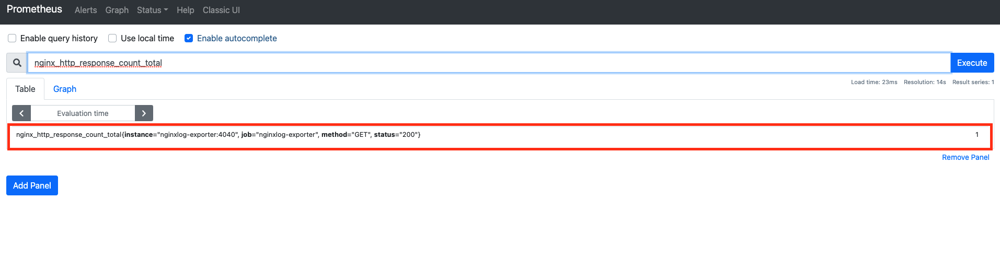

# 웹 서버 모니링하기 (1) prometheus-nginxlog-exporter

이번 장에서는 웹 서버 그 중에서도 `nginx`를 모니터링하는 방법에 대해서 다룬다. 이번 장에서는 `nginx`의 액세스 로그를 이용하여 상태 코드, RPS, 요청 성공률, 응답 시간에 대한 지표를 수집 및 시각화하는데 초점을 맞춘다. 더 많은 지표를 모니터링하기 위해서는 `nginx`에 모듈들을 탑재해야 한다. 그렇게 하기 위한 설정들이 필요한데 이는 이 장에서 다루지 않겠다.

## NGINX란 무엇인가


`nginx`는 웹 서버 소프트웨어로, 가벼움과 높은 성능을 목표로 한다. 웹 서버, 리버스 프록시 및 메일 프록시 기능을 제공하고 있다. 상용 제품의 기능도 강력하지만 오픈소스로 제공되는 기본 `nginx` 역시 성능이 좋고 커스터마이징 하기 쉬워서 많이 사용되는 웹 서버 중 하나이다.

## prometheus-nginxlog-exporter란 무엇인가

`Prometheus` 재단에서 추천하는 `nginx` 관련 익스포터 및 라이브러리는 `Nginx metric library`와 `Nginx VTS exporter`이다. 그러나 `Nginx VTS exporter`는 더 이상 유지보수되지 않는 익스포터이고 `Nginx metric library`는 `Lua`라는 스크립트 언어로 작성되었으며, `nginx`의 부가적인 설정이 필요해서 적용하기 매우 어렵다. 그래서 이번에는 비공식적인 서드 파트 익스포터를 써보고자 한다.

바로 `nginxlog-exporter`이다. 이 익스포터는 `nginx`의 액세스 로그를 파싱하여, 상태 코드에 대한 정보를 수집하여, 엔드포인트에 노출시켜주는 계측기이다. 수집하는 메트릭은 매우 적지만, 그래도 이를 통해 상태 코드 개수, RPS(request per sec), 요청 성공률에 대한 지표를 얻을 수 있다. 


## 로컬 환경에서 설치부터 대시보드 구축까지

각 컴포넌트 간 자세한 설정은 다음 절에서 진행하기로 하고, 로컬 환경에서는 구축된 컴포넌트들을 살펴보도록 한다. 우선 다음 URL에서 코드를 얻어온다.

* [https://github.com/gurumee92/gurumee-prometheus-code/tree/master/part2/ch07](https://github.com/gurumee92/gurumee-prometheus-code/tree/master/part2/ch07)

```
|- config
    |- dashboard.json
    |- dashboard.yml
    |- datasource.yml
    |- nginx.conf
    |- prometheus-nginxlog-exporter.yml
    |- prometheus.yml
|- docker-compose.yml
```

이 구성 파일들을 토대로 `docker-compose up` 명령어를 입력하면 설치부터 대시보드 구축까지 모두 끝난다.

```bash
# 현재 위치 확인
$ pwd
# docker-compose.yml이 들어있는 디렉토리 경로
/Users/a1101320/Studies/gitbooks/gurumee-prometheus/code/part2/ch07

# 컨테이너 실행
$ docker-compose up -d

# 컨테이너 확인
$ docker ps
CONTAINER ID   IMAGE                                                COMMAND                  CREATED         STATUS         PORTS                    NAMES
13d0475a9d7c   grafana/grafana:latest                               "/run.sh"                3 seconds ago   Up 2 seconds   0.0.0.0:3000->3000/tcp   grafana
dec8e781e59b   quay.io/martinhelmich/prometheus-nginxlog-exporter   "/prometheus-nginxlo…"   3 seconds ago   Up 2 seconds   0.0.0.0:4040->4040/tcp   nginxlog-exporter
81214558080f   nginx:latest                                         "/docker-entrypoint.…"   3 seconds ago   Up 2 seconds   0.0.0.0:8080->80/tcp     nginx
4004c4fdc158   prom/prometheus:latest                               "/bin/prometheus --c…"   3 seconds ago   Up 2 seconds   0.0.0.0:9090->9090/tcp   prometheus
```

이제 먼저 터미널에서, `curl` 명령어를 이용해 `nginxlog-exporter`가 수집하고 있는 데이터를 확인해보자.

```bash
$ curl localhost:4040/metrics
# HELP nginx_parse_errors_total Total number of log file lines that could not be parsed
# TYPE nginx_parse_errors_total counter
nginx_parse_errors_total 0
```

현재는 `nginx`가 생성한 액세스 로그가 없기 때문에, 메트릭이 수집된 것이 없다. 이제 `curl` 명령어로 `nginx`를 접속해보자.

```bash
$ curl localhost:8080
<!DOCTYPE html>
<html>
<head>
<title>Welcome to nginx!</title>
<style>
    body {
        width: 35em;
        margin: 0 auto;
        font-family: Tahoma, Verdana, Arial, sans-serif;
    }
</style>
</head>
<body>
<h1>Welcome to nginx!</h1>
<p>If you see this page, the nginx web server is successfully installed and
working. Further configuration is required.</p>

<p>For online documentation and support please refer to
<a href="http://nginx.org/">nginx.org</a>.<br/>
Commercial support is available at
<a href="http://nginx.com/">nginx.com</a>.</p>

<p><em>Thank you for using nginx.</em></p>
</body>
</html>
```

이제 `docker-compose.yml`이 위치한 디렉토리에 보면 "logs"라는 디렉토리가 생성되었을 것이다. 여기에 보면 "access.log" 파일이 다음과 같이 생성되어 있다.

```
172.31.0.1 - - [10/Mar/2021:07:38:54 +0000] "GET / HTTP/1.1" 200 612 "-" "curl/7.64.1" "0.000"
```

`nginxlog-exporter`는 이를 파싱해서 상태코드 200에 대한 요청 정보를 수집하고 있을 것이다.

```bash
$ curl localhost:4040/metrics
# HELP nginx_http_response_count_total Amount of processed HTTP requests
# TYPE nginx_http_response_count_total counter
nginx_http_response_count_total{method="GET",status="200"} 1
# HELP nginx_http_response_size_bytes Total amount of transferred bytes
# TYPE nginx_http_response_size_bytes counter
nginx_http_response_size_bytes{method="GET",status="200"} 612
# HELP nginx_http_response_time_seconds Time needed by NGINX to handle requests
# TYPE nginx_http_response_time_seconds summary
nginx_http_response_time_seconds{method="GET",status="200",quantile="0.5"} 0
nginx_http_response_time_seconds{method="GET",status="200",quantile="0.9"} 0
nginx_http_response_time_seconds{method="GET",status="200",quantile="0.99"} 0
nginx_http_response_time_seconds_sum{method="GET",status="200"} 0
nginx_http_response_time_seconds_count{method="GET",status="200"} 1
# HELP nginx_http_response_time_seconds_hist Time needed by NGINX to handle requests
# TYPE nginx_http_response_time_seconds_hist histogram
nginx_http_response_time_seconds_hist_bucket{method="GET",status="200",le="0.005"} 1
nginx_http_response_time_seconds_hist_bucket{method="GET",status="200",le="0.01"} 1
nginx_http_response_time_seconds_hist_bucket{method="GET",status="200",le="0.025"} 1
nginx_http_response_time_seconds_hist_bucket{method="GET",status="200",le="0.05"} 1
nginx_http_response_time_seconds_hist_bucket{method="GET",status="200",le="0.1"} 1
nginx_http_response_time_seconds_hist_bucket{method="GET",status="200",le="0.25"} 1
nginx_http_response_time_seconds_hist_bucket{method="GET",status="200",le="0.5"} 1
nginx_http_response_time_seconds_hist_bucket{method="GET",status="200",le="1"} 1
nginx_http_response_time_seconds_hist_bucket{method="GET",status="200",le="2.5"} 1
nginx_http_response_time_seconds_hist_bucket{method="GET",status="200",le="5"} 1
nginx_http_response_time_seconds_hist_bucket{method="GET",status="200",le="10"} 1
nginx_http_response_time_seconds_hist_bucket{method="GET",status="200",le="+Inf"} 1
nginx_http_response_time_seconds_hist_sum{method="GET",status="200"} 0
nginx_http_response_time_seconds_hist_count{method="GET",status="200"} 1
# HELP nginx_parse_errors_total Total number of log file lines that could not be parsed
# TYPE nginx_parse_errors_total counter
nginx_parse_errors_total 0
```

공식 문서에 따르면 각 지표는 다음과 같다.

* nginx_http_response_count_total : http 누적 요청 개수 (status, method 등의 태그 존재) 
* nginx_http_response_size_bytes : http 누적 요청 크기 (status, method 등의 태그 존재) 
* nginx_http_response_time_seconds : http 응답 시간 관련 벡터
* nginx_http_response_time_seconds_hist : http 응답 시간 관련 히스토그램 백터

참고로 `nginx_http_response_time_seconds*`은 기본으로 수집되는 지표는 아니고 `nginx` 로그 설정에 "request_time"이란 포맷을 지정해두어야 수집된다. 이에 대한 설정은 다음 절에서 확인할 수 있다.

이제 `Prometheus`에서 `nginxlog-exporter`가 수집하는 데이터를 잘 가져오고 있는지 확인해보자. 브라우저에서 "localhost:9090"을 접속한다. 그럼 다음 화면이 보인다.



여기서, "nginx_http_response_count_total"를 쿼리해보자. 그럼 다음 결과가 나온다.


이전 `curl` 명령어로 `localhost:4040/metrics`를 접속했을 때와 같은 결과가 나오는 것을 확인할 수 있다.

```bash
$ curl localhost:4040/metrics
# HELP nginx_http_response_count_total Amount of processed HTTP requests
# TYPE nginx_http_response_count_total counter
nginx_http_response_count_total{method="GET",status="200"} 1
...
```
이제 구축된 대시보드를 확인해보자. 브라우저에서 "localhost:3000"으로 접속한다. 다음 UI가 보일 것이다.


위의 대시보드를 들어가면, RPS, 상태 코드 별 개수, 요청 성공률, 응답 시간에 대한 지표를 시각화한 것을 볼 수 있다.


이제 브라우저에 접속해서 "localhost:8080/index.html"을 여러 번 빠르게 접속해 본 후, 다시 대시보드를 확인해보자.


이런 식으로 그래프가 변경되는 것을 확인할 수 있다.

## 서버 환경에서 설치부터 대시보드 구축까지

이 실습을 진행하려면 먼저 EC2에서 80, 4040, 9090, 3000번 포트가 개방되어 있어야 한다.

### nginx 설치 및 설정

이제 서버 환경에서 설치부터 구축까지 해보자. 먼저 `nginx`를 설치한다. 역시 진행하기 편하게 `Prometheus`를 설치한 서버에서 진행하기를 바란다.

먼저 ec2 터미널에 접속한 후, `nginx` 설치가 가능한지 확인한다. 터미널에 다음을 입력한다.

```bash
$ yum info nginx
Loaded plugins: extras_suggestions, langpacks, priorities, update-motd
hashicorp                                                                                                              249/249
Error: No matching Packages to list
```

이렇게 나올 경우, 터미널에 다음을 입력하여 `/etc/yum.repos.d/nginx.repo`를 vim 에디터로 열어준다.

```bash
$ sudo vi /etc/yum.repos.d/nginx.repo
```

그 후 다음을 입력하고 저장한다.

/etc/yum.repos.d/nginx.repo
```
[nginx] 
name=nginx repo 
baseurl=http://nginx.org/packages/centos/7/$basearch/ 
gpgcheck=0 
enabled=1
```

다시 한 번 `nginx` 패키지를 찾아본다. 터미널에 다음을 입력한다.

```bash
$ yum info nginx
Loaded plugins: extras_suggestions, langpacks, priorities, update-motd
amzn2-core                                                                                              | 3.7 kB  00:00:00
nginx                                                                                                   | 2.9 kB  00:00:00
nginx/x86_64/primary_db                                                                                 |  59 kB  00:00:00
Available Packages
Name        : nginx
Arch        : x86_64
Epoch       : 1
Version     : 1.18.0
Release     : 2.el7.ngx
Size        : 769 k
Repo        : nginx/x86_64
Summary     : High performance web server
URL         : http://nginx.org/
License     : 2-clause BSD-like license
Description : nginx [engine x] is an HTTP and reverse proxy server, as well as
            : a mail proxy server.
```

이제 `nginx`를 설치한다. 터미널에 다음을 입력한다.

```bash
$ sudo yum install -y nginx
```

이제 `nginx`가 잘 설치되었는지 확인해보자.

```bash
$ nginx -v
nginx version: nginx/1.18.0
```

앞서 말했던 것처럼 응답 시간에 대한 메트릭을 수집하려면, `nginx` 설정 파일을 수정해야 한다. 터미널에 다음을 입력하여 `nginx` 설정 파일을 연다.

```bash
$ sudo vi /etc/nginx/nginx.conf
```

그리고 다음을 입력한다. 

/etc/nginx/nginx.conf
```conf
user  nginx;
worker_processes  1;

error_log  /var/log/nginx/error.log warn;
pid        /var/run/nginx.pid;


events {
    worker_connections  1024;
}

http {
    include       /etc/nginx/mime.types;
    default_type  application/octet-stream;
    # 이 설정이 중요하다!
    log_format  main  '$remote_addr - $remote_user [$time_local] '
                      '"$request" $status $body_bytes_sent '
                      '"$http_referer" "$http_user_agent" "$request_time"'; 


    access_log  /var/log/nginx/access.log  main;

    sendfile        on;
    #tcp_nopush     on;

    keepalive_timeout  65;

    #gzip  on;

    include /etc/nginx/conf.d/*.conf;
}
```

이 소스 코드는 다음 URL에서 확인할 수 있다.

* nginx 설정 파일 : [https://github.com/gurumee92/gurumee-prometheus-code/blob/master/part2/ch07/config/nginx.conf](https://github.com/gurumee92/gurumee-prometheus-code/blob/master/part2/ch07/config/nginx.conf)


이 설정 파일에서 `log_format`과 "access_log"의 경로인 `/var/log/nginx/access.log`는 `nginxlog-exporter`를 설정할 때 필요하므로 잘 기억해두도록 한다. 이제 `nginx`를 실행한다. 터미널에 다음을 입력한다.

```bash
# nginx 시작
$ sudo systemctl start nginx

# nginx 상태 확인
$ sudo systemctl status nginx
● nginx.service - nginx - high performance web server
   Loaded: loaded (/usr/lib/systemd/system/nginx.service; disabled; vendor preset: disabled)
   Active: active (running) since 목 2021-03-04 07:41:42 UTC; 7s ago
     Docs: http://nginx.org/en/docs/
  ...
```

### nginxlog-exporter 설치 및 설정

이제 `nginx` 로그를 파싱하여, 상태 코드 관련 메트릭을 수집할 수 있도록 `nginxlog-exporter`를 설치한다. 터미널에 다음을 입력한다.

```bash
# 전체 앱 관리 디렉토리
$ cd apps

# nginxlog_exporter 디렉토리 생성
$ mkdir nginxlog_exporter

# nginxlog_exporter 디렉토리로 이동
$ cd nginxlog_exporter

# 압축파일 다운
$ wget https://github.com/martin-helmich/prometheus-nginxlog-exporter/releases/download/v1.8.0/prometheus-nginxlog-exporter_1.8.0_linux_amd64.tar.gz

# 압축 파일 해제
$ tar -xvf prometheus-nginxlog-exporter_1.8.0_linux_amd64.tar.gz

# 압축 파일 제거
$ rm prometheus-nginxlog-exporter_1.8.0_linux_amd64.tar.gz

# 실행파일 권한 부여
$ chmod +x prometheus-nginxlog-exporter

# 실행
$ ./prometheus-nginxlog-exporter
using configuration {Listen:{Port:4040 Address:0.0.0.0 MetricsEndpoint:/metrics} Consul:{Enable:false Address: Datacenter: Scheme: Token: Service:{ID: Name: Address: Tags:[]}} Namespaces:[{Name:nginx NamespaceLabelName: NamespaceLabels:map[] MetricsOverride:<nil> NamespacePrefix: SourceFiles:[] SourceData:{Files:[] Syslog:<nil>} Format:$remote_addr - $remote_user [$time_local] "$request" $status $body_bytes_sent "$http_referer" "$http_user_agent" "$http_x_forwarded_for" Labels:map[] RelabelConfigs:[] HistogramBuckets:[] PrintLog:false OrderedLabelNames:[] OrderedLabelValues:[]}] EnableExperimentalFeatures:false EnableExperimentalFeaturesOld:false}
starting listener for namespace nginx
```

이제 설정 파일을 만들어주어야 한다. 같은 경로에 `prometheus-nginxlog-exporter.yml` 파일을 만들어준다.

터미널에 다음을 입력한다. 

```bash
$ vim prometheus-nginxlog-exporter.yml
```

그 후 다음을 입력하고 저장한다.

/home/ec2-user/apps/nginxlog_exporter/prometheus-nginxlog-exporter.yml
```yml
listen:
  port: 4040
  metrics_endpoint: "/metrics"

consul:
  enable: false

namespaces:
  - name: nginx
    format: "$remote_addr - $remote_user [$time_local] \"$request\" $status $body_bytes_sent \"$http_referer\" \"$http_user_agent\" \"$request_time\""
    source:
      files:
        - /var/log/nginx/access.log
    only_count: true
    # response_time을 요청 엔드포인트 별로 볼 수 있게 만드는 설정입니다.
    relabel_configs:
    - target_label: request_uri
      from: request
      split: 2
      separator: ' '  
```

여기서 중요한 것은 "namespaces" 아래 "format"의 값과 "source" 밑에 "files"의 값이 각각 `nginx.conf`에 설정했던 "log_format", "access_log" 파일의 경로가 들어가야 한다. 역시 위 설정 코드 역시 다음 URL에서 확인할 수 있다.

* nginxlog-exporter 설정 파일 : [https://github.com/gurumee92/gurumee-prometheus-code/blob/master/part2/ch07/config/prometheus-nginxlog-exporter.yml](https://github.com/gurumee92/gurumee-prometheus-code/blob/master/part2/ch07/config/prometheus-nginxlog-exporter.yml)

이제 이 설정 파일 토대로 익스포터가 실행하도록 터미널에 다음을 입력한다.

```bash
$ ./prometheus-nginxlog-exporter --config-file /home/ec2-user/apps/nginxlog_exporter/prometheus-nginxlog-exporter.yml
loading configuration file /home/ec2-user/apps/nginxlog_exporter/prometheus-nginxlog-exporter.yml
using configuration {Listen:{Port:4040 Address:0.0.0.0 MetricsEndpoint:/metrics} 
...
```

이제 조금 더 편하게 동작시키기 위해서 서비스로 등록한다. 터미널에 다음을 입력해서 `/etc/systemd/system/nginxlog_exporter.service`를 vim 에디터로 연다

```bash
$ sudo vim /etc/systemd/system/nginxlog_exporter.service
```

그 후 다음을 입력하고 저장한다.

/etc/systemd/system/nginxlog_exporter.service
```
[Unit]
Description=Prometheus Log Exporter
Wants=network-online.target
After=network-online.target

[Service]
User=root
Group=root
Type=simple
ExecStart=/home/ec2-user/apps/nginxlog_exporter/prometheus-nginxlog-exporter --config-file /home/ec2-user/apps/nginxlog_exporter/prometheus-nginxlog-exporter.yml

[Install]
WantedBy=multi-user.target
```

이제 서비스를 실행한다.

```bash
$ sudo systemctl start nginxlog_exporter

$ sudo systemctl status nginxlog_exporter
● nginxlog_exporter.service - Prometheus Log Exporter
   Loaded: loaded (/etc/systemd/system/nginxlog_exporter.service; disabled; vendor preset: disabled)
   Active: active (running) since 목 2021-03-04 08:03:50 UTC; 8s ago
 Main PID: 695 (prometheus-ngin)
    Tasks: 7
   Memory: 1.1M
   CGroup: /system.slice/nginxlog_exporter.service
           └─695 /home/ec2-user/apps/nginxlog_exporter/prometheus-nginxlog-exporter --config-file /home/ec2-user/apps/nginxl...
```

한 번 `curl`을 이용해서 잘 설치가 되었는지 확인해보자. 터미널에 다음을 입력한다.

```bash
$ curl localhost:4040/metrics
# HELP nginx_parse_errors_total Total number of log file lines that could not be parsed
# TYPE nginx_parse_errors_total counter
nginx_parse_errors_total 0
```

이제 브라우저에서 "<nginx가 설치된 주소>"를 많이 접속해보자.

그 후, 다시 다음 명령어를 입력해보자. 

```bash
$ curl localhost:4040/metrics
# HELP nginx_http_response_count_total Amount of processed HTTP requests
# TYPE nginx_http_response_count_total counter
nginx_http_response_count_total{method="GET",status="200"} 8
nginx_http_response_count_total{method="GET",status="404"} 7
# HELP nginx_http_response_size_bytes Total amount of transferred bytes
# TYPE nginx_http_response_size_bytes counter
nginx_http_response_size_bytes{method="GET",status="200"} 4896
nginx_http_response_size_bytes{method="GET",status="404"} 3885
# HELP nginx_parse_errors_total Total number of log file lines that could not be parsed
# TYPE nginx_parse_errors_total counter
nginx_parse_errors_total 0
```

이렇게 형식이 달라졌다면 `nginxlog-exporter`와 `nginx`가 잘 연동된 것이다.

### Prometheus 연동

이제 `Prometheus`와 `nginxlog-exporter`를 연동시켜보자. 프로메테우스 설정 파일을 연다.

```bash
$ vim ~/apps/prometheus/prometheus.yml
```

설정 파일에 다음을 추가한다.

/home/ec2-user/apps/prometheus/prometheus.yml
```yml
# ...

scrape_configs:
  # ...
  - job_name: 'nginxlog-exporter'
    scrape_interval: 5s

    static_configs:
      - targets: ['localhost:4040']
```

그 후 `Prometheus`를 재기동한다. 터미널에 다음을 입력한다.

```bash
$ sudo systemctl restart prometheus
```

역시 잘 연동이 되었는지 확인하려면 먼저 `Prometheus UI`에 접속하자. (브라우저에 "<프로메테우스 설치한 인스턴스 IP>:port"를 입력) 

다음 화면이 보인다.


여기서, "nginx_http_response_count_total"를 쿼리해보자. 그럼 다음 결과가 나온다.


이렇게 되면 잘 연동이 된 것이다.

### 대시보드 설정

이전 장에서 어떻게 json 파일을 가지고 대시보드를 구축하는지 배웠으니 자세한 설정은 넘어간다. 다음 json 파일을 임포트하면 된다.

* [https://github.com/gurumee92/gurumee-prometheus-code/blob/master/part2/ch07/config/dashboard.json](https://github.com/gurumee92/gurumee-prometheus-code/blob/master/part2/ch07/config/dashboard.json)

그럼 다음 화면을 확인할 수 있다.


## 참고

* nginx 공식 문서 : [https://www.nginx.com/](https://www.nginx.com/)
* nginx 관련 도커 문서 : [https://hub.docker.com/_/nginx](https://hub.docker.com/_/nginx)
* exporter 관련 Prometheus 공식 문서 : [https://prometheus.io/docs/instrumenting/exporters/#http](https://prometheus.io/docs/instrumenting/exporters/#http)
* nginxlog-exporter Github Repository : [https://github.com/martin-helmich/prometheus-nginxlog-exporter](https://github.com/martin-helmich/prometheus-nginxlog-exporter)
* nginxlog-exporter 사용한 사례 : [https://blog.ruanbekker.com/blog/2020/04/25/nginx-metrics-on-prometheus-with-the-nginx-log-exporter/](https://blog.ruanbekker.com/blog/2020/04/25/nginx-metrics-on-prometheus-with-the-nginx-log-exporter/)

