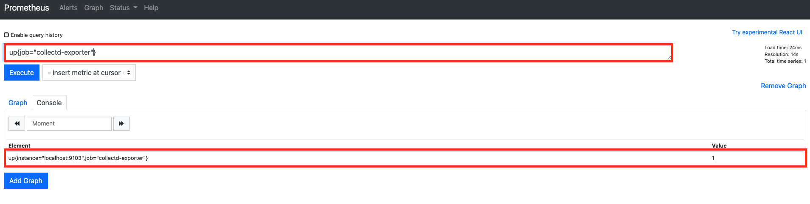
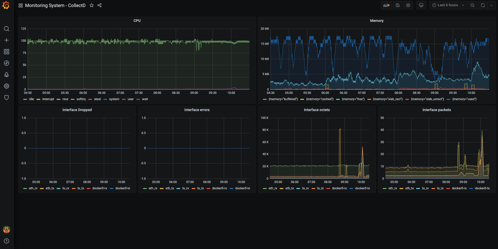

# 06장. 시스템 모니터링하기 (2) collectd-exporter

`Prometheus` 생태계에서 `node-exporter`는 시스템을 모니터링하는데 선택할 수 있는 최고의 방법 중 하나이다. `node-exporter`는 시스템 모니터링 도구 중 비교적 최신 기술에 속한다. 이 말은 이미 구축된 시스템들은 다른 모니터링 도구를 가지고 있을 가능성이 매우 높다는 뜻이다. 물론 기존 모니터링 도구를 버리고 `node-exporter`를 도입할 수는 있다. 하지만 운영자 입장에서는 그 일이 매우 도전적인 과제일 수 있다. 잘 돌고 있는 시스템을 바꾼다는 것이니까.

이러한 상황을 대비해서 `Prometheus` 생태계는 기존 모니터링 도구와 통합할 수 있는 여러 익스포터들을 제공하고 있다. 우리는 이번 장에서 기존의 시스템 모니터링 도구 중 유명한 `CollectD`를 간단하게 살펴볼 것이며, `Prometheus`와 어떻게 통합할 수 있는지 살펴볼 것이다.

## CollectD란 무엇인가


전통적인 시스템 모니터링 도구 중 하나이다. Agent 형태의 도구이며 시스템 뿐 아니라 애플리케이션 성능 관련 메트릭을 수집할 수 있다. `C`로 작성되어서 가볍고 빠르며 오래된 만큼 수 많은 플러그인들을 제공하여, 이를 통해서 다양한 메트릭 수집은 물론 시각화도 가능하고 `Prometheus` 등의 데이터 소스에 메트릭을 전송할 수 있다.

## CollectD 설치

공식적으로 제공되는 `CollectD` 도커 컨테이너가 없기 때문에, 이 장에서는 바로 서버 실습으로 넘어간다. 역시 `Prometheus` 설치한 서버에서 `CollectD`를 설치한다. 일반적으로 `CollectD` 설치는 번거롭다. 그러나 `AWS` 리눅스에서는 굉장히 쉽게 설치가 가능하다. 터미널에 다음을 입력한다.

```bash
# collectd 설치
$ sudo amazon-linux-extras install collectd
```

끝이다. 이제 서비스를 실행한다.

```bash
# collectd 서비스 실행
$ sudo systemctl start collectd

# collectd 서비스 상태 확인
$ sudo systemctl status collectd
● collectd.service - Collectd statistics daemon
   Loaded: loaded (/usr/lib/systemd/system/collectd.service; disabled; vendor preset: disabled)
   Active: active (running) since 금 2021-02-26 01:35:12 UTC; 1min 58s ago
     Docs: man:collectd(1)
           man:collectd.conf(5)
 Main PID: 21910 (collectd)
    Tasks: 11
   Memory: 1.1M
   CGroup: /system.slice/collectd.service
           └─21910 /usr/sbin/collectd
....
```

## collectd-exporter란

`collectd-exporter`는 `CollectD`와 `Prometheus`를 통합하게 만들어주는 익스포터이다. `CollectD`가 수집하는 데이터를 `collectd-exporter`는 엔드포인트에 노출시켜서 `Prometheus`가 그 데이터를 수집할 수 있게 만들어준다. 

## collectd-exporter 설치 및 연동

이 익스포터는 도커 컨테이너가 공식적으로 제공하지만, 이전 `CollectD 설치`에서도 서버에서만 진행했기 때문에, 이번 역시 서버에서만 진행하는 걸로 한다.

```bash
$ https://github.com/prometheus/collectd_exporter/releases/download/v0.5.0/collectd_exporter-0.5.0.linux-amd64.tar.gz

$ tar -xvf collectd_exporter-0.5.0.linux-amd64.tar.gz

$ mv collectd_exporter-0.5.0.linux-amd64 collectd_exporter

$ ./collectd_exporter
level=info ts=2021-02-26T03:48:48.401Z caller=main.go:321 msg="Starting collectd_exporter" version="(version=, branch=, revision=)"
level=info ts=2021-02-26T03:48:48.401Z caller=main.go:322 msg="Build context" context="(go=go1.14.2, user=, date=)"
```

마찬가지로 편하게 사용하기 위해서 서비스 등록을 하자.

```bash
$ sudo vim /etc/systemd/system/collectd-exporter.service
```

마찬가지로 편하게 사용하기 위해서 서비스 등록을 하자.

```
[Unit]
Description=CollectD Exporter

[Service]
Restart=on-failure

#Change this line if you download the
#Prometheus on different path user
ExecStart=/home/ec2-user/apps/collectd_exporter/collectd_exporter

[Install]
WantedBy=multi-user.target
```

그 후 다음을 입력하고 저장한다.

```bash
$ sudo systemctl daemon-reload

$ sudo systemctl start collectd-exporter

$ sudo systemctl status collectd-exporter
● collectd-exporter.service - CollectD Exporter
   Loaded: loaded (/etc/systemd/system/collectd-exporter.service; disabled; vendor preset: disabled)
   Active: active (running) since 금 2021-02-26 03:52:51 UTC; 5s ago
 Main PID: 22947 (collectd_export)
    Tasks: 3
...
```

이제 `CollectD`와 `collectd-exporter`를 연동해야 한다. `/etc/collectd.conf`를 다음과 같이 수정한다.

```
# ...

# 주석 해제 
LoadPlugin write_http

# 추가
<Plugin write_http>
  <Node "collectd_exporter">
    URL "http://localhost:9103/collectd-post"
    Format "JSON"
    StoreRates false
  </Node>
</Plugin>

# ...
```

그리고, `CollectD`와 `collectd-exporter`를 재기동한다. 터미널에 다음을 입력한다.

```bash
$ sudo systemctl restart collectd
$ sudo systemctl restart collectd-exporter
$ curl http://localhost:9103/metrics
# HELP collectd_cpu_total Collectd exporter: 'cpu' Type: 'cpu' Dstype: 'api.Derive' Dsname: 'value'
# TYPE collectd_cpu_total counter
collectd_cpu_total{cpu="0",instance="ip-172-31-37-42.ap-northeast-2.compute.internal",type="idle"} 1.80270717e+08
collectd_cpu_total{cpu="0",instance="ip-172-31-37-42.ap-northeast-2.compute.internal",type="interrupt"} 0
collectd_cpu_total{cpu="0",instance="ip-172-31-37-42.ap-northeast-2.compute.internal",type="nice"} 674
collectd_cpu_total{cpu="0",instance="ip-172-31-37-42.ap-northeast-2.compute.internal",type="softirq"} 2605
collectd_cpu_total{cpu="0",instance="ip-172-31-37-42.ap-northeast-2.compute.internal",type="steal"} 16633
...
```

이제 `Prometheus`가 `collectd-exporter` 노출하고 있는 데이터들을 땡겨올 수 있게 설정 파일을 수정한다.

```yml
# ...

scrape_configs:
  # ...  
  - job_name: 'collectd-exporter'
    static_configs:
    - targets: ['localhost:9103']
```

그리고 `Prometheus`도 재기동을 해준다.

```bash
$ sudo systemctl restart prometheus
```

이제 `Prometheus UI`로 접속해서 다음 쿼리가 있는지 확인해보자.



이게 되면 `collectd-`로 시작되는 메트릭들이 잘 수집되고 있는지 한 번 확인해보자.


## 모니터링 대시보드 구축

아쉽게도 `collectd-exporter`와 `Prometheus` 관련 대시보드는 `node-exporter`와 달리 공식적으로 제공하지 않고 있다. 대부분 데이터 소스가 `Graphite` 기반인 걸로 봐서는 `Prometheus`와 잘 쓰이진 않는 것 같다. 그래서 따로 구축해보았다. 이 대시보드 설정 코드는 Github에 올려두었다. 다음 링크에서 확인할 수 있으니 해당 내용을 복사해오자.

* [https://github.com/gurumee92/gurumee-prometheus-code/blob/master/part2/ch06/dashboard.json](https://github.com/gurumee92/gurumee-prometheus-code/blob/master/part2/ch06/dashboard.json)

먼저 그라파나에 접속한다. 그 후 "+" 버튼을 누른다.


그럼 아래와 같이 메뉴가 보이는데 "Import"를 누른다.


그 후 위 링크에서 제공하고 있는 json 파일을 복사하여 붙여넣고 "Load"를 누른다.


그럼 위와 같이 입력값들이 자동적으로 채워진다. "Import"를 누른다.


그럼 다음 대시보드가 구축된다.



간단하게 다음과 같은 지표들을 확인할 수 있다.

* CPU
* Memory
* Interface 관련 지표

`CollectD` 관련 기본 플러그인만 활성화했기 때문에 수집되는 지표가 `node-exporter`에 비해 많지 않다. 또한 같은 지표더라도 조금씩 다른 값으로 수집되는 것을 확인할 수 있다. `CollectD` 설정에 따라서 달라지겠지만, 이 장의 범위를 벗어난 내용이어서 이는 생략한다. 관심이 있는 사람들은 `CollectD` 공식 문서를 기반으로 설정을 변경하면서 어떻게 바뀌는지 확인해보는 것도 좋은 공부가 될 것이다. 공식 문서의 URL은 참고 절을 확인하라.

## 참고

* CollectD 공식 문서 : [https://collectd.org/](https://collectd.org/)

