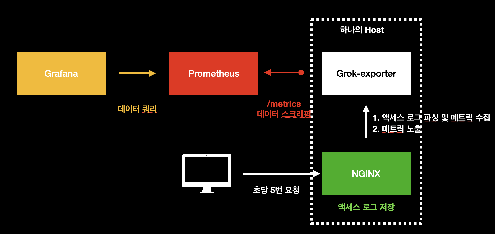
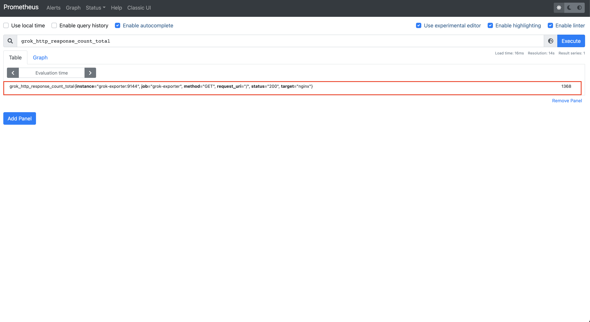
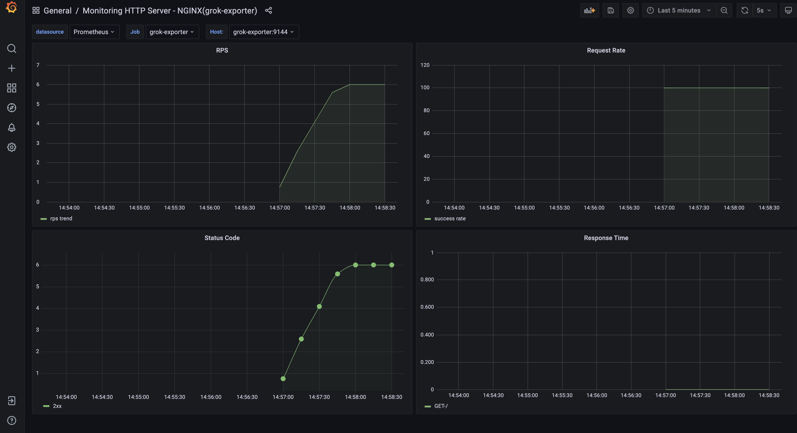
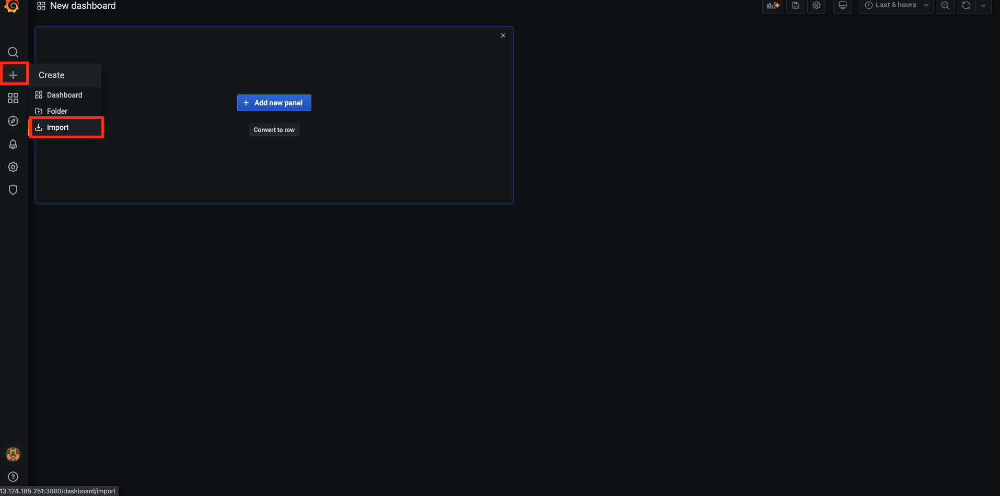
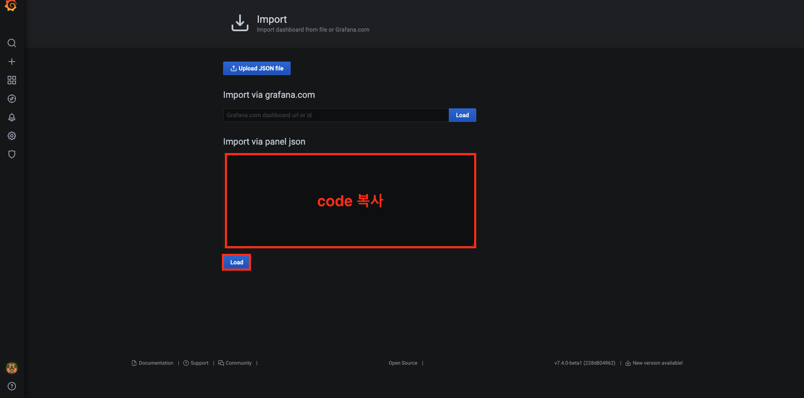
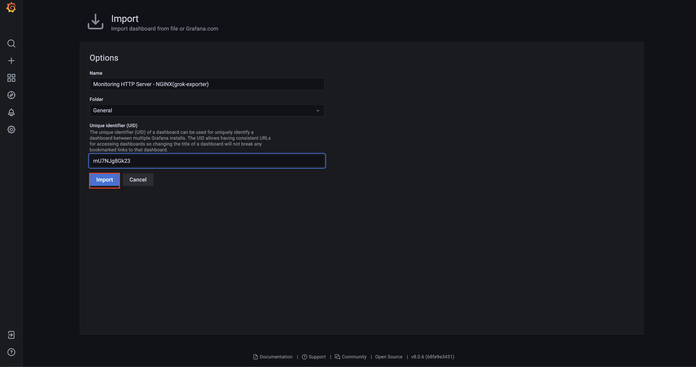

# 서비스 메트릭 모니터링하기 (2) grok-exporter


## 개요

이 문서에서는 `grok-exporter`를 이용해서 `Nginx`의 액세스 로그를 분석하여 RPS, 상태 코드 개수 등의 서비스 메트릭을 수집한다. 그 후 `Grafana`, `Prometheus`를 이용해서 서비스 메트릭을 모니터링할 수 있는 대시보드를 구축하는 것에 대하여 다룬다. 자세한 내용은 다음과 같다.

* Nginx와 설치
* grok-exporter와 설치
* 메트릭 수집을 위한 각 컴포넌트 설정
* 서비스 메트릭 모니터링을 위한 Grafana 대시보드 구축

이 문서에서 진행되는 실습 코드는 편의성을 위해 로컬 `Docker` 환경에서 진행되나, 실세 서버 환경에서도 거의 동일하게 적용할 수 있도록 작성되었다. 이번 장의 코드는 다음 링크에서 확인할 수 있다.

* 이번 장 코드 : [https://github.com/gurumee92/gurumee-book-prometheus/tree/master/src/part2/ch05](https://github.com/gurumee92/gurumee-book-prometheus/tree/master/src/part2/ch05)

이 문서에서 구성하는 인프라스트럭처는 다음과 같다.



## Nginx와 설치

`Nginx`는 대표적인 웹 서버 중 하나로, 가볍고 높은 성능으로 많은 엔지니어들의 사랑(?)을 받고 있다. 상용 솔루션 뿐 아니라 오픈 소스조차 굉장히 성능이 우수하고, 필요 기능은 공개된 모듈을 통해서 쉽게 커스텀이 가능하기 떄문에 업계 표준으로 자리잡았다.

로컬 환경에서는 다음과 같이 `Docker`로 간단하게 설치 및 구동 가능하다.

```bash
$ docker run --rm -p 8080:80 nginx
```

역시 이 장의 코드를 다운 받았다면, 다음과 같이 `docker-compose`로 간단하게 설치 및 구동할 수 있다.

```bash
$ pwd
/Users/gurumee/Workspace/gurumee-book-prometheus/src/part2/ch05

$ docker compose up -d nginx
[+] Running 2/2
 ⠿ Network ch05_default  Created                                                                                                                                                                                                   0.3s
 ⠿ Container nginx       Started  
```

서버 환경에서는 다음 명령어로 설치 및 구동이 가능하다.

```bash
# 필요 패키지 설치
$ sudo yum install -y yum-utils

# nginx 패키지 레포지토리 추가
$ sudo tee /etc/yum.repos.d/nginx.repo << EOF
[nginx-stable]
name=nginx stable repo
baseurl=http://nginx.org/packages/centos/\$releasever/\$basearch/
gpgcheck=1
enabled=1
gpgkey=https://nginx.org/keys/nginx_signing.key
module_hotfixes=true

[nginx-mainline]
name=nginx mainline repo
baseurl=http://nginx.org/packages/mainline/centos/\$releasever/\$basearch/
gpgcheck=1
enabled=0
gpgkey=https://nginx.org/keys/nginx_signing.key
module_hotfixes=true
EOF

# nginx 레포지토리 선택
$ sudo yum-config-manager --enable nginx-stable

# nginx 설치
$ sudo yum install -y nginx 

# nginx 구동
$ sudo systemctl restart nginx 

# nginx 구동 상태 확인
$ sudo systemctl status nginx
● nginx.service - nginx - high performance web server
   Loaded: loaded (/usr/lib/systemd/system/nginx.service; disabled; vendor preset: dis>
   Active: active (running) since Thu 2021-07-22 02:20:48 UTC; 4s ago
     Docs: http://nginx.org/en/docs/
  Process: 2037 ExecStart=/usr/sbin/nginx -c /etc/nginx/nginx.conf (code=exited, statu>
...
```

그 후 터미널에 다음을 입력하면 다음 결과를 얻을 수 있다.

```bash
# 로컬의 경우
$ curl localhost:8080

# 서버의 경우
$ curl localhost

# 결과 출력
<!DOCTYPE html>
<html>
<head>
<title>Welcome to nginx!</title>
<style>
    body {
        width: 35em;
        margin: 0 auto;
        font-family: Tahoma, Verdana, Arial, sans-serif;
    }
</style>
</head>
<body>
<h1>Welcome to nginx!</h1>
<p>If you see this page, the nginx web server is successfully installed and
working. Further configuration is required.</p>

<p>For online documentation and support please refer to
<a href="http://nginx.org/">nginx.org</a>.<br/>
Commercial support is available at
<a href="http://nginx.com/">nginx.com</a>.</p>

<p><em>Thank you for using nginx.</em></p>
</body>
</html>
```

## grok-exporter와 설치

RPS, 상태 코드 개수, Fail Rate, Response Time 등의 서비스 메트릭은 대부분 액세스 로그의 그 정보가 들어 있다. 아쉽게도 `Prometheus`에서 공식적으로 지원하는 `Nginx` 액세스 로그르 파싱해서 메트릭을 수집하는 `Exporter`는 없다. 

하지만, 어떤 훌륭한 개발자가 `grok` 포맷으로 `Nginx`를 포함한 여러 로그를 파싱하는 `Exporter`를 만들어서 공개했는데 그게 바로 `grok-exporter`이다. 터미널에 다음을 입력해서 설치가 가능하다. 

```bash
$ docker pull palobo/grok_exporter:latest
```  

구동을 위해서는 설정 파일이 필요하다. 이는 추후 절 "메트릭 수집을 위한 각 컴포넌트 설정"에서 다룬다. 역시 이 장의 코드를 다운 받았다면, 다음과 같이 `docker-compose`로 간단하게 설치 및 구동할 수 있다.
   
```bash
$ pwd
/Users/gurumee/Workspace/gurumee-book-prometheus/src/part2/ch05

$ docker compose up -d grok-exporter
[+] Running 1/0
 ⠿ Container grok-exporter  Running                                                                                                                                                  0.0s
```

서버 환경에서는 다음과 같이 설치할 수 있다.

```bash
$ pwd
/home/sidelineowl

$ mkdir -p ~/apps/grok-exporter

# 압축 파일 다운로드
$ wget https://github.com/fstab/grok_exporter/releases/download/v1.0.0.RC5/grok_exporter-1.0.0.RC5.linux-amd64.zip

# 압축 파일 해제
$ unzip grok_exporter-1.0.0.RC5.linux-amd64.zip

# 압축 파일 삭제
$ rm grok_exporter-1.0.0.RC5.linux-amd64.zip 

# gro-exporter 경로 변경
$ mv grok_exporter-1.0.0.RC5.linux-amd64/ ~/apps/grok_exporter

# grok-exporter 설치된 디렉토리로 이동
$ cd ~/apps/grok_exporter

# grok-exporter 실행 (설정 파일이 없어서 실패)
$ ./grok_exporter 
Usage: grok_exporter -config <path>
```

이제 손쉽게 구동하기 위해서 서비스로 등록해보자.

```bash
$ pwd
/home/sidelineowl/apps/grok_exporter

# user 추가
$ sudo useradd -M -r -s /bin/false grok_exporter

# 실행 파일 /usr/local/bin/으로 경로 이동
$ sudo cp ./grok_exporter /usr/local/bin

# /etc/ 경로 생성
$ sudo mkdir /etc/grok_exporter

# patterns /etc/grok_exporter/ 에 복사
$ sudo cp -R ./patterns /etc/grok_exporter/

# /usr/local/bin/grok_exporter grok_exporter 유저, 그룹 권한 주기
$ sudo chown grok_exporter:grok_exporter /usr/local/bin/grok_exporter

# /etc/grok_exporter에 grok_exporter 유저, 그룹 권한 주기
$ sudo chown -R grok_exporter:grok_exporter /etc/grok_exporter

# 서비스 파일 등록
$ sudo tee /etc/systemd/system/grok_exporter.service << EOF
[Unit]
Description=Grok Exporter
Wants=network-online.target
After=network-online.target

[Service]
User=grok_exporter
Group=grok_exporter
Type=simple
ExecStart=/usr/local/bin/grok_exporter

[Install]
WantedBy=multi-user.target
EOF

# 데몬 리로드
# sudo systemctl daemon-reload
```

그 후 터미널에 다음을 입력해서 서비스를 구동시킨다.

```bash
# 서비스 가동
$ sudo systemctl restart grok_exporter

# 서비스 상태 확인
$ sudo systemctl status grok_exporter

● grok_exporter.service - Grok Exporter
   Loaded: loaded (/etc/systemd/system/grok_exporter.service; disabled; vendor preset: disabled)
   Active: failed (Result: exit-code) since Thu 2021-07-22 06:22:14 UTC; 4s ago
  Process: 2980 ExecStart=/usr/local/bin/grok_exporter (code=exited, status=255)
 Main PID: 2980 (code=exited, status=255)
...
```

역시 설정 파일이 없기 때문에 구동이 되지는 않는다. 하지만 여기까지 왔으면 성공이다.

## 메트릭 수집을 위한 각 컴포넌트 설정

이제 각 컴포넌트를 설정해서 메트릭을 수집해보자. 로컬의 경우엔, 이미 다 설정되어 있으므로 어떻게 설정하는지만 확인하면 된다. 먼저 `Nginx`부터 설정해보자. 기본적으로 `Nginx` 액세스 로그 포맷은 `Response Time`이 들어있지 않다. 관련 메트릭 수집을 위해서 액세스 로그를 다음과 같이 설정한다. 서버 환경에서는 `/etc/nginx/nginx.conf`에서 작업하면 된다.

[src/part2/ch05/nginx/nginx.conf](https://github.com/gurumee92/gurumee-book-prometheus/tree/master/src/part2/ch05/nginx/nginx.conf)
```conf
user  nginx;
worker_processes  1;

error_log  /var/log/nginx/error.log warn;
pid        /var/run/nginx.pid;


events {
    worker_connections  1024;
}

http {
    include       /etc/nginx/mime.types;
    default_type  application/octet-stream;
    
    # 이 부분을 수정
    log_format  main  '$remote_addr - $remote_user [$time_local] '
                      '"$request" $status $body_bytes_sent '
                      '"$http_referer" "$http_user_agent" "$request_time"';


    access_log  /var/log/nginx/access.log  main;
    sendfile        on;
    keepalive_timeout  65;
    include /etc/nginx/conf.d/*.conf;
}
```

터미널에 다음을 입력해서 `Nginx`를 재구동한다.

```bash
$ sudo systemctl restart nginx
```

이제 `grok-exporter`가 `Nginx`의 액세스 로그를 파싱하기 위해서 해당 파일에 모든 접근을 허용하는 권한을 준다.

```bash
$ sudo chmod 777 /var/log/nginx/access.log
```

그 후 `grok-exporter` 설정을 진행한다. `/etc/grok_exporter` 경로에 `config.yml`을 다음과 같이 설정한다.

[src/part2/ch05/grok_exporter/config.yml](https://github.com/gurumee92/gurumee-book-prometheus/tree/master/src/part2/ch05/grok_exporter/config.yml)
```yml
global:
  config_version: 2
input:
  type: file
  path: /var/log/nginx/access.log
  readall: false
grok:
  patterns_dir: /etc/grok_exporter/patterns
  additional_patterns:
  - 'TEXT [a-zA-Z ]*'
metrics:
  - type: counter
    name: grok_http_response_count_total
    help: Amount of processed HTTP requests
    match: '%{IPORHOST:clientip} (?:-|(%{WORD}.%{WORD})) %{USER:ident} \[%{HTTPDATE:timestamp}\] \"(?:%{WORD:verb} %{NOTSPACE:request}(?: HTTP/%{NUMBER:httpversion})?|%{DATA:rawrequest})\" %{NUMBER:response} (?:%{NUMBER:bytes}|-) %{QS:referrer} %{QS:agent} \"%{NUMBER:response_time}\"'
    labels:
      target: nginx
      request_uri: '{{.request}}'
      method: '{{.verb}}'
      status: '{{.response}}'
  - type: histogram
    name: grok_http_response_time_seconds_hist
    help: Time needed by NGINX to handle requests.
    match: '%{IPORHOST:clientip} (?:-|(%{WORD}.%{WORD})) %{USER:ident} \[%{HTTPDATE:timestamp}\] \"(?:%{WORD:verb} %{NOTSPACE:request}(?: HTTP/%{NUMBER:httpversion})?|%{DATA:rawrequest})\" %{NUMBER:response} (?:%{NUMBER:bytes}|-) %{QS:referrer} %{QS:agent} \"%{NUMBER:response_time}\"'
    value: '{{.response_time}}'
    labels:
      target: nginx
      request_uri: '{{.request}}'
      method: '{{.verb}}'
      status: '{{.response}}'
    buckets: [0.1, 0.5, 1, 5, 10]
server:
  port: 9144
```

위 설정은 `grok` 문법을 토대로 현재 설정된 `Nginx`의 액세스 로그 포맷에 맞게 지정한 것이다. 이렇게 설정해두면 `status code` 정보를 포함한 `http request count`와 `response_time`을 정보를 가져올 수 있다. 자세한 설정은 다음 문서를 참고한다. 

* [grok-exporter 설정 문서](https://github.com/fstab/grok_exporter/blob/master/CONFIG.md#histogram-metric-type)

이제 `grok-exporter` 서비스를 다음과 같이 수정한다.

/etc/systemd/system/grok_exporter.service
``` 
[Unit]
Description=Grok Exporter
Wants=network-online.target
After=network-online.target

[Service]
User=grok_exporter
Group=grok_exporter
Type=simple
ExecStart=/usr/local/bin/grok_exporter -config /etc/grok_exporter/config.yml

[Install]
WantedBy=multi-user.target                      
```

그 후 `grok-exporter` 서비스를 재구동한다.

```bash
# 데몬 리로드
$ sudo systemctl daemon-reload

# 서비스 재구동
$ sudo systemctl restart grok_exporter
```

그 다음 `Nginx`에 여러 번 `curl`을 날려본다.

```bash
# curl 5번 요청
$ for i in {1..5}
do
curl localhost
done
```

그 후 터미널에 다음을 입력한다.

```bash
$ curl curl localhost:9144/metrics | grep "grok_http_response_count_total"
 % Total    % Received % Xferd  Average Speed   Time    Time     Time  Current
                                Dload  Upload   Total   Spent    Left  Speed
100  9417    0  9417    0     0  4598k      0 --:--:-- --:--:-- --:--:-- 4598k
grok_exporter_line_processing_errors_total{metric="grok_http_response_count_total"} 0
grok_exporter_lines_matching_total{metric="grok_http_response_count_total"} 5
grok_exporter_lines_processing_time_microseconds_total{metric="grok_http_response_count_total"} 609
# HELP grok_http_response_count_total Amount of processed HTTP requests
# TYPE grok_http_response_count_total counter
grok_http_response_count_total{method="GET",request_uri="/",status="200",target="nginx"} 5
...
```

위와 같은 메트릭들이 수집된다면 성공이다. 이제 마지막으로 `Prometheus`를 다음과 같이 설정한다. (`/etc/prometheus/prometheus.yml`)

[src/part2/ch05/prometheus/prometheus.yml](https://github.com/gurumee92/gurumee-book-prometheus/tree/master/src/part2/ch05/prometheus/prometheus.yml)
```yml
# my global config
global:
  scrape_interval:     15s # By default, scrape targets every 15 seconds.
  evaluation_interval: 15s # By default, scrape targets every 15 seconds.
  
  external_labels:
    monitor: 'my-project'

rule_files:

scrape_configs:
  - job_name: 'prometheus'
    scrape_interval: 5s

    static_configs:
      - targets: ['localhost:9090']

  - job_name: 'grok-exporter'
      scrape_interval: 5s
  
      static_configs:
      # grok-exporter, nginx 설치된 IP:9144
        - targets: ['grok-exporter:9144']
```

이제 `Prometheus`를 재구동한다.

```bash
$ sudo systemctl restart prometheus
```

그 후, `Prometheus UI`에서 다음을 쿼리해보자.

```
grok_http_response_count_total
```



## 서비스 메트릭 모니터링을 위한 Grafana 대시보드 구축

이제 대시보드를 구축한다. 다음 JSON 파일을 복사해서 대시보드를 임포트한다. (로컬 환경에는 이미 대시보드가 로드되어 있다.) 다음 링크로 가서 JSON 파일을 복사한다.

* [src/part2/ch05/grafana/dashboard.json](https://github.com/gurumee92/gurumee-book-prometheus/tree/master/src/part2/ch05/grafana/dashboard.json)

먼저 그라파나에 접속한다. 그 후 "+" 버튼을 누른다.



그럼 아래와 같이 메뉴가 보이는데 "Import"를 누른다.



그 후 위 링크에서 제공하고 있는 json 파일을 복사하여 붙여넣고 "Load"를 누른다.



그럼 위와 같이 입력값들이 자동적으로 채워진다. "Import"를 누른다.



그럼 다음 대시보드가 구축된다.


다음과 같은 지표를 확인할 수 있다.

* RPS(오늘, 1일전, 1주일전)
* Fail Rate
* Status Code(2xx, 3xx, 4xx, 5xx)
* Response Time