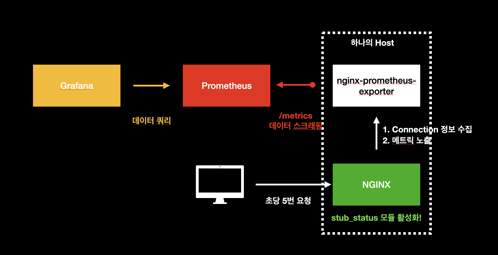
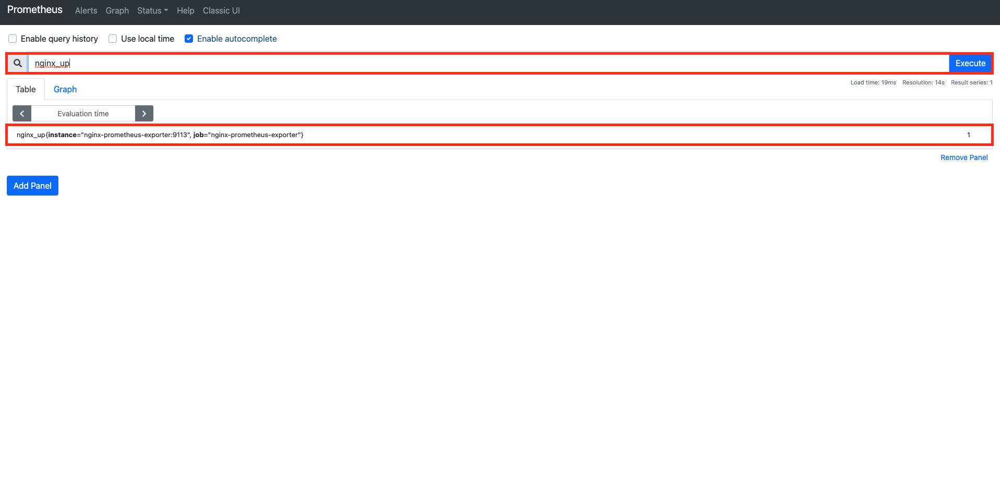

# 웹 서버 모니링하기 (1) nginx-prometheus-exporter


## 개요

이 문서에서는 `nginx-prometheus-exporter`를 이용해서 `Nginx`의 커넥션 정보에 대한 메트릭을 수집한다. 그 후 `Grafana`, `Prometheus`를 이용해서 `Nginx` 웹 서버를 모니터링할 수 있는 대시보드를 구축하는 것에 대하여 다룬다. 자세한 내용은 다음과 같다.

* Nginx와 설치
* nginx-prometheus-exporter와 설치
* 메트릭 수집을 위한 각 컴포넌트 설정
* NGINX 서버 모니터링을 위한 Grafana 대시보드 구축

이 문서에서 진행되는 실습 코드는 편의성을 위해 로컬 `Docker` 환경에서 진행되나, 실세 서버 환경에서도 거의 동일하게 적용할 수 있도록 작성되었다. 이번 장의 코드는 다음 링크에서 확인할 수 있다.

* 이번 장 코드 : [https://github.com/gurumee92/gurumee-book-prometheus/tree/master/src/part2/ch06](https://github.com/gurumee92/gurumee-book-prometheus/tree/master/src/part2/ch06)

이 문서에서 구성하는 인프라스트럭처는 다음과 같다.



## Nginx와 설치

`Nginx`는 대표적인 웹 서버 중 하나로, 가볍고 높은 성능으로 많은 엔지니어들의 사랑(?)을 받고 있다. 상용 솔루션 뿐 아니라 오픈 소스조차 굉장히 성능이 우수하고, 필요 기능은 공개된 모듈을 통해서 쉽게 커스텀이 가능하기 떄문에 업계 표준으로 자리잡았다.

로컬 환경에서는 다음과 같이 `Docker`로 간단하게 설치 및 구동 가능하다.

```bash
$ docker run --rm -p 8080:80 nginx
```

역시 이 장의 코드를 다운 받았다면, 다음과 같이 `docker-compose`로 간단하게 설치 및 구동할 수 있다.

```bash
$ pwd
/Users/gurumee/Workspace/gurumee-book-prometheus/src/part2/ch06

$ docker compose up -d nginx
[+] Running 2/2
 ⠿ Network ch04_default  Created                                                                                                                                                                                                   0.3s
 ⠿ Container nginx       Started  
```

서버 환경에서는 다음 명령어로 설치 및 구동이 가능하다.

```bash
# 필요 패키지 설치
$ sudo yum install -y yum-utils

# nginx 패키지 레포지토리 추가
$ sudo tee /etc/yum.repos.d/nginx.repo << EOF
[nginx-stable]
name=nginx stable repo
baseurl=http://nginx.org/packages/centos/\$releasever/\$basearch/
gpgcheck=1
enabled=1
gpgkey=https://nginx.org/keys/nginx_signing.key
module_hotfixes=true

[nginx-mainline]
name=nginx mainline repo
baseurl=http://nginx.org/packages/mainline/centos/\$releasever/\$basearch/
gpgcheck=1
enabled=0
gpgkey=https://nginx.org/keys/nginx_signing.key
module_hotfixes=true
EOF

# nginx 레포지토리 선택
$ sudo yum-config-manager --enable nginx-stable

# nginx 설치
$ sudo yum install -y nginx 

# nginx 구동
$ sudo systemctl restart nginx 

# nginx 구동 상태 확인
$ sudo systemctl status nginx
● nginx.service - nginx - high performance web server
   Loaded: loaded (/usr/lib/systemd/system/nginx.service; disabled; vendor preset: dis>
   Active: active (running) since Thu 2021-07-22 02:20:48 UTC; 4s ago
     Docs: http://nginx.org/en/docs/
  Process: 2037 ExecStart=/usr/sbin/nginx -c /etc/nginx/nginx.conf (code=exited, statu>
...
```

그 후 터미널에 다음을 입력하면 다음 결과를 얻을 수 있다.

```bash
# 로컬의 경우
$ curl localhost:8080

# 서버의 경우
$ curl localhost

# 결과 출력
<!DOCTYPE html>
<html>
<head>
<title>Welcome to nginx!</title>
<style>
    body {
        width: 35em;
        margin: 0 auto;
        font-family: Tahoma, Verdana, Arial, sans-serif;
    }
</style>
</head>
<body>
<h1>Welcome to nginx!</h1>
<p>If you see this page, the nginx web server is successfully installed and
working. Further configuration is required.</p>

<p>For online documentation and support please refer to
<a href="http://nginx.org/">nginx.org</a>.<br/>
Commercial support is available at
<a href="http://nginx.com/">nginx.com</a>.</p>

<p><em>Thank you for using nginx.</em></p>
</body>
</html>
```

## nginx-prometheus-exporter와 설치

웹 서버를 모니터링할 때 가장 중요하게 생각되는 지표는 다음과 같다. (물론 더 많을 수 있다.)

* Connection 개수
* Connection 상태

`Nginx`의 `stub_status` 모듈을 활성화시키면 이런 커넥션 정보를 얻을 수 있다. 오픈 소스에는 볼 수 있는 지표가 적지만, 상용 버전에는 꽤 많은 지표를 확인할 수 있다. 이에 대한 `Nginx` 설정은 추후 절 "메트릭 수집을 위한 각 컴포넌트 설정"에서 다룬다.

하지만 모듈을 활성화시켰다고 해서, 커넥션에 대한 메트릭이 자동적으로 수집되는 것은 아니다. 이를 위해서 `Nginx` 재단은 `nginx-prometheus-exporter`라는 것을 만들고 오픈 소스로 배포해두었다. 우리는 `Nginx` 웹 서버를 모니터링하기 위해서 이 `Exporter`를 사용할 것이다.

먼저 로컬에서는 다음과 같이 설치가 가능하다.

```bash
$ docker pull nginx/nginx-prometheus-exporter:latest 
```

구동은 `Nginx`의 `stub_status` 모듈이 활성화가 되야지 실행을 할 수가 있다. 이 역시도 추후 절 "메트릭 수집을 위한 각 컴포넌트 설정"에서 다루도로고 하겠다. 역시 이 장의 코드를 다운 받았다면, 다음과 같이 `docker-compose`로 간단하게 설치 및 구동할 수 있다.
                                                                                                    
```bash
$ pwd
/Users/gurumee/Workspace/gurumee-book-prometheus/src/part2/ch06

$ docker compose up -d nginx-prometheus-exporter
[+] Running 1/1
 ⠿ Container nginx-prometheus-exporter  Started                                                                                                                                      0.7s
```

서버 환경에서는 다음 명령어로 설치할 수 있다.

```bash
# 디렉토리 생성
$ mkdir -p ~/apps/nginx-prometheus-exporter

# 압축 파일 다운로드
$ wget https://github.com/nginxinc/nginx-prometheus-exporter/releases/download/v0.9.0/nginx-prometheus-exporter_0.9.0_linux_amd64.tar.gz

# 압축 파일 해제 및 경로 지정
$ tar xvf nginx-prometheus-exporter_0.9.0_linux_amd64.tar.gz -C ~/apps/nginx-prometheus-exporter

# 압축 파일 삭제
$ rm nginx-prometheus-exporter_0.9.0_linux_amd64.tar.gz

# 경로 이동
$ cd ~/apps/nginx-prometheus-exporter

# nginx-prometheus-exporter 실행
$ ./nginx-prometheus-exporter
2021/07/22 10:05:50 Starting NGINX Prometheus Exporter version=0.9.0 commit=5f88afbd906baae02edfbab4f5715e06d88538a0 date=2021-03-22T20:16:09Z
2021/07/22 10:05:50 Could not create Nginx Client: failed to get http://127.0.0.1:8080/stub_status: Get "http://127.0.0.1:8080/stub_status": dial tcp 127.0.0.1:8080: connect: 
connection refused
```

역시 구동은 되지 않는다. 이제 쉽게 구동하기 위해서 서비스 파일로 등록해보자.

```bash
$ pwd
/home/sidelineowl/apps/nginx-prometheus-exporter

# user 추가
$ sudo useradd -M -r -s /bin/false nginx_prometheus_exporter

# 실행 파일 /usr/local/bin/으로 경로 이동
$ sudo cp ./nginx-prometheus-exporter /usr/local/bin

# /usr/local/bin/nginx-prometheus-exporter nginx_prometheus_exporter 유저, 그룹 권한 주기
$ sudo chown nginx_prometheus_exporter:nginx_prometheus_exporter /usr/local/bin/nginx-prometheus-exporter

# 서비스 파일 등록
$ sudo tee /etc/systemd/system/nginx_prometheus_exporter.service << EOF
[Unit]
Description=Nginx Prometheus Exporter
Wants=network-online.target
After=network-online.target

[Service]
User=nginx_prometheus_exporter
Group=nginx_prometheus_exporter
Type=simple
ExecStart=/usr/local/bin/nginx-prometheus-exporter -nginx.scrape-uri http://localhost/metrics

[Install]
WantedBy=multi-user.target
EOF

# 데몬 리로드
# sudo systemctl daemon-reload
```

이제 서비스 구동을 해보자.

```bash
# 서비스 구동
$ sudo systemctl restart nginx_prometheus_exporter

# 서비스 상태 확인
$ sudo systemctl status nginx_prometheus_exporter
● nginx_prometheus_exporter.service - Nginx Prometheus Exporter
   Loaded: loaded (/etc/systemd/system/nginx_prometheus_exporter.service; disabled; vendor preset: disabled)
   Active: failed (Result: exit-code) since Thu 2021-07-22 10:12:10 UTC; 21s ago
  Process: 4110 ExecStart=/usr/local/bin/nginx-prometheus-exporter -nginx.scrape-uri http://localhost/metrics (code=exited, status=1/FAILURE)
 Main PID: 4110 (code=exited, status=1/FAILURE)
...
```

`-nginx.scrape-url`로 설정한 엔드포인트에 `stub_status` 모듈이 활성화되지 않아서 역시 구동은 안된다. 여기까지 왔으면 성공이다.

## 메트릭 수집을 위한 각 컴포넌트 설정

이제 `Nginx`의 `stub_status` 모듈을 활성화시킨다. `/metrics` 엔드포인트에 이 모듈이 수집하는 메트릭을 노출시킬 것이다. `Nginx` 설정 파일을 다음과 같이 수정한다. 서버 환경에서는 `/etc/nginx/nginx.conf`를 수정하면 된다. (로컬 환경에서는 `docker compose`로 모든 컴포넌트를 구동만 하면 된다.)

[src/part2/ch06/nginx/nginx.conf](https://github.com/gurumee92/gurumee-book-prometheus/tree/master/src/part2/ch06/nginx/nginx.conf)
```conf
user  nginx;
worker_processes  1;

error_log  /var/log/nginx/error.log warn;
pid        /var/run/nginx.pid;


events {
    worker_connections  1024;
}

http {
    include       /etc/nginx/mime.types;
    default_type  application/octet-stream;

    log_format  main  '$remote_addr - $remote_user [$time_local] "$request" '
                      '$status $body_bytes_sent "$http_referer" '
                      '"$http_user_agent" "$http_x_forwarded_for"';

    access_log  /var/log/nginx/access.log  main;
    sendfile        on;
    keepalive_timeout  65;

    server {
        listen 80;
        proxy_set_header     X-Scope-OrgID docker-ha;

         location / {
            root   /usr/share/nginx/html;
            index  index.html index.htm;
        }
        
        # stub_status 모듈 활성
        location /metrics {
            stub_status on;
            access_log off;
            allow all;
        }
    }
}
```

그리고 `Nginx`를 재가동한다.

```bash
$ sudo systemctl restart nginx
```

이제 `curl`로 한 번 확인을 해보자.

```bash
$ curl localhost/metrics
Active connections: 1 
server accepts handled requests
1 1 1 
Reading: 0 Writing: 1 Waiting: 0 
```

이렇게 나오면 성공이다. `nginx-prometheus-exporter` 서비스를 재구동한다.

```bash
$ sudo systemctl restart nginx_prometheus_exporter
```

그 후 `curl`로 메트릭이 수집되는지 확인해보자.

```bash
$ curl localhost:9113/metrics
# HELP nginx_connections_accepted Accepted client connections
# TYPE nginx_connections_accepted counter
nginx_connections_accepted 2
# HELP nginx_connections_active Active client connections
# TYPE nginx_connections_active gauge
nginx_connections_active 1
# HELP nginx_connections_handled Handled client connections
# TYPE nginx_connections_handled counter
nginx_connections_handled 2
# HELP nginx_connections_reading Connections where NGINX is reading the request header
# TYPE nginx_connections_reading gauge
nginx_connections_reading 0
# HELP nginx_connections_waiting Idle client connections
# TYPE nginx_connections_waiting gauge
nginx_connections_waiting 0
...
```

이제 `Prometheus` 설정 파일을 다음과 같이 수정한다. 서버에서라면 `/etc/prometheus/prometheus.yml`에 있다.

[src/part2/ch06/prometheus/prometheus.yml](https://github.com/gurumee92/gurumee-book-prometheus/tree/master/src/part2/ch06/prometheus/prometheus.yml)
```yml
# my global config
global:
  scrape_interval:     15s # By default, scrape targets every 15 seconds.
  evaluation_interval: 15s # By default, scrape targets every 15 seconds.
  
  external_labels:
    monitor: 'my-project'

rule_files:

scrape_configs:
  # ...

  - job_name: 'nginx-prometheus-exporter'
    scrape_interval: 5s

    static_configs:
    # nginx와 nginx-prometheus-exporter가 설치된 IP:9113
      - targets: ['nginx-prometheus-exporter:9113']
```

그리고 `Prometheus`를 재구동한다.

```bash
$ sudo systemctl restart prometheus
```

그 후 `Prometheus UI`에서 다음을 쿼리해보자.

```
nginx_up
```

다음과 같이 나오면 성공이다.



## NGINX 서버 모니터링을 위한 Grafana 대시보드 구축

이제 대시보드를 구축한다. 다음 JSON 파일을 복사해서 대시보드를 임포트한다. (로컬 환경에는 이미 대시보드가 로드되어 있다.)

* [src/part2/ch06/grafana/dashboard.json](https://github.com/gurumee92/gurumee-book-prometheus/tree/master/src/part2/ch06/grafana/dashboard.json)

그럼 다음과 같은 대시보드를 확인할 수 있다.

