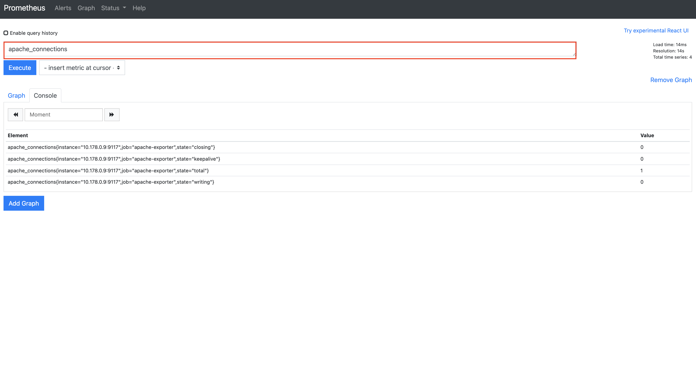

# 08장. NGINX 서버 모니링하기 (2) nginx-prometheus-exporter

지난 장에서는 `nginxlog-exporter`를 `Prometheus`와 `Grafana`에 연동하여, `nginx`가 생성해내는 로그를 기반으로 메트릭을 수집하고, 수집된 메트릭을 통해서 요청 성공률 및 RPS, 응답 시간 등의 데이터를 보여주는 대시보드를 구축했었다.

이 대시보드로도 충분하지만, `nginx`의 Connection 정보가 필요할 수가 있다. 이번에는 `nginx-prometheus-exporter`를 통해서 메트릭을 수집하고 대시보드를 구축한다. 

> 참고! 
> 
> 이번 장은 지난 장을 진행했다고 가정합니다. 진행하지 않았다면 [지난 장](../07_nginx_server_monitoring_01/07_nginx_server_monitoring_01.md)부터 먼저 진행하고 이 문서의 실습을 진행하시길 바랍니다.

## nginx-prometheus-exporter란 무엇인가

지난 장에서 우리는 `Prometheus`가 공식적으로 지정한 `nginx` 메트릭 수집을 위한 라이브러리와 익스포터가 무엇인지 살펴봤었다.

* nginx metric library
* nginx-vts-exporter

하지만 이 두 라이브러리와 익스포터는 `nginx`에 추가적인 설정이 필요하다는 점과 라이브러리의 경우에는 `Lua`라는 스크립트로 작성되었다는 점, 익스포터의 경우에는 더 이상 유지보수가 되지 않는다는 점에서 실무에서 사용하기 어렵다라고 언급했었다.

이번에는 `Prometheus`에서 공식적으로 지정된 것은 아니지만 `nginx`쪽에서 만든 `nginx-prometheus-exporter`란 익스포터를 이용할 것이다. 아무래도 `nginx`를 만든 곳에서 만들었기 때문에 보다 통합하기 쉬우며, 현재까지 유지 보수가 잘 되고 있다. 이 익스포터가 기본적으로 수집하는 데이터는 다음과 같다.

* Connection
* Http Request

자 이제 시작해보자.

## 로컬 환경에서 설치부터 대시보드 구축까지

먼저 역시 로컬에서 구성한다. 지난 장과 마찬가지로 각 컴포넌트 간 자세한 설정은 다음 절에서 진행하기로 하고, 로컬 환경에서는 구축된 컴포넌트들이 어떻게 동작하는지 살펴보도록 한다. 우선 다음 URL에서 코드를 얻어온다.

* [https://github.com/gurumee92/gurumee-prometheus-code/tree/master/part2/ch08](https://github.com/gurumee92/gurumee-prometheus-code/tree/master/part2/ch08)

```
|- config
    |- dashboard.json
    |- dashboard.yml
    |- datasource.yml
    |- nginx-default.conf
    |- nginx.conf
    |- prometheus.yml
|- docker-compose.yml
```

이 구성 파일들을 토대로 `docker-compose up` 명령어를 입력하면 설치부터 대시보드 구축까지 모두 끝난다.

```bash
# 현재 위치 확인
$ pwd
# docker-compose.yml이 들어있는 디렉토리 경로
/Users/a1101320/Studies/gitbooks/gurumee-prometheus/code/part2/ch08

# 컨테이너 실행
$ docker-compose up -d

# 컨테이너 확인
$ docker ps
CONTAINER ID   IMAGE                                    COMMAND                  CREATED       STATUS        PORTS                    NAMES
ba64b7bccb9c   grafana/grafana:latest                   "/run.sh"                4 hours ago   Up 1 second   0.0.0.0:3000->3000/tcp   grafana
ec6382462d42   nginx:latest                             "/docker-entrypoint.…"   4 hours ago   Up 1 second   0.0.0.0:8080->80/tcp     nginx
b2156fe7adf1   prom/prometheus:latest                   "/bin/prometheus --c…"   4 hours ago   Up 1 second   0.0.0.0:9090->9090/tcp   prometheus
21ed939146cf   nginx/nginx-prometheus-exporter:latest   "/usr/bin/exporter -…"   4 hours ago   Up 1 second   0.0.0.0:9113->9113/tcp   nginx-prometheus-exporter
```

먼저 브라우저에서 "localhost:8080/metrics"를 접속해보자. 다음 화면이 보일 것이다.


`nginx` 설정을 통해서 "stub_status" 모듈을 활성화시키면 특정 엔드 포인트에서 다음 메트릭 정보를 확인할 수 있다.

* Connection
* Http Request

이제 브라우저에서 "localhost:9113/metrics"를 접속해보자. 다음 화면이 보인다.



이는 `nginx-prometheus-exporter`가 "nginx/metrics"에서 노출되고 있는 메트릭들을 수집한 화면을 보여주는 것이다. 이제 브라우저에서 "localhost:9090"에 접속하여 `Prometheus UI` 화면으로 이동한다.


`nginx-prometheus-exporter`가 수집하는 메트릭을 `Prometheus`가 잘 땡겨오고 있는지 확인한다. 쿼리 입력 창에 "nginx_up"이란 쿼리를 입력한 후 실행한다.


그럼 위의 화면처럼 "1"이 보이면 잘 연동이 된 것이다. 이제 "localhost:3000"에 접속하여, 그라파나로 이동한다.


구축된 대시보드로 이동한다. 그럼 다음 화면이 보인다.


위 대시보드에서 확인할 수 있는 지표는 다음과 같다.

* NGINX Alive
* Process Connection Count
* Active Connection Count
* Total Request Count

## 서버 환경에서 설치부터 대시보드 구축까지

이 실습을 진행하려면 먼저 EC2에서 80, 9113, 9090, 3000번 포트가 개방되어 있어야 한다. 설정이 되었다면 ec2에 접속한다.

### nginx 설정

`nginx` 관련 메트릭 수집을 하기 위해서는 설정을 통해서 "stub_status" 모듈을 활성화시켜야 한다. 터미널에 다음을 입력한다.

```bash
$ cat /etc/nginx/nginx.conf
# ...

http {
    # ....

    include /etc/nginx/conf.d/*.conf;
}
```

위의 설정에서 확인할 수 있듯이 `nginx`는, `/etc/nginx/conf.d/*.conf` 파일들로 기타 모듈 작업을 진행할 수 있다. 여기서는 기본적으로 제공되는 `/etc/nginx/conf.d/default.conf`를 수정해서 진행할 것이다.

실무라면, `stub_status`모듈을 활성화시키는 거니까 `stub_status.conf` 이런 식으로 관리하는 것을 추천한다.

이제 `/etc/nginx/conf.d/default.conf`를 수정한다. 터미널에 먼저 vi으로 해당 파일을 연다.

```bash
$ sudo vi /etc/nginx/conf.d/default.conf
```

그 후 다음을 복사한다.

/etc/nginx/conf.d/default.conf
```conf
server {
  listen 80;
  
  # ...
  
  location / {
    root   /home/ec2-user/app/build;
    index  index.html index.htm;
    try_files $uri $uri/ /index.html;
  }

  location /metrics {
      stub_status on;
      access_log off;
      allow all;
  }

  # ...
}
```

위 설정은 "/metrics" 엔드 포인트에 `nginx` 관련 메트릭을 노출 시킬 수 있도록 "stub_status" 모듈을 활성화시키는 것이다. 이제 `nginx`를 재시동한다. 

```bash
$ sudo systemctl restart nginx
```

이제 "stub_status" 모듈이 활성화되었는지 확인한다. 터미널에 다음을 입력한다.

```bash
$ curl localhost/metrics
Active connections: 1
server accepts handled requests
 1 1 1
Reading: 0 Writing: 1 Waiting: 0
```

### nginx-prometheus-exporter 설치 및 설정

이제 `nginx-prometheus-exporter`를 설치한다. 터미널에 다음을 입력한다.

```bash
# apps 디렉토리로 이동
$ cd apps

# nginx-prometheus-exporter 디렉토리 생성
$ mkdir nginx-prometheus-exporter

# nginx-prometheus-exporter 디렉토리 이동
$ cd nginx-prometheus-exporter

# nginx-prometheus-exporter 압축 파일 설치
$ wget https://github.com/nginxinc/nginx-prometheus-exporter/releases/download/v0.8.0/nginx-prometheus-exporter-0.8.0-linux-amd64.tar.gz

# nginx-prometheus-exporter 압축 파일 해제
$ tar -xvf nginx-prometheus-exporter-0.8.0-linux-amd64.tar.gz

# nginx-prometheus-exporter 바이너리 파일 실행 권한 부여
$ chmod +x nginx-prometheus-exporter

# nginx-prometheus-exporter 실행
$ ./nginx-prometheus-exporter -nginx.scrape-uri http://localhost/metrics
2021/03/08 06:24:05 Starting NGINX Prometheus Exporter Version=0.8.0 GitCommit=de15093
2021/03/08 06:24:05 Listening on :9113
2021/03/08 06:24:05 NGINX Prometheus Exporter has successfully started
```

여기서 옵션으로 준 `nginx.scrape-uri`는 기본 값이 "http://127.0.0.1/stub_status"이다. 하지만 우리는 경로 "stub_status" 모듈 노출 경로를 "/metrics"로 바꿨기 때문에 이에 대한 경로가 들어가야 한다. 이제 조금 더 관리하기 쉽게 서비스로 등록한다. 터미널에 다음을 입력한다.

```bash
$ sudo vim /etc/systemd/system/nginx-prometheus-exporter.service
```

그리고 다음을 입력하고 저장한다.

/etc/systemd/system/nginx-prometheus-exporter.service
```
[Unit]
Description=NGINX Prometheus Exporter
Wants=network-online.target
After=network-online.target

[Service]
User=root
Group=root
Type=simple
ExecStart=/home/ec2-user/apps/nginx-prometheus-exporter/nginx-prometheus-exporter -nginx.scrape-uri http://localhost/metrics

[Install]
WantedBy=multi-user.target
```

그 후 서비스를 시작하고, 상태를 확인한다.

```bash
$ sudo systemctl start nginx-prometheus-exporter

$ sudo systemctl status nginx-prometheus-exporter
● nginx-prometheus-exporter.service - NGINX Prometheus Exporter
   Loaded: loaded (/etc/systemd/system/nginx-prometheus-exporter.service; disabled; vendor preset: disabled)
   Active: active (running) since 월 2021-03-08 06:31:22 UTC; 13s ago
 ...
```

`nginx`와 잘 연동이 되었는지 확인해보자. 터미널에 다음을 입력한다.

```bash
$ curl localhost:9113/metrics
# HELP nginx_connections_accepted Accepted client connections
# TYPE nginx_connections_accepted counter
nginx_connections_accepted 5
# HELP nginx_connections_active Active client connections
# TYPE nginx_connections_active gauge
nginx_connections_active 1
# HELP nginx_connections_handled Handled client connections
# TYPE nginx_connections_handled counter
nginx_connections_handled 5
# HELP nginx_connections_reading Connections where NGINX is reading the request header
# TYPE nginx_connections_reading gauge
nginx_connections_reading 0
# HELP nginx_connections_waiting Idle client connections
# TYPE nginx_connections_waiting gauge
nginx_connections_waiting 0
# HELP nginx_connections_writing Connections where NGINX is writing the response back to the client
# TYPE nginx_connections_writing gauge
nginx_connections_writing 1
# HELP nginx_http_requests_total Total http requests
# TYPE nginx_http_requests_total counter
nginx_http_requests_total 5
# HELP nginx_up Status of the last metric scrape
# TYPE nginx_up gauge
nginx_up 1
# HELP nginxexporter_build_info Exporter build information
# TYPE nginxexporter_build_info gauge
nginxexporter_build_info{gitCommit="de15093",version="0.8.0"} 1
...
```

잘 수집하고 있는 것을 확인할 수 있다.

### Prometheus 연동

이제 `Prometheus`와 `nginx-prometheus-exporter`를 연동시켜보자. 프로메테우스 설정 파일을 연다.

```bash
$ vim ~/apps/prometheus/prometheus.yml
```

설정 파일에 다음을 추가한다.

/home/ec2-user/apps/prometheus/prometheus.yml
```yml
# ...

scrape_configs:
  # ...
  - job_name: 'nginx-prometheus-exporter'
    scrape_interval: 5s

    static_configs:
      - targets: ['localhost:9113']
```

그 후 `Prometheus`를 재기동한다. 터미널에 다음을 입력한다.

```bash
$ sudo systemctl restart prometheus
```

역시 잘 연동이 되었는지 확인하려면 먼저 `Prometheus UI`에 접속하자. (브라우저에 "<프로메테우스 설치한 인스턴스 IP>:port"를 입력) 

다음 화면이 보인다.


여기서, "nginx_up"를 쿼리해보자. 그럼 다음 결과가 나온다.


이렇게 되면 잘 연동이 된 것이다.

### 대시보드 설정

이전 장에서 어떻게 json 파일을 가지고 대시보드를 구축하는지 배웠으니 자세한 설정은 넘어간다. 다음 json 파일을 임포트하면 된다.

* [https://github.com/gurumee92/gurumee-prometheus-code/blob/master/part2/ch08/config/dashboard.json](https://github.com/gurumee92/gurumee-prometheus-code/blob/master/part2/ch08/config/dashboard.json)

그럼 다음 대시보드를 확인할 수 있다.


## 참고

* nginx 공식 문서 : [https://www.nginx.com/](https://www.nginx.com/)
* exporter 관련 Prometheus 공식 문서 : [https://prometheus.io/docs/instrumenting/exporters/#http](https://prometheus.io/docs/instrumenting/exporters/#http)
* nginx-prometheus-exporter Github Repository : [https://github.com/nginxinc/nginx-prometheus-exporter](https://github.com/nginxinc/nginx-prometheus-exporter)

