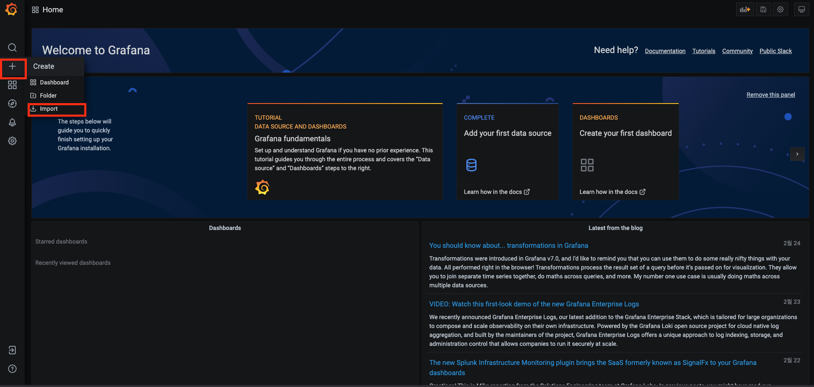

# 웹 서버 모니링하기 (2) apache-exporter


## 개요

이 문서에서는 `apache-exporter`를 이용해서 `Apache`의 커넥션 정보에 대한 메트릭을 수집한다. 그 후 `Grafana`, `Prometheus`를 이용해서 `Apache` 웹 서버를 모니터링할 수 있는 대시보드를 구축하는 것에 대하여 다룬다. 자세한 내용은 다음과 같다.

* Apache 서버와 설치
* apache-exporter와 설치
* 메트릭 수집을 위한 각 컴포넌트 설정
* Apache 서버 모니터링을 위한 Grafana 대시보드 구축

이 문서에서 진행되는 실습 코드는 편의성을 위해 로컬 `Docker` 환경에서 진행되나, 실세 서버 환경에서도 거의 동일하게 적용할 수 있도록 작성되었다. 이번 장의 코드는 다음 링크에서 확인할 수 있다.

* 이번 장 코드 : [https://github.com/gurumee92/gurumee-book-prometheus/tree/master/src/part2/ch07](https://github.com/gurumee92/gurumee-book-prometheus/tree/master/src/part2/ch07)

이 문서에서 구성하는 인프라스트럭처는 다음과 같다.


## Apache 서버와 설치

`Nginx`가 떠오르는 신흥 강자라면 `Apache` 웹 서버는 전통적인 강자이다. 리눅스는 물론 윈도우 기반 서버에서도 구동이 가능하며 아직까지 오픈 소스 웹 서버 기준 세계 점유율 1위를 차지하고 있다. 하지만 스레드/프로세스 기반으로 서버 리소스를 많이 쓰기 때문에 점점 `Nginx`로 전환하는 분위기이다. 그럼에도 많은 시스템에서 이 웹 서버를 사용하기 때문에 운영자 입장에서는 모니터링이 필수적으로 필요한 컴포넌트 중 하나이다.

로컬 환경에서 설치는 다음과 같이 진행할 수 있다.

```bash
$  docker run --rm httpd
```

역시 이 장의 코드를 다운 받았다면, 다음과 같이 `docker-compose`로 간단하게 설치 및 구동할 수 있다.

```bash
$ pwd
/Users/gurumee/Workspace/gurumee-book-prometheus/src/part2/ch07

$ docker compose up -d httpd
[+] Running 2/2
 ⠿ Network ch07_default  Created                                                                                                                                                     0.3s
 ⠿ Container httpd       Started                                                                                                                                                     0.8s
```

서버 환경에서 설치는 다음과 같이 진행할 수 있다.     

```bash
$ sudo yum update -y

$ sudo yum install httpd -y
```

그리고 다음과 같이 구동할 수 있다.

```bash
$ sudo systemctl restart httpd

$ sudo systemctl status httpd
● httpd.service - The Apache HTTP Server
   Loaded: loaded (/usr/lib/systemd/system/httpd.service; disabled; vendor preset: disabled)
   Active: active (running) since Fri 2021-07-23 04:13:54 UTC; 4s ago
     Docs: man:httpd.service(8)
...
```

그 후 터미널에 다음을 입력하면 다음 결과를 얻을 수 있다.

```bash
# 로컬의 경우
$ curl localhost:8080

# 서버의 경우
$ curl localhost

# 결과 출력
<html><body><h1>It works!</h1></body></html>
```

## apache-exporter와 설치

웹 서버를 모니터링할 때 가장 중요하게 생각되는 지표는 다음과 같다. (물론 더 많을 수 있다.)

* Connection 개수
* Connection 상태

`Apache` 웹 서버의 `status` 모듈을 활성화시키면 이런 커넥션 정보를 얻을 수 있다. 이에 대한 `Apache` 설정은 추후 절 "메트릭 수집을 위한 각 컴포넌트 설정"에서 다룬다.

하지만 모듈을 활성화시켰다고 해서, 커넥션에 대한 메트릭이 자동적으로 수집되는 것은 아니다. 이를 위해서 `Prometheus`에서 공식적으로 지원하는 `Exporter`는 아쉽게도 없다. 하지만 어떤 훌륭한 개발자가 `apache-exporter`라는 것을 만들고 오픈 소스로 배포해두었다. 우리는 `Apache` 웹 서버를 모니터링하기 위해서 이 `Exporter`를 사용할 것이다.

먼저 로컬에서는 다음과 같이 설치가 가능하다.

```bash
$ docker pull motork/apache_exporter:latest
```

구동은 `Apache`의 `status` 모듈이 활성화가 되야지 실행을 할 수가 있다. 이 역시도 추후 절 "메트릭 수집을 위한 각 컴포넌트 설정"에서 다루도로고 하겠다. 역시 이 장의 코드를 다운 받았다면, 다음과 같이 `docker-compose`로 간단하게 설치 및 구동할 수 있다.

```bash
$ docker compose up -d apache-exporter
[+] Running 1/1
 ⠿ Container apache-exporter  Started                                                                                                                                                0.7s
```

서버 환경에서는 다음과 같이 설치할 수 있다.

```bash
# 압축 파일 다운로드
$ wget https://github.com/Lusitaniae/apache_exporter/releases/download/v0.9.0/apache_exporter-0.9.0.linux-amd64.tar.gz

# 압축 파일 해제
$ tar -xvf apache_exporter-0.9.0.linux-amd64.tar.gz 

# 압축 파일 삭제
$ rm apache_exporter-0.9.0.linux-amd64.tar.gz

# 디렉토리 경로 지정
$ mv apache_exporter-0.9.0.linux-amd64 ~/apps/apache_exporter

# 디렉토리 이동
$ cd ~/apps/apache_exporter/

# 실행
$ ./apache_exporter
INFO[0000] Starting apache_exporter (version=0.9.0, branch=HEAD, revision=5f55c8eafd0c5e51237736b361db395b2b2b5e09)  source="apache_exporter.go:367"
INFO[0000] Build context (go=go1.16.5, user=root@8855f7ef9546, date=20210606-11:51:22)  source="apache_exporter.go:368"
INFO[0000] Starting Server: :9117                        source="apache_exporter.go:369"
INFO[0000] Collect from: http://localhost/server-status/?auto  source="apache_exporter.go:370"
INFO[0000] listening and wait for graceful stop          source="apache_exporter.go:374"
```

이제 간단히 구동하기 위해서 서비스로 등록하자.

```bash
$ pwd
/home/sidelineowl/apps/apache_exporter

# user 추가
$ sudo useradd -M -r -s /bin/false apache_exporter

# 실행 파일 /usr/local/bin/으로 경로 이동
$ sudo cp ./apache_exporter /usr/local/bin

# /usr/local/bin/apache_exporter apache_exporter 유저, 그룹 권한 주기
$ sudo chown apache_exporter:apache_exporter /usr/local/bin/apache_exporter

# 서비스 파일 등록
$ sudo tee /etc/systemd/system/apache_exporter.service << EOF
[Unit]
Description=Apache Exporter
Wants=network-online.target
After=network-online.target

[Service]
User=apache_exporter
Group=apache_exporter
Type=simple
ExecStart=/usr/local/bin/apache_exporter 

[Install]
WantedBy=multi-user.target
EOF

# 데몬 리로드
# sudo systemctl daemon-reload
```

다음과 같이 구동할 수 있다.

```bash
# 서비스 구동
$ sudo systemctl restart apache_exporter

# 서비스 상태 확인
$ sudo systemctl status apache_exporter
```

실제로 구동은 되지만 `Apache`의 `status` 모듈이 활성화되지 않아서 제대로 동작하지는 않는다. `curl`로 그 내용을 확인할 수 있다.

```bash
$ curl localhost:9117/metrics
# HELP apache_exporter_build_info A metric with a constant '1' value labeled by version, revision, branch, and goversion from which apache_exporter was built.
# TYPE apache_exporter_build_info gauge
apache_exporter_build_info{branch="HEAD",goversion="go1.16.5",revision="5f55c8eafd0c5e51237736b361db395b2b2b5e09",version="0.9.0"} 1
# HELP apache_exporter_scrape_failures_total Number of errors while scraping apache.
# TYPE apache_exporter_scrape_failures_total counter
## 실패 상황을 확인할 수 있음.
apache_exporter_scrape_failures_total 1
...
```

## 메트릭 수집을 위한 각 컴포넌트 설정

로컬 환경에서는 이미 설정 작업을 했기 때문에 `docker compose`로 모두 구동하면 된다. 먼저 `Apache` 서버 설정을 보자. 다음과 같이 설정 파일을 만들어서 `status` 모듈을 활성화한다. 서버 환경에서는 `/etc/httpd/conf.d` 경로에 `server-status.conf`를 만들어서 다음 내용을 입력하면 된다.

[src/part2/ch07/httpd/conf.d/server-status.conf](https://github.com/gurumee92/gurumee-book-prometheus/tree/master/src/part2/ch07/httpd/conf.d/server-status.conf)
```conf
ExtendedStatus on
<Location "/server-status">
    SetHandler server-status
    Allow from all
</Location>
```

그리고 `Apache` 서버를 재구동한다.

```bash
$ sudo systemctl restart httpd
```

이제 `curl`로 "/server-status?auto" 경로를 호출하면 커넥션 정보를 획득할 수 있다.

```bash
$ curl localhost/server-status?auto
localhost
ServerVersion: Apache/2.4.37 (centos)
ServerMPM: event
Server Built: May 20 2021 04:33:06
CurrentTime: Friday, 23-Jul-2021 04:23:58 UTC
RestartTime: Friday, 23-Jul-2021 04:23:47 UTC
ParentServerConfigGeneration: 1
ParentServerMPMGeneration: 0
ServerUptimeSeconds: 10
...
```

`apache-exporter`는 디폴트 옵션으로 주기적으로 "http://localhost/server-status/?auto"에 대한 URL을 접속해서 메트릭을 수집하게 되어 있다. 이론 상, 재구동은 필요없지만 혹시 모르니 재구동을 한다.

```bash
# 사실은 필요없다.
$ sudo systemctl restart apache_exporter
```

그 후 터미널에 다음을 입력한다.

```bash
$ curl localhost:9117/metrics
# HELP apache_accesses_total Current total apache accesses (*)
# TYPE apache_accesses_total counter
### apache_exporter_scrape_failures_total에서 변경됨
apache_accesses_total 1
...
```

이전에는 `apache_exporter_scrape_failures_total` 메트릭이 수집되었다면 현재는 `apache_accesses_total`가 수집되고 있다. 이제 `Prometheus`가 설치된 서버에 접속해서 설정 파일을 다음과 같이 수정한다.

[src/part2/ch07/prometheus/prometheus.yml](https://github.com/gurumee92/gurumee-book-prometheus/tree/master/src/part2/ch07/prometheus/prometheus.yml)
```yml
# my global config
global:
  scrape_interval:     15s # By default, scrape targets every 15 seconds.
  evaluation_interval: 15s # By default, scrape targets every 15 seconds.
  
  external_labels:
    monitor: 'my-project'

rule_files:

scrape_configs:
  # ...

  - job_name: 'apache-exporter'
    scrape_interval: 5s

    static_configs:
      # httpd(apache), apache-exporter 설치된 인스턴스 IP:9117
      - targets: ['apache-exporter:9117']
```

그리고 재구동한다. 

```bash
$ sudo systemctl restart prometheus
```

이제 `Prometheus UI`에 접속해서 다음 쿼리를 날려보자.

```
apache_connections
```

그럼 다음과 같이 결과를 얻을 수 있다.


여기까지 진행됐다면 `Apache` 웹 서버의 메트릭 수집을 위한 모든 절차는 끝난 것이다.

## Apache 서버 모니터링을 위한 Grafana 대시보드 구축

이제 대시보드를 구축한다. `apache-exporter`의 경우 이미 대시보드가 `Grafana 공식 문서`에 공유되어 있다. 다음 링크로 이동한다.

* [apache-exporter 그라파나 대시보드](https://grafana.com/grafana/dashboards/3894)
  
그러면 아래 화면이 보이는데 다음을 복사한다.


그 후 대시보드로 이동한 후, 왼쪽 탭의 두 번째 "+"의 "Import" 메뉴를 클릭한다.



그러면 다음 화면에서 아까 복사한 대시보드 ID를 입력하고 "Load" 버튼을 누른다.


그 후 "Datasource"에서 "Prometheus"를 선택한 뒤 "Import"를 누른다.


그럼 다음 화면이 보인다.


다음과 같은 지표를 확인할 수 있다.

* Apache 구동 상태
* Apache 서버 전송량
* Apache Connection 정보
* Apache Scoreboard 현황
* Apache CPU 사용률
 