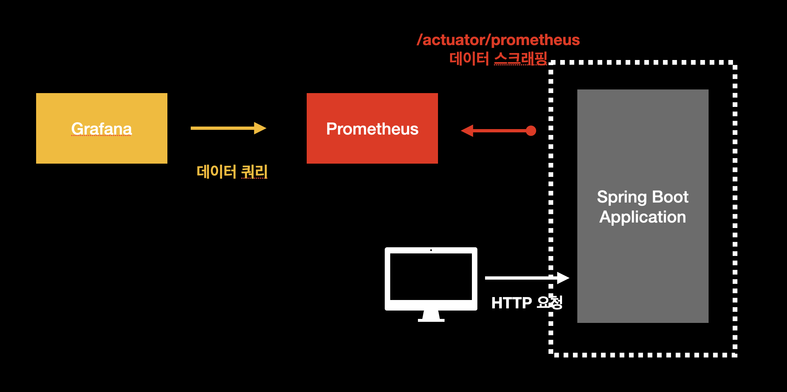
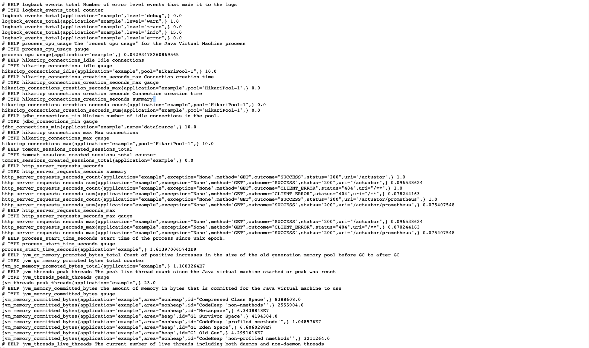
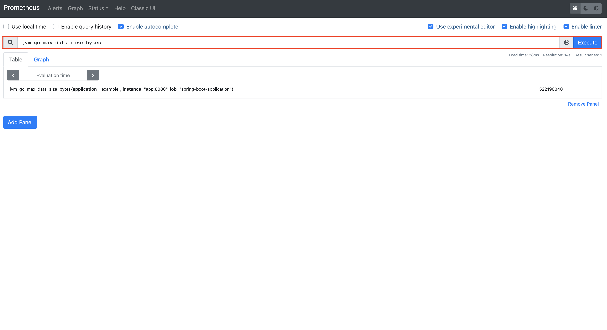
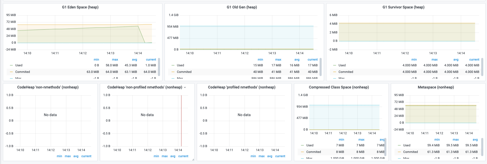
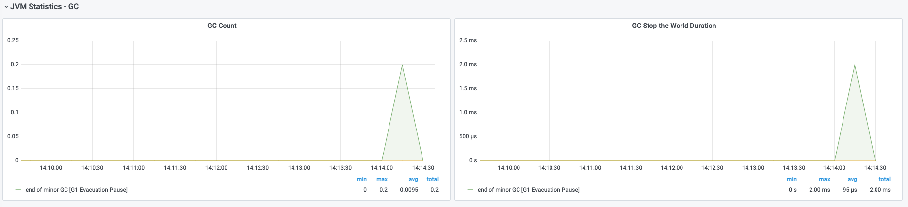
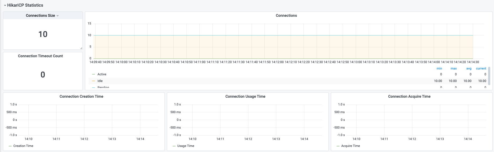
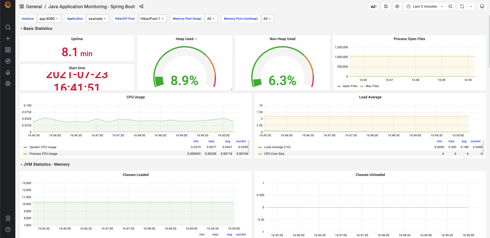

# 08장 자바 어플리케이션 모니터링하기 (1) spring-boot

## 개요

이 문서는 프로메테우스로 `어플리케이션 모니터링`하는 것을 다룬다. 여기서 칭하는 어플리케이션은 바로 `WAS(Web Application Server)`이다. 대중적으로 널리 사용되는 자바/스프링 부트 기반으로 작성된 것을 예로 살펴볼 것이며 이에 대한 기반 지식이 없더라도 기본적인 모니터링 대시보드를 구축하는데 초점을 맞춘다.

코드는 다음 링크에서 확인할 수 있다.

* [part2/ch08](https://github.com/gurumee92/gurumee-prometheus-code/tree/master/part2/ch08)

## 웹 애플리케이션 서버 설정

먼저 스프링 부트 기반의 WAS라면, `spring-boot-starter-actuator`와 `micrometer-registry-prometheus` 의존성이 필요하다. 보통 `gradle` 혹은 `maven`이라는 빌드 툴로 관리하는데, 각각의 도구에서 다음 코드처럼 의존성을 명시하면 된다.

> 참고! 빌드 도구에 따른 의존성 관리 파일 경로
> gradle의 경우에는 build.gradle, maven의 경우에는 pom.xml이 프로젝트 루트 디렉토리 최상단에 존재합니다. 이들을 수정하면 됩니다.

project/build.gradle
```gradle
// ...

dependencies {
    // ...
	implementation 'org.springframework.boot:spring-boot-starter-actuator'
	runtimeOnly 'io.micrometer:micrometer-registry-prometheus'
    // ...
}

// ...
```

project/pom.xml
```xml
<!-- ... -->

<dependencies>
    <!-- ... -->
    <dependency>  
        <groupId>org.springframework.boot</groupId>  
        <artifactId>spring-boot-starter-actuator</artifactId>  
    </dependency>  
    <dependency>  
        <groupId>io.micrometer</groupId>  
        <artifactId>micrometer-registry-prometheus</artifactId>  
    </dependency>
    <!-- ... -->
</dependencies>

<!-- ... -->
```

그리고 `application.yml`에 다음을 적어주면 된다.

> 참고! application.yml
> 
> 스프링 부트 기반 WAS는 application.yml 혹은 application.properties에 애플리케이션에 필요한 메타 정보를 기술합니다. 예를 들어서 애플리케이션 이름, 데이터 베이스 정보 등의 정보가 포함됩니다. 여기서는 어플리케이션 이름, 프로메테우스가 스크래핑할 엔드포인트를 노출할 용도로 사용합니다.

project/src/main/resources/application.yml
```yml
spring:
  application:
    name: example
management:
  endpoints:
    web:
      exposure:
        include: "prometheus"
  metrics:
    tags:
      application: ${spring.application.name}
```

위 설정을 가지고 있을 때 스프링 부트 기반 WAS는 다음 엔드포인트를 제공한다. 

* http://localhost:8080/actuator/prometheus

위 엔드포인트를 들어가게 되면 다양한 애플리케이션에서 수집되는 메트릭들을 확인할 수 있다.



수집되는 정보는 크게 다음과 같다.

* 로그 이벤트
* process cpu 정보
* hikaricp 풀 정보 (DB 연결 정보)
* http 서버 요청/응답 정보
* jvm 메모리 정보

아마 자바/스프링 부트 기반의 애플리케이션을 접하지 않은 사람이라면 위 정보가 익숙하지 않을 것이다. 그냥 자바 애플리케이션 모니터링 시 필요한 필수 정보라고 생각하자. 여기까지 하면 일단은 자바/스프링 부트 기반의 WAS에서 할 수 있는 설정은 완료하였다.

## 프로메테우스 설정 및 모니터링 대시 보드 구축

이제 프로메테우스를 설정하고, 스프링 부트 기반의 WAS를 모니터링할 수 있는 대시보드를 만들어보자. 먼저 프로메테우스 설정을 다음과 같이 변경한다.

* AWS EC2 환경 /home/ec2-user/apps/prometheus/prometheus.yml (프로메테우스 설치 경로/prometheus.yml)
* 로컬 환경 /project/docker/prometheus.yml

prometheus.yml
```yml
# ...

scrape_configs:
  # ...

  - job_name: 'was-monitoring'
    scrape_interval: 5s
    metrics_path: "/actuator/prometheus"
    static_configs:
      - targets: ["was:8080"] # 형식은 "WAS IP Address:port" 한다. 여러 WAS를 수집할 수 있다.
```

그 후 그라파나에서, 위에서 제공된 [소스 코드](https://github.com/gurumee92/gurumee-prometheus-code/blob/master/part2/ch08/docker/dashboard_was.json)에서 "part2/ch08/docker/dashboard_was.json"을 임포트해서 대시보드를 구축한다. 어떤 것을 모니터링할 수 있는지 같이 한 번 확인해보자.

### Basic Statistics



다음 대시보드에서 확인할 수 있는 지표는 다음과 같다.

* uptime 
* start time
* heap 메모리 사용량
* non-heap 메모리 사용량
* process open file 지표
* process cpu 사용량
* system load 관련 지표

### JVM Statistics - Memory



* JVM 로드된 클래스 개수, 로드되지 않은 클래스 개수
* JVM 버퍼 사용량 (direct, map)
* 쓰레드 관련 지표
* GC Memory 할당/Promote(GC 지역 사이를 돌아다니는)량



* GC 힙 영역 공간 지표
* GC 논-힙 영역 공간 지표

### JVM Statistics - GC



* GC 락 개수
* GC 락 시간 합계

### HikariCP Statistics



히카리 풀은 자바의 DB 커넥션 풀 구현체 중 하나이다. 

* 히카리 풀 커넥션 개수
* 히카리 풀 커넥션 타임아웃 개수
* 평균 커넥션 생성 시간
* 평균 커넥션 사용 시간
* 평균 커넥션 획득 시간

### HTTP Statistics


* HTTP 요청 개수
* HTTP 응답 시간

### Log Statistics



* 로그 레벨 별 이벤트 발생 평균 개수

## 스프링 부트 기반이 아닌 WAS라면?

이 문서에서는 다루지 않았지만, 모니터링해야 되는 WAS가 스프링 부트 기반이 아닌 자바 기반, 혹은 타 프로그래밍 언어로 개발된 애플리케이션일 수도 있다. 먼저 스프링 부트가 아닌 자바 기반 애플리케이션을 모니터링하는 방법 중 가장 쉬운 것은 바로 `JMX Exporter`를 이용하는 것이다. `JMX`란 실행 중인 자바 애플리케이션의 상태를 모니터링 하고, 설정을 변경할 수 있게 해주는 API라고 보면 된다. 이 JMX API를 통해서 메트릭을 수집하는 것이 바로 `JMX Exporter`이다. 자세한 내용은 다음을 참고하라.

* [JMX Exporter](https://github.com/prometheus/jmx_exporter)

그 외 자바나 타 프로그래밍 언어로 만들어진 애플리케이션을 모니터링하려면, 클라이언트 라이브러리를 사용하여 코드로 직접 메트릭을 수집하게끔 만들어주어야 한다. 실제로 애플리케이션은 비지니스로직에 따라 수집해야 할 메트릭이 천차만별이다. 따라서 실무에서는 이 방법을 고려해야 하는 순간이 언젠가 올 것이다. 여러 프로그래밍 언어에 대한 프로메테우스 클라이언트 라이브러리들의 정보는 다음 링크를 참고한다.

* [프로메테우스 공식 문서 - 클라이언트 라이브러리](https://prometheus.io/docs/instrumenting/clientlibs/)

> 참고! 스프링 부트에서는 코드 작업이 없었는데요?
> 
> 스프링 부트의 경우, 수집하는 코드를 이미 정의해서 애플리케이션 시작과 동시에 해당 코드가 메트릭을 수집합니다. 하지만 이는 범용적인 메트릭만 수집하기 때문에 더 고도화된 메트릭을 수집하기 위해서는 스프링 부트 기반의 애플리케이션도 코드 작업은 필요합니다.

## 결론

이렇게 해서 자바/스프링 부트 기반 WAS를 모니터링 대시보드를 구축하였다. 실무에서는 개발 환경이 다 다르기 이렇게 간단하게 모니터링 메트릭을 수집하기는 어려울 것이다. 하지만 기본적인 대시보드를 구축해 보았으니 이를 두고 확장시켜 나가면 애플리케이션 마다 인사이트를 제공하는 대시보드를 구축할 수 있을 것이다. 
