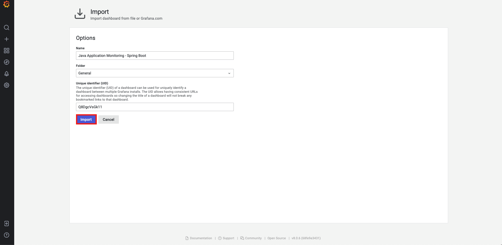

# 자바 어플리케이션 모니터링하기 (1) spring-boot

## 개요

이 문서에서는 `Prometheus`로 `spring-boot`기반의 자바 애플리케이션의 메트릭을 수집한 후 `Grafana` 대시보드를 구축하는 것에 대하여 다룬다. 자세한 내용은 다음과 같다.

* 자바, 빌드 도구 설치
* Spring Boot Application 설정
* Prometheus 설정
* Spring Boot Application 서버 모니터링을 위한 Grafana 대시보드 구축

이 문서에서 진행되는 실습 코드는 편의성을 위해 로컬 `Docker` 환경에서 진행되나, 실세 서버 환경에서도 거의 동일하게 적용할 수 있도록 작성되었다. 이번 장의 코드는 다음 링크에서 확인할 수 있다.

* 이번 장 코드 : [https://github.com/gurumee92/gurumee-book-prometheus/tree/master/src/part2/ch08](https://github.com/gurumee92/gurumee-book-prometheus/tree/master/src/part2/ch08)

이 문서에서 구성하는 인프라스트럭처는 다음과 같다.


## 자바, Gradle 및 프로젝트 설치 (서버 환경)


## Spring Boot Application 설정 훑어보기

먼저 스프링 부트 기반의 WAS라면, `spring-boot-starter-actuator`와 `micrometer-registry-prometheus` 의존성이 필요하다. 보통 `gradle` 혹은 `maven`이라는 빌드 툴로 관리하는데, 각각의 도구에서 다음 코드처럼 의존성을 명시하면 된다.

> 참고! 빌드 도구에 따른 의존성 관리 파일 경로
> gradle의 경우에는 build.gradle, maven의 경우에는 pom.xml이 프로젝트 루트 디렉토리 최상단에 존재합니다. 이들을 수정하면 됩니다.

[src/part2/ch08/app/src/build.gradle]
```gradle
// ...

dependencies {
    // ...
	implementation 'org.springframework.boot:spring-boot-starter-actuator'
	runtimeOnly 'io.micrometer:micrometer-registry-prometheus'
    // ...
}

// ...
```

그리고 `application.yml`에 다음을 적어주면 된다.

[src/part2/ch08/app/src/main/resources/application.yml]()
```yml
spring:
  application:
    name: example
management:
  endpoints:
    web:
      exposure:
        include: "prometheus"
  metrics:
    tags:
      application: ${spring.application.name}
```

위 설정을 가지고 있을 때 스프링 부트 기반 WAS는 다음 엔드포인트를 제공한다. 

* http://localhost:8080/actuator/prometheus

위 엔드포인트를 들어가게 되면 다양한 애플리케이션에서 수집되는 메트릭들을 확인할 수 있다.


수집되는 정보는 크게 다음과 같다.

* 로그 이벤트
* process cpu 정보
* hikaricp 풀 정보 (DB 연결 정보)
* http 서버 요청/응답 정보
* jvm 메모리 정보

아마 자바/스프링 부트 기반의 애플리케이션을 접하지 않은 사람이라면 위 정보가 익숙하지 않을 것이다. 그냥 자바 애플리케이션 모니터링 시 필요한 필수 정보라고 생각하자. 여기까지 하면 일단은 자바/스프링 부트 기반의 WAS에서 할 수 있는 설정은 완료하였다.

## Prometheus 설정

`Prometheus`는 역시 다음과 같이 설정 파일을 수정하면 된다. 서버 환경에서라면, `/etc/prometheus/prometheus.yml`을 수정하자.

[src/part2/ch08/prometheus/prometheus.yml]()
```yml
# my global config
global:
  scrape_interval:     15s # By default, scrape targets every 15 seconds.
  evaluation_interval: 15s # By default, scrape targets every 15 seconds.

  external_labels:
    monitor: 'my-project'

rule_files:

scrape_configs:
  # ...

  - job_name: 'spring-boot-application'
    scrape_interval: 5s
    # 여기에서는 spring actuator가 활성화시키는 엔드포인트에서 데이터를 스크래핑한다.
    metrics_path: "/actuator/prometheus"

    static_configs:
      # 자바 애플리케이션이 실행되는 IP:PORT
      - targets: ["app:8080"]
```

잘 수집되는지 확인하려면 `Prometheus UI`에 다음을 쿼리해보자.

```
jvm_gc_max_data_size_bytes
```

그럼 다음과 같은 결과를 얻을 수 있다.


## Spring Boot Application 서버 모니터링을 위한 Grafana 대시보드 구축

이제 대시보드를 구축한다. 다음 JSON 파일을 복사해서 대시보드를 임포트한다. (로컬 환경에는 이미 대시보드가 로드되어 있다.) 다음 링크로 가서 JSON 파일을 복사한다.

* [src/part2/ch08/grafana/dashboard.json](https://github.com/gurumee92/gurumee-book-prometheus/tree/master/src/part2/ch08/grafana/dashboard.json)

먼저 그라파나에 접속한다. 그 후 "+" 버튼을 누른다.


그럼 아래와 같이 메뉴가 보이는데 "Import"를 누른다.


그 후 위 링크에서 제공하고 있는 json 파일을 복사하여 붙여넣고 "Load"를 누른다.


그럼 위와 같이 입력값들이 자동적으로 채워진다. "Import"를 누른다.



그럼 다음 대시보드가 구축된다.


### Basic Statistics


다음 대시보드에서 확인할 수 있는 지표는 다음과 같다.

* uptime 
* start time
* heap 메모리 사용량
* non-heap 메모리 사용량
* process open file 지표
* process cpu 사용량
* system load 관련 지표

### JVM Statistics - Memory


* JVM 로드된 클래스 개수, 로드되지 않은 클래스 개수
* JVM 버퍼 사용량 (direct, map)
* 쓰레드 관련 지표
* GC Memory 할당/Promote(GC 지역 사이를 돌아다니는)량


* GC 힙 영역 공간 지표
* GC 논-힙 영역 공간 지표

### JVM Statistics - GC


* GC 락 개수
* GC 락 시간 합계

### HikariCP Statistics


히카리 풀은 자바의 DB 커넥션 풀 구현체 중 하나이다. 

* 히카리 풀 커넥션 개수
* 히카리 풀 커넥션 타임아웃 개수
* 평균 커넥션 생성 시간
* 평균 커넥션 사용 시간
* 평균 커넥션 획득 시간

### HTTP Statistics


* HTTP 요청 개수
* HTTP 응답 시간

### Log Statistics


* 로그 레벨 별 이벤트 발생 평균 개수
