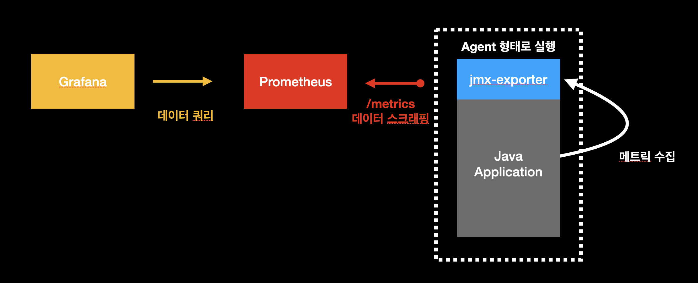
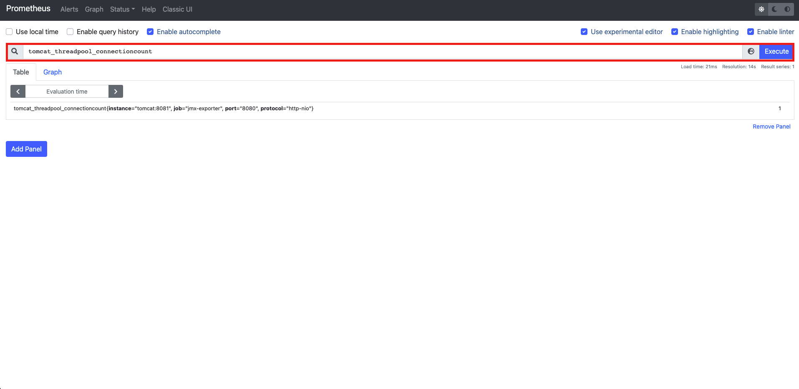
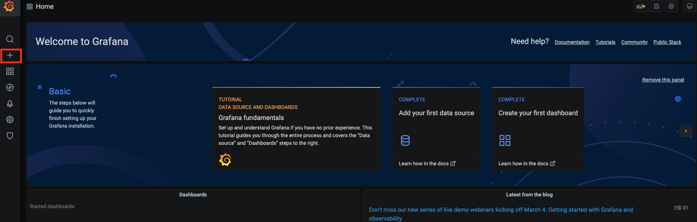
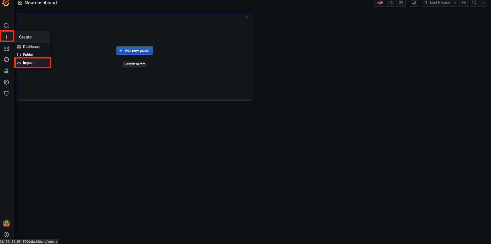
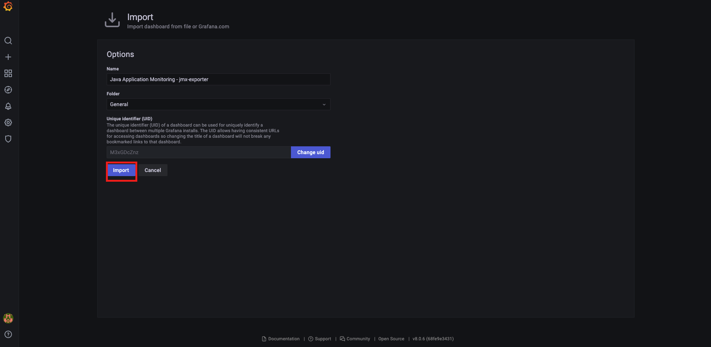
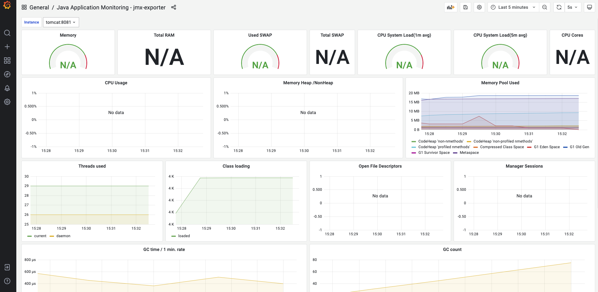

# 자바 어플리케이션 모니터링하기 (2) jmx-exporter


## 개요

이 문서에서는 대표적인 자바 애플리케이션 `Tomcat`을 모니터링하기 위해서 `jmx-exporter`를 이용해서 메트릭을 수집한 후 `Prometheus`에 데이터 저장, `Grafana` 대시보드를 구축하는 것에 대하여 다룬다. 자세한 내용은 다음과 같다.

* Tomcat과 설치
* jmx-exporter와 설치
* 메트릭 수집을 위한 각 컴포넌트 설정
* 자바 애플리케이션 모니터링을 위한 Grafana 대시보드 구축

이 문서에서 진행되는 실습 코드는 편의성을 위해 로컬 `Docker` 환경에서 진행되나, 실세 서버 환경에서도 거의 동일하게 적용할 수 있도록 작성되었다. 이번 장의 코드는 다음 링크에서 확인할 수 있다.

* 이번 장 코드 : [https://github.com/gurumee92/gurumee-book-prometheus/tree/master/src/part2/ch09](https://github.com/gurumee92/gurumee-book-prometheus/tree/master/src/part2/ch09)

이 문서에서 구성하는 인프라스트럭처는 다음과 같다.



## Tomcat과 설치

`Apache Tomcat`이란 서블릿 컨테이너만 있는 `Web Application Server(WAS)`로, 자바 기반 웹 애플리케이션 서버를 구축하는데 쓰인다. 전통적인 구성은 다음과 같았다.

* 웹 서버 : Apache Httpd
* WAS 서버 : Apache Tomcat
* 코드 : JSP 

참고적으로 최근 많이 작성되는 `Spring Boot`기반의 자바 애플리케이션의 경우엔 내부에서 `Tomcat`, `Netty` 등의 `WAS`가 구동된다. 즉 전통적인 방식은 자바 코드를 `WAR` 형태로 패키징하여 `Tomcat`에 올리는 반면, 최근에는 내부에 `Tomcat`을 구동하는 코드가 있기 때문에 단 하나의 `JAR`로 `WAS`를 실행시킨다는 차이점을 알아두면 좋다.   
 
그런 고로 `Tomcat`은 아직까지 대중적으로 많이 사용되는 자바 애플리케이션이기에 모니터링 구성 시, 1순위는 아니더라도 2,3 순위로 고려되는 컴포넌트이기도 하다. 이 문서는 `Tomcat`만 다루지만, 자바 기반 애플리케이션을 모니터링하는 것의 한 예이며 다른 자바 애플리케이션도 `jmx`가 활성화되어 있다면 같은 방식으로 모니터링 할 수 있다.    

먼저 로컬에서는 다음과 같이 `Tomcat` 설치 및 구동이 필요하다.

```bash
$ docker run --rm -p 8080:8080 tomcat
``` 

역시 이 장의 코드를 다운 받았다면, 다음과 같이 `docker-compose`로 간단하게 설치 및 구동할 수 있다.

```bash
$ pwd
/Users/gurumee/Workspace/gurumee-book-prometheus/src/part2/ch09

$  docker compose up -d tomcat
  [+] Running 2/2
   ⠿ Network ch09_default  Created                                                                                                                                                     0.3s
   ⠿ Container tomcat      Started                                                                                                                                                     0.7s                                                                                                                                              0.8s
```

서버 환경에서 `Tomcat` 설치 및 구동을 위해서는 먼저 자바가 필요하다. 다음과 같이 설치한다.

```bash
# 패키지 인스톨
$ sudo yum install java-11-openjdk-devel -y

# 자바 버전 확인
$ java -version
openjdk version "11.0.11" 2021-04-20 LTS
OpenJDK Runtime Environment 18.9 (build 11.0.11+9-LTS)
OpenJDK 64-Bit Server VM 18.9 (build 11.0.11+9-LTS, mixed mode, sharing)
```

만약 11버전이 아니라 8(1.8)이 나온다면 서버를 재부팅한다. 그럼 11 버전이 나올 것이다. `Tomcat`은 다음과 같이 설치 및 구동할 수 있다.

```bash
# tomcat 유저 생성
$ sudo useradd -M -r -s /bin/false tomcat

# 압축 파일 다운로드
$ wget https://mirror.navercorp.com/apache/tomcat/tomcat-10/v10.0.8/bin/apache-tomcat-10.0.8.tar.gz

# 압축 파일 해제
$ tar -xvf apache-tomcat-10.0.8.tar.gz 

# 압축 파일 삭제
$ rm apache-tomcat-10.0.8.tar.gz

# /usr/local/tomcat 경로 변경
$ sudo mv apache-tomcat-10.0.8 /usr/local/tomcat

# /usr/local/tomcat에 tomct 유저:그룹 권한 주기
$ sudo chown -R tomcat:tomcat /usr/local/tomcat

# SELinux 옵션 설정
$ setenforce 0
$ sed -i 's/ELINUX=enforcing/ELINUX=disabled/g' /etc/selinux/config

# 서비스 파일 등록
$ sudo tee /etc/systemd/system/tomcat.service <<EOF
[Unit]
Description=Apache Tomcat Server
After=syslog.target network.target

[Service]
Type=forking
User=tomcat
Group=tomcat

Environment=CATALINA_PID=/usr/local/tomcat/temp/tomcat.pid
Environment=CATALINA_HOME=/usr/local/tomcat
Environment=CATALINA_BASE=/usr/local/tomcat

ExecStart=/usr/local/tomcat/bin/catalina.sh start
ExecStop=/usr/local/tomcat/bin/catalina.sh stop

RestartSec=10
Restart=always

[Install]
WantedBy=multi-user.target
EOF

# 서비스 데몬 리로드
$ sudo systemctl daemon-reload

# 서비스 구동
$ sudo systemctl restart tomcat

# 서비스 상태 확인
$ sudo systemctl status tomcat
● tomcat.service - Apache Tomcat Server
Loaded: loaded (/etc/systemd/system/tomcat.service; enabled; vendor preset: disabled)
Active: active (running) since Sun 2021-07-25 06:20:06 UTC; 25s ago
Main PID: 2672 (java)
...
```

이제 여기서 `curl`을 입력하면 다음 결과를 얻을 수 있다.

```bash
$ curl localhost:8080
  <!DOCTYPE html>
  <html lang="en">
      <head>
          <meta charset="UTF-8" />
          <title>Apache Tomcat/10.0.8</title>
          <link href="favicon.ico" rel="icon" type="image/x-icon" />
          <link href="tomcat.css" rel="stylesheet" type="text/css" />
      </head>
      <body>
          <div id="wrapper">
...
```

## jmx-exporter와 설치 (서버만)

`jmx-exporter`는 자바 기반 애플리케이션을 모니터링하기 위해서 `Prometheus` 재단에서 만들어진 공식적인 `Exporter`이다. `jmx-exporter`는 에이전트 형태로 실행되며, 메트릭 수집을 위해서는 자바 애플리케이션에서 `jmx`가 활성화되어야 한다. `Tomcat`의 경우 버전 9부터는 `jmx`가 디폴트로 활성화가 된다. 먼저 다음과 같이 설치를 할 수 있다.

```bash
$ pwd
/home/sidelineowl

# jmx-exporter jar 설치
$ wget https://repo1.maven.org/maven2/io/prometheus/jmx/jmx_prometheus_javaagent/0.16.1/jmx_prometheus_javaagent-0.16.1.jar

# 설치한 jar 위치할 경로 생성
$ sudo mkdir -p /usr/local/tomcat/etc

# 설치한 jar 위의 경로로 이동
$ sudo mv jmx_prometheus_javaagent-0.16.1.jar /usr/local/tomcat/etc/
``` 

`jmx-exporter` 실행을 위해서는 몇 가지 설정이 필요하다. 이는 다음 절 "메트릭 수집을 위한 각 컴포넌트 설정"에서 자세히 다룬다. 

## 메트릭 수집을 위한 각 컴포넌트 설정

이번에도 로컬의 경우는 모든 설정이 구성되어 있다. 즉, `docker compose up` 명령어로 인프라스트럭처를 구동하게 되면 메트릭 수집 및 대시보드 구축까지 확인할 수 있다. 서버 환경에서 어떻게 설정하는지 살펴보자.

먼저, `jmx-exporter`가 `Tomcat` 메트릭 수집을 위한 설정을 해보자. `/usr/local/tomcat/etc/config.yaml` 파일을 다음과 같이 생성한다. 

[src/part2/ch09/tomcat/etc/config.yaml](https://github.com/gurumee92/gurumee-book-prometheus/tree/master/src/part2/ch09/tomcat/etc/config.yaml)
```yml
---
lowercaseOutputLabelNames: true
lowercaseOutputName: true
rules:
  - pattern: 'Catalina<type=GlobalRequestProcessor, name=\"(\w+-\w+)-(\d+)\"><>(\w+):'
    name: tomcat_$3_total
    labels:
      port: "$2"
      protocol: "$1"
    help: Tomcat global $3
    type: COUNTER
  - pattern: 'Catalina<j2eeType=Servlet, WebModule=//([-a-zA-Z0-9+&@#/%?=~_|!:.,;]*[-a-zA-Z0-9+&@#/%=~_|]), name=([-a-zA-Z0-9+/$%~_-|!.]*), J2EEApplication=none, J2EEServer=none><>(requestCount|maxTime|processingTime|errorCount):'
    name: tomcat_servlet_$3_total
    labels:
      module: "$1"
      servlet: "$2"
    help: Tomcat servlet $3 total
    type: COUNTER
  - pattern: 'Catalina<type=ThreadPool, name="(\w+-\w+)-(\d+)"><>(currentThreadCount|currentThreadsBusy|keepAliveCount|pollerThreadCount|connectionCount):'
    name: tomcat_threadpool_$3
    labels:
      port: "$2"
      protocol: "$1"
    help: Tomcat threadpool $3
    type: GAUGE
  - pattern: 'Catalina<type=Manager, host=([-a-zA-Z0-9+&@#/%?=~_|!:.,;]*[-a-zA-Z0-9+&@#/%=~_|]), context=([-a-zA-Z0-9+/$%~_-|!.]*)><>(processingTime|sessionCounter|rejectedSessions|expiredSessions):'
    name: tomcat_session_$3_total
    labels:
      context: "$2"
      host: "$1"
    help: Tomcat session $3 total
    type: COUNTER
```

만약 다른 자바 애플리케이션 이를테면, `Kafka`나 `Cassandra` 등의 메트릭 수집 설정은 다음 링크를 참고하자.

* [jmx-exporter 설정 파일 샘플](https://github.com/prometheus/jmx_exporter/tree/master/example_configs)

이제 `Tomcat`을 구동할 때 옵션에 `jmx-exporter`를 같이 실행될 수 있도록 설정해주어야 한다. 이 때 `CATALINA_OPTS`에 추가해주어야 하는데 이런 추가적인 옵션들은 `setenv.sh`로 관리한다. `/usr/local/tomcat/bin/setenv.sh`를 다음과 같이 만든다.

[src/part2/ch09/tomcat/bin/setenv.sh](https://github.com/gurumee92/gurumee-book-prometheus/tree/master/src/part2/ch09/tomcat/bin/setenv.sh)
```bash
CATALINA_OPTS="$CATALINA_OPTS -javaagent:/usr/local/tomcat/etc/jmx_prometheus_javaagent-0.16.1.jar=8081:/usr/local/tomcat/etc/config.yaml"
```

위 설정은 `Tomcat` 구동 시, `jmx-exporter`를 위의 설정과 함께 8081번 포트에 같이 구동을 시킨다. 터미널에 다음을 입력해보자.

```bash
# 톰캣 재구동
$ sudo systemctl restart tomcat

# jmx-exporter 확인
$ curl localhost:8081/metrics
# HELP jvm_info VM version info
# TYPE jvm_info gauge
jvm_info{runtime="OpenJDK Runtime Environment",vendor="Red Hat, Inc.",version="11.0.12+7-LTS",} 1.0
# HELP jmx_config_reload_failure_total Number of times configuration have failed to be reloaded.
# TYPE jmx_config_reload_failure_total counter
jmx_config_reload_failure_total 0.0
# HELP jmx_exporter_build_info A metric with a constant '1' value labeled with the version of the JMX exporter.
# TYPE jmx_exporter_build_info gauge
jmx_exporter_build_info{version="0.16.1",name="jmx_prometheus_javaagent",} 1.0
...
```

이렇게 되면 성공이다. 이제 `Prometheus`에서 메트릭 수집을 위한 설정을 하자. `prometheus.yml`을 다음과 같이 설정한다.

[src/part2/ch09/prometheus/prometheus.yml](https://github.com/gurumee92/gurumee-book-prometheus/tree/master/src/part2/ch09/prometheus/prometheus.yml)
```yml
# my global config
global:
  scrape_interval:     15s # By default, scrape targets every 15 seconds.
  evaluation_interval: 15s # By default, scrape targets every 15 seconds.

  external_labels:
    monitor: 'my-project'

rule_files:

scrape_configs:
  # ...

  - job_name: 'jmx-exporter'
    scrape_interval: 5s
    static_configs:
    # tomcat 설치된 인스턴스 IP:jmx-exporter 설정 PORT
      - targets: ["tomcat:8081"]
``` 

그 후 `Prometheus`를 재 구동한다.

```bash
$ sudo systemctl restart prometheus
```

이제 `Prometheus UI`에 다음을 입력해보자.

```
tomcat_threadpool_connectioncount
```

다음과 같은 결과가 나오면 성공이다.



## 자바 애플리케이션 모니터링을 위한 Grafana 대시보드 구축

이제 대시보드를 구축한다. 다음 JSON 파일을 복사해서 대시보드를 임포트한다. (로컬 환경에는 이미 대시보드가 로드되어 있다.) 다음 링크로 가서 JSON 파일을 복사한다.

* [src/part2/ch09/grafana/dashboard.json](https://github.com/gurumee92/gurumee-book-prometheus/tree/master/src/part2/ch09/grafana/dashboard.json)

먼저 그라파나에 접속한다. 그 후 "+" 버튼을 누른다.



그럼 아래와 같이 메뉴가 보이는데 "Import"를 누른다.



그 후 위 링크에서 제공하고 있는 json 파일을 복사하여 붙여넣고 "Load"를 누른다.


그럼 위와 같이 입력값들이 자동적으로 채워진다. "Import"를 누른다.



그럼 다음 대시보드가 구축된다.



다음과 같은 지표를 확인할 수 있다.

* Memory Pool
* Thread Count
* Class Load
* GC 정보

참고적으로 `java_lang_operatingsystem_*` 이름의 메트릭을 기반으로 구성된 대시보드 패널들은 작동하지 않는다. 현재 설정으로는 이 메트릭 수집을 지원하지 않기 때문이다. 