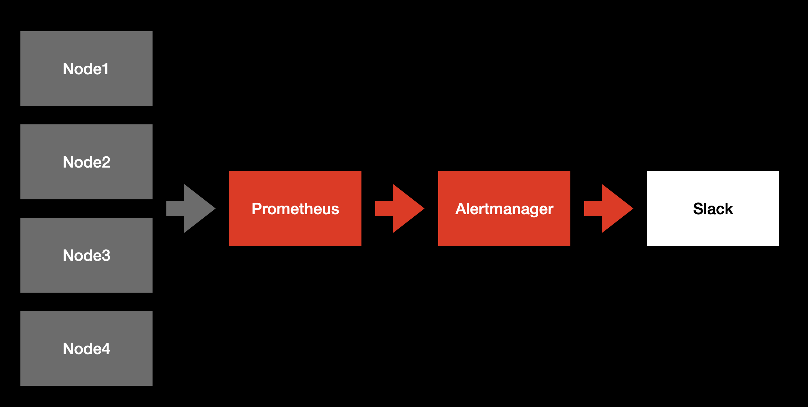
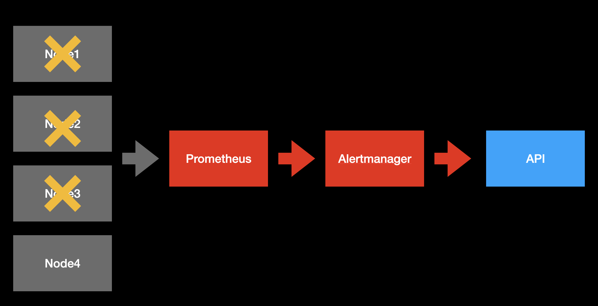
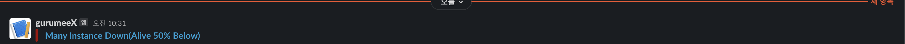
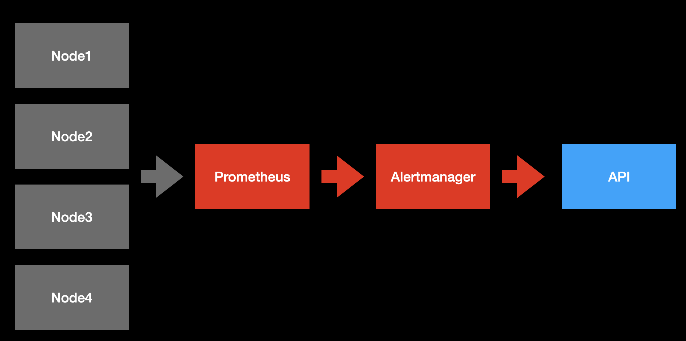

# Alertmanager란 무엇인가 (1)


## 개요

`Prometheus`의 알람은 크게 2가지 부분으로 나눌 수 있다.

* 알람 규칙을 정의하는 Alerting Rule
* 생성된 알람을 3자에 전달해주는 Alertmanager

이 문서에서는 `Prometheus`에서 전달된 알람을 제 3자, `Slack`, `Email` 등으로 전달하는 `Alertmanager`에 대해서 다룰 예정이다. 이번 장에서 다음 내용들을 살펴볼 것이다.

1. Alertmanager 설치 및 연동
2. 리시버

또한 현재 문서에서 진행되는 실습들은 편의성을 위해 `Docker` 환경에서 진행하나, 실제 서버 환경에서도 크게 다르지 않으니 거의 동일하게 작업할 수 있다. 관련 코드는 다음 링크를 참고하길 바란다.

* 이번 장 코드 : [https://github.com/gurumee92/gurumee-prometheus-code/tree/master/part4/ch04](https://github.com/gurumee92/gurumee-prometheus-code/tree/master/part4/ch04)

## Alertmanager 설치

`AWS EC2 Amazon Linux2` 서버 환경에서 `Alertmanager`는 다음 명령어로 설치할 수 있다.

```bash
# 압축 파일 설치
$ wget https://github.com/prometheus/alertmanager/releases/download/v0.22.2/alertmanager-0.22.2.linux-amd64.tar.gz

# 압축 파일 해제
$ tar -xf alertmanager-0.22.2.linux-amd64.tar.gz

# 해제된 파일 /home/ec2-user/apps/alertmanager 경로로 변경
$ mv alertmanager-0.22.2.linux-amd64.tar.gz ~/apps/alertmanager
```

실행을 하고 싶다면 터미널에 다음을 입력하면 된다.

```bash
# 설치 경로 이동
$ cd ~/apps/alertmanager

# alertmanager 실행
$ ./alertmanager
```

`Prometheus`에서 `Alertmanager`를 연동하려면, `Prometheus`가 실행되는 서버에서 다음과 같이 설정하면 된다.

[par4/ch04/prometheus/prometheus.yml](https://github.com/gurumee92/gurumee-prometheus-code/blob/master/part4/ch04/prometheus/prometheus.yml)
```yml
# my global config
global:
  scrape_interval:     15s # By default, scrape targets every 15 seconds.
  evaluation_interval: 15s # By default, scrape targets every 15 seconds.

# ...

# alert
alerting:
  alertmanagers:
  - scheme: http
    static_configs:
    - targets:
      # alertmanager ip:port
      - "alertmanager:9093"
```

## 리시버 

`Receiver`는 `Alertmanager`가 알람을 통보(Notification)할 클라이언트를 의미한다. `Alertmanager`의 `Receiver`로 지정할 수 있는 솔루션들은 다음과 같다.

* Slack
* Pagerduty
* Opsgenie
* Victorops
* Wechat
* Pushover
* Email(SMTP 서버)
* Webhook (API 서버)

우리는 이 중에서 `Slack`과 `Webhook` 설정만 살펴보도록 하자. 다른 리시버에 대한 설정은 다음 링크를 참고한다.

* [프로메테우스 공식 문서 - Alertmanager 설정](https://prometheus.io/docs/alerting/latest/configuration/#slack_config)

### Slack 설정

`Slack`은 대표적인 리시버의 예이다. 먼저 터미널에 다음을 입력하자.

```bash
# 현재 위치 확인
$ pwd
/Users/gurumee/Workspace/gurumee-prometheus-code/part4/ch04

# 인프라스트럭처 구성
$ docker compse up
```

이번 장의 코드를 통해 구성되는 인프라스트럭처는 다음과 같다.



현재 `Node Exporter` 4대에서 `Prometheus`가 메트릭을 수집하고 있다. 또한, `rules/node_exporter_rules.yml`에 설정된 `alerting rule`을 통해서 `Node Exporter` 4대 중 절반 이하가 다운되면 알람이 생성된다. 

[part4/ch04/prometheus/rules/node_exporter_rules.yml](https://github.com/gurumee92/gurumee-prometheus-code/blob/master/part4/ch04/prometheus/rules/node_exporter_rules.yml)
```yml
groups:
- name: node_exporter
  rules:
  # node-exporter 인스턴스 평균을 구하는 recording rule
  - record: job:up:avg
    expr: avg without(instance)(up{job="node-exporter"})
  
  # 인스턴스 평균이 0.5보다 낮으면 알람 세트를 생성하는 alerting rule
  - alert: ManyInstanceDown
    expr: job:up:avg{job="node-exporter"} < 0.5
    for: 15s
    labels:
      severity: 'critical'
    annotations:
      summary: 'Many Instance Down(Alive 50% Below)'  

```

이제 실제로 다음 그림과 같이 `Node Exporter` 인스턴스 3대를 제거해서 알람이 오는지 확인해보자.



터미널에 다음을 입력한다.

```bash
$ docker compose stop node1 node2 node3
```

어느 정도 시간이 지나면, `Promethes`에서 생성된 알람은 PENDING 상태를 거쳐 FIRING이 되면 `Alertmanager`로 알람이 전달된다. 그러면 `Alertmanager`는 설정을 통해서, 슬랙으로 전달 받은 알람을 통보한다. 해당 설정은 다음과 같다.

[part4/ch04/alertmanager/alertmanager.yml](https://github.com/gurumee92/gurumee-prometheus-code/blob/master/part4/ch04/alertmanager/alertmanager_step1.yml)
```yml
global:

route:
  receiver: 'slack'
  repeat_interval: 2m
  group_interval: 10s
  group_wait: 5s

receivers:
  - name: 'slack'
    slack_configs:
    - channel: '<YOUR_SLACK_CHANNEL>'
      api_url: '<YOUR_SLACK_WEBHOOK_URL>'
      send_resolved: true 
      title: "{{ range .Alerts }}{{ .Annotations.summary }}\n{{ end }}"
      text: "{{ range .Alerts }}{{ .Annotations.description }}\n{{ end }}"

# ...
```

결과는 다음과 같다.



만약 같은 슬랙에 여러 채널에 알람을 통보해야 하는 경우 `receiver` 개별 설정마다 일일이 `api_url`을 설정해줘도 좋지만, `global`의 `slack_api_url` 설정을 통해서 전역적으로 설정할 수 있다. 전역 설정은 다음과 같다.

[part4/ch04/alertmanager/alertmanager.yml](https://github.com/gurumee92/gurumee-prometheus-code/blob/master/part4/ch04/alertmanager/alertmanager_step2.yml)
```yml
global:
  slack_api_url: '<YOUR_SLACK_WEBHOOK_URL>' # <전역 설정>

route:
  receiver: 'slack'
  repeat_interval: 2m
  group_interval: 10s
  group_wait: 5s

receivers:
  - name: 'slack'
    slack_configs:
    - channel: '<YOUR_SLACK_CHANNEL>'
      send_resolved: true 
      title: "{{ range .Alerts }}{{ .Annotations.summary }}\n{{ end }}"
      text: "{{ range .Alerts }}{{ .Annotations.description }}\n{{ end }}"
  
  - name: 'slack2'
    slack_configs:
    - channel: '<YOUR_SLACK_CHANNEL_2>'
      send_resolved: true 
      title: "{{ range .Alerts }}{{ .Annotations.summary }}\n{{ end }}"
      text: "{{ range .Alerts }}{{ .Annotations.description }}\n{{ end }}"

# ...
```

### API 서버 설정

알람 처리 중 비지니스 로직이 필요한 경우를 제외하고 권장하는 클라이언트는 아니지만 `Webhook`을 이용하여 `API 서버`에 알람을 통보할 수 있다. 다음과 같이 설정할 수 있다.

[part4/ch04/alertmanager/alertmanager.yml](https://github.com/gurumee92/gurumee-prometheus-code/blob/master/part4/ch04/alertmanager/alertmanager_step3.yml)
```yml
global:

route:
  receiver: 'webhook'
  repeat_interval: 2m
  group_interval: 10s
  group_wait: 5s

receivers:  
  - name: 'webhook'
    webhook_configs:
      # API 서버 IP:PORT/<PATH>
      - url: http://app:8080/
```

터미널을 이용해서 다시 모든 컴포넌트를 재부팅한다.

```bash
# 컴포넌트 중지
$ docker compose down

# 컴포넌트 실행
$ docker compose up -d
```
이제 인프라스트럭처는 다음과 같이 변경된다.



여기서 `app`은 `golang`으로 작성된 API 서버로 코드는 다음과 같다.

[part4/ch04/app/main.go](https://github.com/gurumee92/gurumee-prometheus-code/blob/master/part4/ch04/app/main.go)
```golang
package main

import (
	"encoding/json"
	"fmt"
	"io/ioutil"
	"log"
	"net/http"
)

func Index(w http.ResponseWriter, req *http.Request) {
	if req.Method == "POST" {
		body, err := ioutil.ReadAll(req.Body)
		defer req.Body.Close()

		if err != nil {
			http.Error(w, "Error reading request body", http.StatusInternalServerError)
		}

		var data map[string]interface{}
		err = json.Unmarshal(body, &data)

		if err != nil {
			http.Error(w, "Error json deserialize request body", http.StatusInternalServerError)
		}

		log.Printf("body : %v", data["alerts"])
		fmt.Fprintf(w, "POST %v", data)
	} else {
		http.Error(w, "Invalid request method", http.StatusMethodNotAllowed)
	}
}

func main() {
	http.HandleFunc("/", Index)
	http.ListenAndServe(":8080", nil)
}
```

`app`의 역할은 `POST "/"`에 들어오는 request body 값 중 "alerts"의 키에 들어있는 값을 추출해서 로그를 찍고 응답을 보낸다. 이제 한 번 테스트해보자. 똑같이 `node1`, `node2`. `node3`을 제거해보자.

```bash
$ docker compose stop node1 node2 node3
```

이제 조금 시간이 지나면 똑같이 `Prometheus`에 알람 세트가 생성되고 PENDING 상태를 거쳐 FIRING 된다. 그 후 `API Server`에 작성된 로그를 살펴보자.

```
...
app           | 2021/07/17 04:52:10 body : [map[annotations:map[summary:Many Instance Down(Alive 50% Below)] endsAt:0001-01-01T00:00:00Z fingerprint:d12a71e5f56c5c79 generatorURL:http://cb3b72b269a4:9090/graph?g0.expr=job%3Aup%3Aavg%7Bjob%3D%22node-exporter%22%7D+%3C+0.5&g0.tab=1 labels:map[alertname:ManyInstanceDown env:test job:node-exporter severity:critical team:gurumee] startsAt:2021-07-17T04:51:55.108Z status:firing]]
...
```

FIRING된 알람이 `app`에 전달된 것을 확인할 수 있다. 다시 `Node Exporter`들을 실행시켜보자.

```bash
$ docker compose up -d node1 node2 node3
```

그러면 이제 아래와 같이 알람 세트가 RESOLVED 된 것을 알리는 통보를 전달 받은 것을 확인할 수 있다.

```
...
app           | 2021/07/17 04:57:09 body : [map[annotations:map[summary:Many Instance Down(Alive 50% Below)] endsAt:2021-07-17T04:56:55.108Z fingerprint:d12a71e5f56c5c79 generatorURL:http://cb3b72b269a4:9090/graph?g0.expr=job%3Aup%3Aavg%7Bjob%3D%22node-exporter%22%7D+%3C+0.5&g0.tab=1 labels:map[alertname:ManyInstanceDown env:test job:node-exporter severity:critical team:gurumee] startsAt:2021-07-17T04:51:55.108Z status:resolved]]
...
```

위 예제에서는 단순히 로그를 찍는 것 뿐이지만 알람에 대해서 비지니스 로직이 필요한 경우 해당 엔드포인트를 처리하는 핸들러에 이에 대한 코드를 구현하면 된다.


