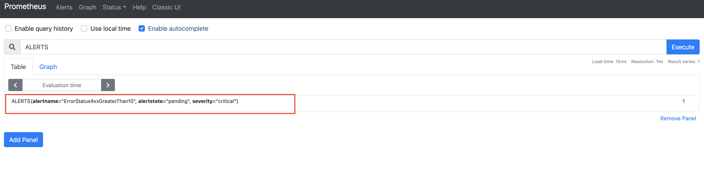
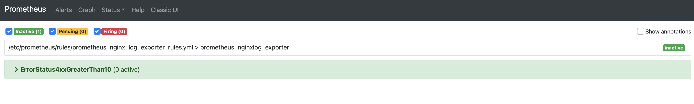
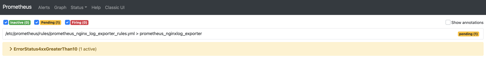
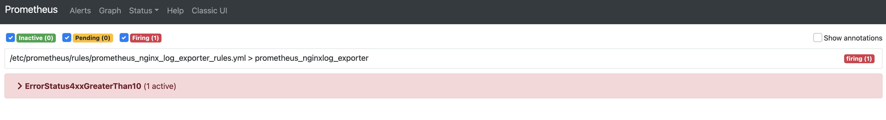
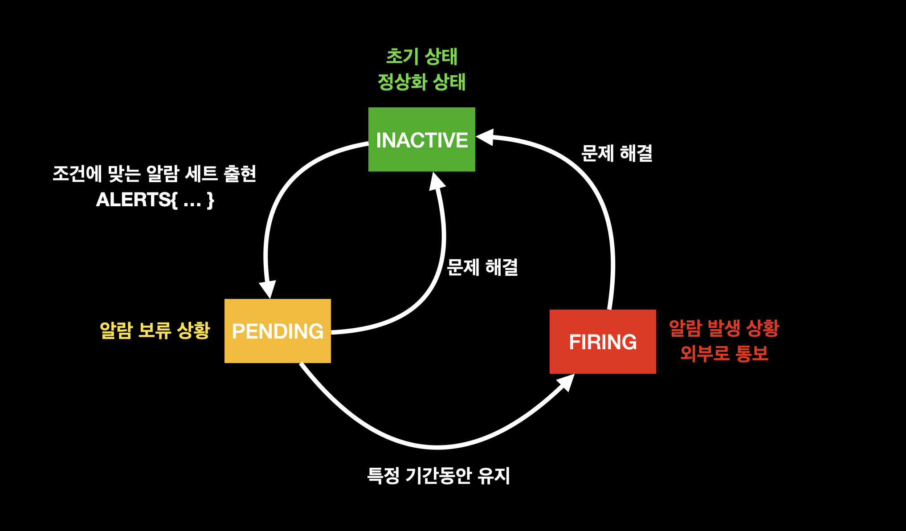
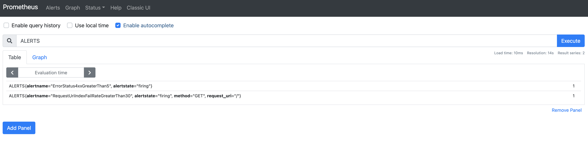
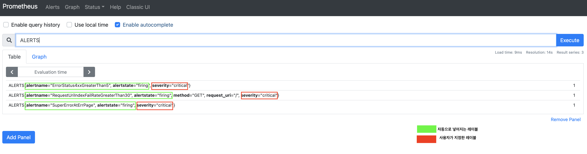
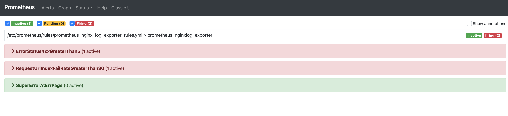
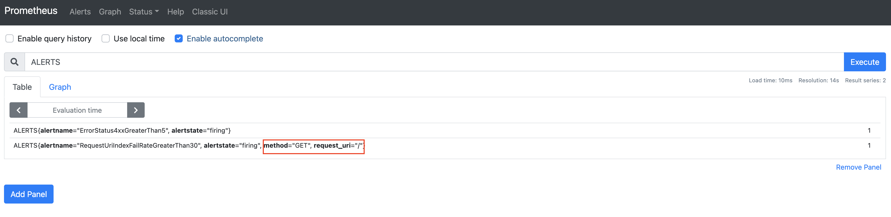
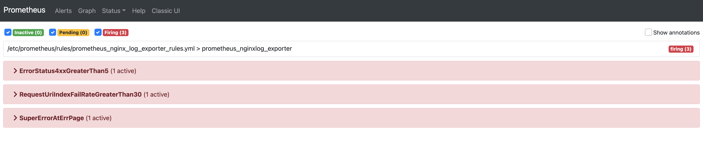

# 알림 규칙(Alerting Rule)이란 무엇인가


## 개요

`Prometheus`의 알람은 크게 2가지 부분으로 나눌 수 있다.

* 알람 규칙을 정의하는 Alerting Rule
* 생성된 알람을 3자에 전달해주는 Alertmanager

이 문서에서는 `Prometheus`에서 알람을 생성하는 부분인 `Alerting Rule`에 대해서 다룰 예정이다. 또한 현재 문서에서는 편의성을 위해 `Docker` 환경에서 진행하나, 실제 서버 환경에서도 크게 다르지 않으니 거의 동일하게 작업할 수 있다. 관련 코드는 다음 링크를 참고하길 바란다.

* 이번 장 코드 : [https://github.com/gurumee92/gurumee-prometheus-code/tree/master/part4/ch03](https://github.com/gurumee92/gurumee-prometheus-code/tree/master/part4/ch03)

## Alerting Rule은 무엇인가?

`Prometheus` 공식 문서에 따르면 `Alerting Rule`의 정의는 다음과 같다.

> 알림 규칙은 PromQL을 기반으로 알람 조건을 정의하고, 외부 서비스에 FIRING된 알람들을 전달한다.

`Alerting Rule`은 `PromQL` 혹은 `Recording Rule`을 통해 쿼리된 시계열에 대해 알람 조건을 지정한다. 만약 조건을 충족하는 경우 해당 시계열에 대해서, `ALERTS`라는 시계열에 저장되는 알람 세트를 생성해낸다.



`Prometheus`에서 알람은 크게 다음의 3가지 상태를 가진다.

* INACTIVE : 알람 조건에 맞는 알람 세트가 없음. 정상 상태.
  
* PENDING : 알람 조건에 충족하여 알람 세트가 생성된 상태이다. Alert Rule에 정의된 "for" 기간 동안 이 상태를 유지하게 되면 "FIRING" 상태가 된다.
  
* FIRING : "PENDING" 상태가 주어진 기간동안 유지될 경우, 이 상태로 전이한다. 이 상태가 되면 Prometheus는 알람의 "Notification"을 Alertmanager로 전송한다.
  

또한 FIRING 이후, 문제 해결이 됐을 때, 혹은 그 이전에 해결된 경우 그러니까 더 이상 조건에 충족하는 알람 세트가 없다면 다시 "INACTIVE"가 된다. 상태 전이를 알기 쉽게 그림으로 표현하면 다음과 같다.



## Alerting Rule 사용법 (1) 작성 방법

`Alerting Rule`은 `Recording Rule`과 같이 `yml` 파일로 작성된다. 작성 요령은 비슷하다. 다음을 살펴보자.

[part4/ch03/prometheus/rules/prometheus_nginxlog_exporter_rules_backup.yml](https://github.com/gurumee92/gurumee-prometheus-code/blob/master/part4/ch03/prometheus/rules/prometheus_nginxlog_exporter_rules_backup.yml)
```yml
groups:
- name: prometheus_nginxlog_exporter
  # ...

  - alert: ErrorStatus4xxGreaterThan5
    expr: sum(rate(nginx_http_response_count_total{status=~"4.."}[1m])) > 5

# ...
```

먼저, `alert`, `expr`은 필수 요소이다. `record`가 `Recording Rule`이 생성하는 메트릭의 이름을 나타낸 것처럼, `alert`는 `Alerting Rule`이 만들어내는 알람 세트의 이름을 나타낸다. 

`expr`에는 알람 조건을 작성한다. `PromQL` 혹은 `Recording Rule`로 작성할 수 있다. 위의 `Alerting Rule`은 초당 4xx 상태 코드 개수가 5개보다 높으면 알람 세트를 생성한다. 이 알람 세트는 `ALERTS`로 쿼리할 수 있다.



위 그림에서 보면 레이블 "alertname"에 우리가 `alert`에 지정한 이름이 지정된 것을 확인할 수 있다. 그 외 레이블들은 다음 절 "Alerting Rule 사용법 (2) 알람 레이블과 애노테이션"에 더 자세히 다루도록 하겠다. 이번엔 다른 예를 살펴보자.

[part4/ch03/prometheus/rules/prometheus_nginxlog_exporter_rules_backup.yml](https://github.com/gurumee92/gurumee-prometheus-code/blob/master/part4/ch03/prometheus/rules/prometheus_nginxlog_exporter_rules_backup.yml)
```yml
groups:
- name: prometheus_nginxlog_exporter
  # ...

  - alert: RequestUriIndexFailRateGreaterThan30
    expr: job:nginx_http_response_count_total:fail_rate_1m{request_uri="/"} > 0.3
    for: 1m

# ...
```

`RequestUriIndexFailRateGreaterThan30`이 바로 `Recording Rule`로 작성한 `Alerting Rule`이다. 여기서는 `for`가 추가된 것을 확인할 수 있다. `for`는 PENDING 상태에서 FIRING 상태로 넘어가는 시간을 말한다. 쉽게 말해서 알람 발생 이전에 보류 기간이 1분이라는 것이다. 이 기간이 지나면, `Prometheus`는 `Alertmanager`로 알람을 전송한다. 이후 `Alertmanager`가 제 3자인 `Slack`, `email` 등으로 통보(Notification)하게 된다.

한 가지 반드시 알아둘 것은 `Recording Rule`은 쿼리 시 시계열의 개수를 줄이는 것에 반면, `Alerting Rule`은 알람 조건을 걸어야 하는 시계열을 정확하게 하는데 의미가 있다는 것이다. 무슨 말이냐면, 일반적으로 `Recording Rule`은 정규 표현식을 쓸 것이 아니라면, 레이블 사용을 권장하지 않는다. 오히려 레이블의 이점을 남는 방식으로 작성하는 것이 정석이다.  반면에 위 `Alerting Rule`은 "/에 요청 실패율 30% 이상일 때 알람을 걸자" 같은 명확한 요구 사항이 있다. 따라서 `Alerting Rule`은 오히려 `PromQL`에서 레이블 사용을 적극적으로 하고 있는 편이다.

## Alerting Rule 사용법 (2) 알람 레이블과 애노테이션 

`Alerting Rule`로 만들어낸 시계열 역시 레이블을 넣어줄 수 있다. 기본적으로 `alert`에 지정한 `alertname`과 알람 세트의 상태를 나타내는 `alertstate`가 있다. 그 외 레이블들은 `labels`로 지정할 수 있다. 



> 참고! 저는 ALERTS로 쿼리하면 2개밖에 뜨지 않아요.
> 위 결과는 다음 절 "Alerting Rule 사용법 (3) 작성 시 주의 사항"을 진행해야 확인할 수 있습니다. 위 그림은 그냥 레이블을 썼을 때, 이런 레이블이 나타납니다를 보여주는 그림입니다. 이 절은 레이블을 어떻게 작성하는지에 대해서 더 집중해주세요.

이제 어떻게 작성하면 되는지 알아보자. 

[part4/ch03/prometheus/rules/prometheus_nginxlog_exporter_rules_backup.yml](https://github.com/gurumee92/gurumee-prometheus-code/blob/master/part4/ch03/prometheus/rules/prometheus_nginxlog_exporter_rules_backup.yml)
```yml
groups:
- name: prometheus_nginxlog_exporter
  # ...

  - alert: SuperErrorAtErrPage
    expr: | 
        (status:nginx_http_response_count_total:4xx_1m > 5) 
            and 
        (job:nginx_http_response_count_total:fail_rate_1m{request_uri="/"} > 0.3)
    for: 1m
    labels:
      severity: 'critical'
    annotations:
      summary: 'SUPER ERROR'  
```

위와 같이 알람에 대한 부가 정보가 필요하다면, `labels`를 통해서 레이블 키-값 쌍을 작성하면 된다. 이 레이블은 `Prometheus`보다는 `Alertmanager`가 알람 그룹화, 라우팅 등의 작업 시 유용하게 쓰인다.

또한 알람 세트는 각각 `annotaion`을 부여할 수 있다. 이 역시도 부가 정보인데, 알람 세트의 내용이나, 대시보드 URL, 위키 페이지 등을 연결할 때 자주 쓰인다. 애노테이션은 레이블과 반대로 `Alertmanager`에서 사용되지 않는다. `golang`의 템플릿을 이용해서 더 내용을 추가할 수 있다.

## Alerting Rule 사용법 (3) 작성 시 주의 사항

알람 사용 시 주의 사항이 있다. 한 가지 예를 살펴보자. 현재 알람 설정으로는 다음과 같은 상황이 벌어진다.



`ErrorStatus4xxGreaterThan5`과 `RequestUriIndexFailRateGreaterThan30` 알람은 잘 감지해내고 있는데 2개의 AND 조건으로 구성된 알람 `SuperErrorAtErrPage`이 발생되지 않는다. 왜 그럴까? 문제의 답은 여기에 있다.



자동으로 생성되는 레이블 중 `alertname`과 `alertstate` 말고 우리도 모르게 생성된 것들이 있다. 바로 `method`와 `request_uri`인데, 이는 원래 알람이 쿼리하고 있는 시계열의 레이블과 일치한다. 즉, 원 시계열에 속한 레이블도 알람 레이블로 자동으로 들어간다는 것이다. 

여기서 알 수 있는 것은 알람도 결국 시계열에 속한 "벡터" 중 하나라는 것이다. 따라서 이 예제처럼 여러 시계열의 조건을 복합해서 알람을 만들어야 할 때는, 생성되는 알람 세트들이 같은 레이블을 가질 수 있도록 맞춰주어야 `Prometheus`가 정상적으로 `Alerting Rule`을 평가할 수 있다. 코드를 다음과 같이 수정한다.

[part4/ch03/prometheus/rules/prometheus_nginxlog_exporter_rules.yml](https://github.com/gurumee92/gurumee-prometheus-code/blob/master/part4/ch03/prometheus/rules/prometheus_nginxlog_exporter_rules.yml)
```yml
groups:
- name: prometheus_nginxlog_exporter
  # ...

  - alert: SuperErrorAtErrPage
     expr: |
        (status:nginx_http_response_count_total:4xx_1m > 5) 
            and ignoring(method, request_uri) 
        (job:nginx_http_response_count_total:fail_rate_1m{request_uri="/"} > 0.3)
     for: 1m
     labels:
       severity: 'critical'
     annotations:
       summary: 'SUPER ERROR'  
```

`ignoring`을 이용해서 `job:nginx_http_response_count_total:fail_rate_1m{request_uri="/"}` 쿼리의 레이블들을 제거한다. 이후 다시 `Prometheus`를 재기동 한 후, 에러를 발생시키면 정상적으로 알람이 발생된 것을 확인할 수 있다.

