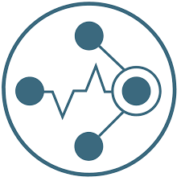
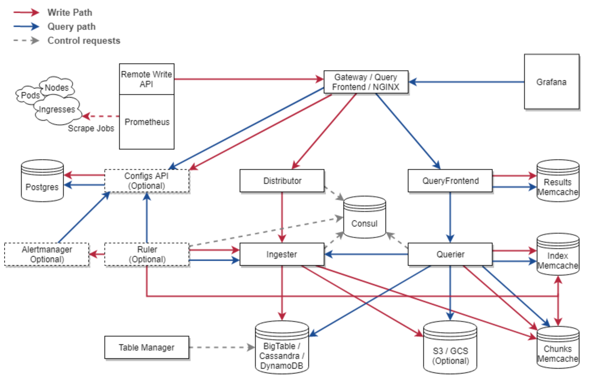

# Cortex란 무엇인가

## Prometheus의 문제점?

이번 장에서는 `Cortex`가 무엇인지 공부한다. "갑자기 생뚱맞게 `Prometheus` 공부하다가 무슨 `Cortex`야?" 라는 의문이 생길 수도 있다. `Prometheus`는 최근 나온 모니터링 기술 중 `InfluxDB`와 함께 업계 표준으로 자리 잡았다. 하지만 운영하면서 몇 가지 아쉬운 점이 발견되었다. 대표적으로는 다음의 문제점이 존재한다.

1. Prometheus는 scale-out 구조를 고려하지 않고 설계되었다.
2. Prometheus에서 긴 시간 범위를 지닌 데이터를 쿼리할 때 성능이 매우 저하되었다.
3. Prometheus가 저장하는 데이터 특성 상 오랜 시간 저장하는 것이 쉽지 않다.

이를 해결하는 기술 중 하나가 바로 `Grafana Labs`가 관리하고 있는 `Cortex`이다. 이제부터 이를 알아보도록 하자. 

> 참고! Loki에 대해서
>
> 현재 업계에서 뜨고 있는 기술 중 하나인 "Loki"는 "Grafana Labs"가 만든 오픈 소스 로그 모니터링 시스템입니다. 이는 "Cortex"를 벤치마킹하여 만들었는데, 서로의 구조가 매우 유사합니다. 그래서 둘 중 하나를 배워두면 다른 하나를 배우는데 큰 도움이 될 것입니다.

## Cortex란 무엇인가?

`Cortex`는 `CNCF`의 인큐베이션 프로젝트 중 하나로, `Weave Cloud`와 `Grafana Labs`가 관리하는 `Prometheus` 기반 오픈소스이다. `Cortex` 공식 문서에 따르면, 자신을 이렇게 소개하고 있다.

>  "Cortex provides horizontally scalable, highly available, multi-tenant, long term storage for Prometheus."

번역하면 `Cortex`는 `Prometheus`를 위한, 수평적으로 확장 가능한, 고 가용성의, 멀티 테넌트, 롱 텀 스토리지이다. 정의만 보더라도 위에서 지적한 `Prometheus`의 문제점과 매우 밀접한 관계를 맺고 있다는 것을 볼 수 있다. 

문서에 따르면, `Cortex`는 다음의 특징을 갖는다.

* Horizontally Scalable
* Highly Available
* Multi-Tenant
* Long Term Storage

`Cortex`는 "Horizontally scalable" 즉 수평적으로 확장이 가능하다. 이 말은 여러 머신을 클러스터로 구성할 수 있다는 뜻이다. 여기서 중요한 점이 바로 "Globally Aggregated"를 지원한다는 점이다. 가령, 시스템 메트릭 데이터만 수집하는 `Prometheus A`와 액세스 로그 데이터만 수집하는 `Prometheus B`가 있다고 해보자. 하지만 웹서버가 이상 동작을 일으킬 때, 우리는 `Prometheus A`와 `Prometheus B`를 모두 살펴보아야 한다. 하지만 각각의 지표를 봤을 때 해결점을 찾기란 쉽지 않다.

여기서는 메트릭을 기준으로 잡았지만 지역별로 쪼갠다든가 다른 방식으로 `Prometheus`를 나눈다 하더라도 결국 전역적으로 집계할 필요가 생긴다. 이 때 `Cortex`를 이용하면 쉽게 해결할 수 있다. `Prometheus A`와 `Prometheus B` 모두 수집한 데이터를 `Cortex`가 구성된 클러스터에게 넘겨주기만 하면 모두 쿼리 및 집계가 가능하다.

`Cortex`는 "High Available"을 지원한다. 이 말은 클러스터 내 `Cortex`끼리는 데이터를 복제가 가능하다. 즉 클러스터 내에 특정 한 개의 `Cortex`가 망가지더라도 구성된 다른 `Cortex`들이 고장난 녀석의 몫까지 커버할 수 있다는 뜻이다.

또한, "Long Term Storage"를 지원한다. `Cortex`는 AWS의 DynamoDB, S3 혹은 GCP의 BigTable, GCS 등을 데이터 저장소로써 쓸 수 있다. 이 때 Index/Chunk 단위로 데이터를 나누고 Chunk는 압축해서, Index는 DynamoDB/BigTable에 저장되고 Chunk는 S3/GCS 등에 저장된다. 이렇게 저장된 데이터는 일반 `Prometheus`에 저장된 데이터보다 훨씬 긴 라이프사이클을 가지게 된다. 중요한 점은 긴 시간 범위에 해당하는 데이터를 조회하더라도 매우 빠르게 조회가 가능하도록 설계가 되었다는 점이다.

마지막으로 "Multi-Tenant"를 지원한다. 이 부분은 정확하게 뜻이 이해되지 않는데 단일 클러스터에 있는 `Cortex`는 여러 독립적인 `Prometheus` 소스의 데이터와 쿼리를 격리하여 신뢰할 수없는 당사자가 동일한 클러스터를 공유 할 수 있도록 만들어준다고 한다. 이 부분은 공부하면서 나중에 이해 되면 그 때 채워넣기로 하자.

## Cortex 아키텍처

다음은 공식 문서에서 가져온 `Cortex` 아키텍처의 구성도이다.

위의 관계도를 보면 `Cortex`에서 `Prometheus`는 일종의 중개자 역할이 된다. 각 Exporter 및 Push Gateway에서 수집된 메트릭들을 `Cortex`로 넘기는 역할을 수행한다. 이 때 `Cortex`는 클러스터 내에서, 역할에 따라 다음과 같이 분류될 수 있다.

* Distributor
* Ingester
* Querier
* Query Frontend
* Ruler

### Distributor

`Prometheus`가 전송한 데이터를 처리하는 역할을 한다. 전송된 데이터의 유효성을 체크한 후, 문제가 없으면 `Ingester`로 병렬적으로 데이터를 전송한다. 이 때 데이터를 전송할 `Ingester`를 선택할 때 구성된 Hash Ring을 통해서 해싱하여 선택한다. 이 때 해싱할 때 데이터의 내부 속성을 이용해서 해싱하게 된다. 이용할 수 있는 내부 속성의 조합은 다음과 같다.

* 메트릭 이름 + 테넌트 ID (기본)
* 메트릭 이름 + 라벨 + 테넌트 ID

또한, 데이터 유효성 체크는 다음을 포함한다.

* 메트릭의 라벨(=태그)들의 이름이 형식적으로 정확한가
* 각 메트릭마다 최대/최소 라벨 개수를 준수하는가 (=최소 ~ 최대 개수 사이인가)
* 수집된 데이터의 timestamp가 최소/최대 시간 범위 안에 있는가

`Distributor`는 "stateless"하며, 필요에 따라 스케일 업/다운이 가능하다. 

### Ingester

`Ingester`는 `Distributor`로 전달 받은 데이터들을 `Storage`에 넘겨주는 역할을 한다. `Cortex`가 지원하고 있는 데이터 저장 방법은 크게 2가지이다.

* Chunk
* Block

Chunk 방식이 기본이며, 수신된 데이터를 Index/Chunk를 나누어서 저장한다. 가능한 데이터 저장소로는 `AWS DynamoDB/S3`, `GCP BigTable/GCS`, `Cassandra/Cassandra` 가 있다. 

또한 Block 방식은 `Prometheus TSDB`와 유사한 방식으로 데이터를 저장하는 방법이며, `AWS S3`, `GCP GCS` 등을 저장소로 사용할 수 있다.

또한, 앞서 언급했던 것처럼 `Ingester` 들은 각각 토큰과 함께 "Hash Ring"에 구성되는데 KV Store가 필요하다. 이를 지원하는 KV Store는 다음과 같다.

* Consul
* Etcd
* Gossip Memberlist

### Querier

`Querier`는 이름 그대로 `Cortex` 클러스터의 `Ingester`와 `Storage`에 저장된 데이터를 `PromQL`로 쿼리하는 역할을 한다. 복제본으로 인해 중복되는 데이터가 있다면, 내부적으로 이를 제거해서 쿼리 결과로 보여준다.

### Query Frontend

`Query Frontend`는 선택적인 역할로, `Querier`의 쿼리 속도를 높이는데 사용된다. 내부적으로 쿼리 조정을 수행하고 내부 큐의 쿼리들을 보관한다. 만약 `Query Frontend` 역할을 하는 `Cortex`가 있다면, `Querier`들은 이 내부 큐의 작업들을 가져와서 실행한 후 반환하는 작업자들이 된다.

`redis`, `memcache` 등을 데이터베이스로써 사용할 수 있으며, 보통 로드 밸런싱하는 게이트웨이, 구성도로 보면 `NGINX`와 같이 구성되서 사용된다. 

### Ruler

`Ruler`는 선택적인 역할로써, 규칙과 알림을 기록하기 위해서 `PromQL` 쿼리들을 실행한다. 또한 각 테넌트에 대한 기록 규칙 및 경고를 저장하는 데이터베이스가 필요하다. 

`Ruler`는 semi-stateful하며, 병렬적으로 스케일할 수 있다. `Prometheus AlertManager` 기반으로 작성된 `Cortex AlertManager`를 통해서 기록된 알림들을 `Slack` 등의 외부 엔드포인트로 보내줄 수 있다.

