# 알람 파이프라인 구축하기


## 개요

이번 장에서는 `Prometheus`, `Alertmanager`, `Slack`을 연동해서, 알람 파이프라인을 구축할 것이다. 우리가 구축할 알람 파이프라인은 다음과 같다.

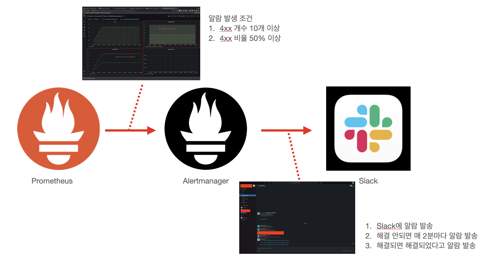

알람 파이프라인에 대해 간단히 설명하자면, 먼저 지난 장 "[서비스 메트릭 모니터링하기 (1) prometheus-nginxlog-exporter]()"에서 진행했던 것을 토대로 `Nginx`, `Prometheus`, `prometheus-nginxlog-exporter`를 연동해서 **상태 코드 및, 응답 실패율**에 대한 정보를 얻는다. 그리고 다음 조건을 만족하면 `Prometheus`에서 알람을 발생(Firing)시킨다.

1. 1분간 상태 코드 4xx 개수의 합이 10개 이상이다.
2. 1분간 4xx 응답 실패율이 50% 이상이다.

그리고 이 발생된 알람을 `Alertmanager`에 전달하고 알람이 처리(Resolved)되기 전까지 매 2분동안 `Slack`에 알람을 전달(Notify)하는 것이다.

이 문서에서는 편의성을 위해서 `Docker` 환경에서 진행할 것이나, 실제 서버 환경에서 어떻게 작업해야 하는지까지 최대한 다루도록 하겠다. 관련 코드는 다음 링크를 참고하길 바란다.

* 이번 장 코드 : [https://github.com/gurumee92/gurumee-prometheus-code/tree/master/part4/ch01](https://github.com/gurumee92/gurumee-prometheus-code/tree/master/part4/ch01)

## 사전 작업 (1) Slack App 만들기

`Prometheus`에서 발생된 알람을 `Alertmanager`에서 `Slack`으로 전달하기 위해서는 사전에 `Slack` 회원가입 및 워크 스페이스를 가지고 있어야 하며, `Slack App` 생성해두어야 한다. 왜냐하면  앱을 만들게 되면 외부에서 앱을 통해서 `Slack API`를 사용할 수 있도록 "웹 훅 URL"이 할당되는데, 이를 `Alertmanager`가 이용해서 `Slack`에게 알람을 전달하기 때문이다. 파이프라인 구축을 위해서 슬랙 앱을 만들어보자. 

먼저 "[https://api.slack.com/](https://api.slack.com/)"에 접속한다.

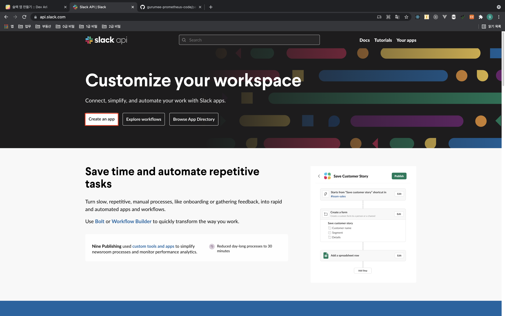

위의 그림에서, "Create an app"을 누른다. 그럼 페이지 이동과 함께 다음과 같은 팝업창이 뜨게 된다.


"From scratch"를 클릭한다.


앱의 이름과 연동할 워크스페이스를 지정한다. 그 후, "Create App"을 누른다.

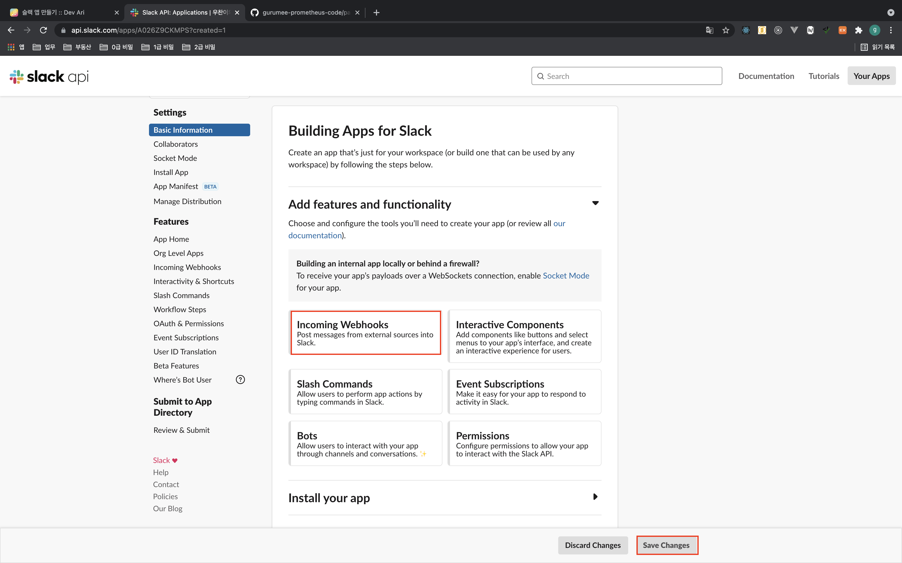

그러면 위의 그림과 같이 다른 페이지로 이동되는데, "Incoming Webhooks"를 누른다.


그럼 Webhook을 설정할 수 있는 페이지로 넘어간다. 상단 "off" 토글을 눌러 "on"으로 변경한다.


그럼 위 그림처럼 UI가 변경되는데, 하단에 "Add New Webhook to Workspace"를 클릭한다.


그럼 위의 그림처럼 페이지 이동이 되는데, 여기서 알람을 전송할 채널을 선택하면 된다. 선택 후 "Allow" 버튼을 누르면 된다. 


그럼 위 그림과 같이 Webhook URL이 보이는 페이지로 리다이렉션된다. 이 URL은 외부로 노출이 되면 안되기 때문에 보안에 유의한다. 

추후 `Alertmanger`에서 `Slack`으로 전송하게 하는 설정에서 이 Webhook URL을 사용할 것이다. (아래 Copy 버튼을 누른다.)

## 사전 작업 (2) Alertmanager 설치하기

이 장의 내용을 로컬에서 진행할 예정인 사람들은 가볍게 패쓰해도 좋다. `Alertmanager` 설치는 다음 환경에서 진행되었다.

* AWS EC2
* AMI: Amazon Linux 2 AMI 
* Instance Type: t2.micro

`Alertmanager`는 다음 명령어로 설치가 가능하다.

```bash
# alertmanager 다운로드
$ wget https://github.com/prometheus/alertmanager/releases/download/v0.22.2/alertmanager-0.22.2.linux-amd64.tar.gz 

# 압축 파일 해제
$ tar -xvf alertmanager-0.22.2.linux-amd64.tar.gz

# 압축 파일 /home/ec2-user/apps/alertmanager 로 이동
$ mv alertmanager-0.22.2.linux-amd64 /home/ec2-user/apps/alertmanager

# 압축 파일 삭제
$ rm alertmanager-0.22.2.linux-amd64.tar.gz

# 서비스 파일 등록
$ sudo tee /etc/systemd/system/alertmanager.service<<EOF [Unit]
Description=Alert Manager

[Service]
ExecStart=/home/ec2-user/apps/alertmanager/alertmanager --config.file=/home/ec2-user/apps/alertmanager/alertmanager.yml

[Install] 
WantedBy=multi-user.target 
EOF
```

또한 다음 명령어로 `Alertmanager`를 실행시킬 수 있다.

```bash
# alertmanager 실행
$ sudo systemctl restart alertmanager

# alertmanager 상태 확인
$ sudo systemctl status alertmanager 
● alertmanager.service
   Loaded: loaded (/etc/systemd/system/alertmanager.service; disabled; vendor preset: disabled)
   Active: active (running) since 토 2021-06-26 05:23:59 UTC; 4s ago
 Main PID: 3368 (alertmanager)
   CGroup: /system.slice/alertmanager.service
           └─3368 /home/ec2-user/apps/alertmanager/alertmanager --config.file=/home/ec2-user/apps/alertmanager/alertmanager.yml
...
```

이렇게 터미널에 결과가 나왔다면 설치는 완료된 것이다. `Slack`과의 연동은 추후 진행되는 "파이프라인 구축하기 (3)"절에서 확인할 수 있다.

## 파이프라인 구축하기 (1) promql과 alert rule 이용해서 알람 만들기

이제 `Prometheus`에서 알람을 정의해보자. 우선 알람의 조건을 다시 보자.

1. 1분간 상태 코드 4xx 개수의 합이 10개 이상이다.
2. 1분간 4xx 응답 실패율이 50% 이상이다.

이는 `PromQL`로 바꾸면 다음과 같이 작성할 수 있다.

1. sum(rate(nginx_http_response_count_total{status=~"4.."}[1m])) >= 10
2. sum(rate(nginx_http_response_count_total{status=~"4.."}[1m])) / sum(rate(nginx_http_response_count_total[1m])) * 100 >= 50

`nginx_http_response_count_total`는 `prometheus-nginxlog-exporter`가 수집하는 메트릭으로써, `Nginx`에서 받응 응답의 개수를 의미한다. 이 메트릭은 `Label`로 "status" 즉, 상태 코드에 대한 정보를 저장하고 있다. 따라서, 4xx, 5xx는 `Label`에서 정규 표현식으로 `{status=~"4.."}` 매칭하여 구할 수 있다. 그리고 응답 실패율은, "4xx, 5xx 개수의 합 / 전체 상태 코드 개수의 합"으로 구할 수 있다. 

이제 위 `PromQL`을 이용해서 `Alert Rule`을 작성하면, 알람을 만들 수 있다. `Prometheus`에서 만들 알람에 대한 정보를 저장할 파일을 `rule file`이라고 부른다. `rule file`은 `prometheus.yml`과 같은 위치에 `rules` 디렉토리를 만들고 규칙을 작성할 잡과 같은 이름으로 작성하면 된다. 지금은 `prometheus-nginxlog-exporter`를 수집하는 job 이름을 `prometheus-nginxlog-exporter`로 설정 했으니까, `prometheus_nginxlog_exporter_rules.yml` 같은 이름으로 지으면 된다. 파일 내용은 다음과 같다.

[part4/ch01/prometheus/rules/prometheus_nginxlog_exporter_rules.yml (초기 버전)](https://github.com/gurumee92/gurumee-prometheus-code/blob/master/part4/ch01/prometheus/rules/prometheus_nginx_log_exporter_rules_backup.yml)
```yml
groups:
- name: prometheus_nginxlog_exporter
  rules:
  - alert: ErrorStatusAndFailRate
    expr: | 
      sum(rate(nginx_http_response_count_total{status=~"4.."}[1m])) >= 10
      and
      (
        sum(rate(nginx_http_response_count_total{status=~"4.."}[1m])) 
        / 
        sum(rate(nginx_http_response_count_total[1m])) * 100
      ) >= 50
    for: 1m
    labels:
      severity: 'critical'
    annotations:
      summary: 'Error Status Code Bigger than 10 And Fail Rate Higher than 50%'
```

여기서 중요한 것은 `alert`, `expr`, `labels`, `for`이다. 이것이 실제로 `Prometheus`에서 알람을 설정하는 코드이다. `Prometheus`는 `expr`에 해당하는 쿼리를 계속 감시하다가 `for`에서 지정한 시간 동안 조건을 충족하게 되면 알림을 보내게 된다. 

`rule file`을 작성했으면, `Prometheus` 설정 파일인 `promethes.yml`에 다음과 같이 작성해두면 된다.

[part4/ch01/prometheus/prometheus.yml](https://github.com/gurumee92/gurumee-prometheus-code/blob/master/part4/ch01/prometheus/prometheus.yml)
```yml
global:
  scrape_interval:     15s # By default, scrape targets every 15 seconds.
  evaluation_interval: 15s # By default, scrape targets every 15 seconds.

rule_files:
  - 'rules/prometheus_nginx_log_exporter_rules.yml'

# ...
```

> 참고! prometheus.yml은 어디 있는가?
> 
> 이전 절 "Prometheus 설치"를 잘 따라했다면, Prometheus가 설치한 위치는 "/home/ec2-user/apps/prometheus/"일 것이다. 여기에 prometheus.yml과 rules >디렉토리가 같이 있으면 된다. 다음처럼 말이다.
> ```   
>|- /home/ec2-user/apps/prometheus/
>    |- prometheus.yml
>    |- rules
>        |- prometheus_nginxlog_exporter_rules.yml
> ```
    

설정한 `rule file`이 잘 작동하는지 확인하려면 다음 명령어를 실행하면 된다.

```bash
$ /promtool check rules rules/prometheus_nginxlog_exporter_rules.yml Checking rules/prometheus_nginxlog_exporter_rules.yml
SUCCESS: 1 rules found
```

이제 `Prometheus` 웹 UI 상단에 "Alerts" 메뉴에서 보면 설정된 것을 확인할 수 있다.

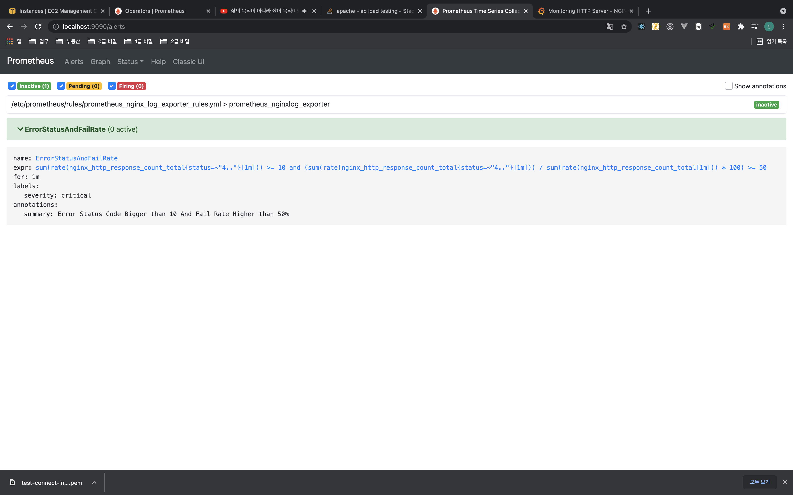

알림이 처음 발생되면 다음처럼 PENDING 상태가 된다. 

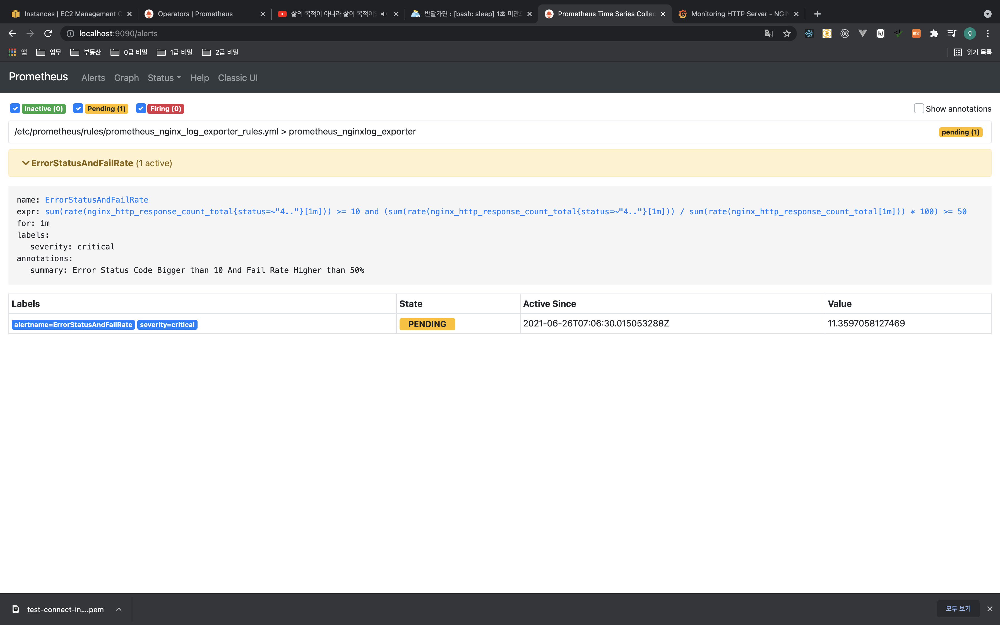

이 상태가 1분 이상 지속되면 FIRING 상태가 된다.

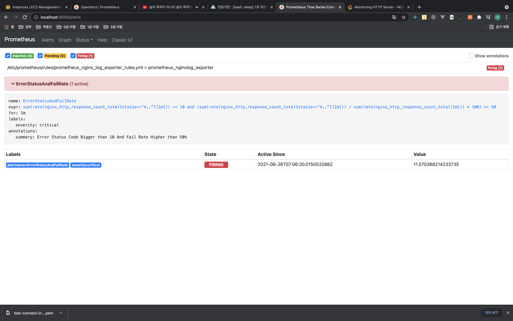

## 파이프라인 구축하기 (2) recording rule 이용해서 알람 최적화하기

바로 작업해도 좋지만, 현재 알람의 문제는 `PromQL`이 쿼리하는 시계열의 카디널리티가 매우 높다. 이는 알람의 수가 지금처럼 적으면 상관 없지만, 알람이 많아질수록 모니터링 요소가 많아질수록 `Prometheus`에게 부담이 된다. 이런 카디널리티를 줄이고 시계열을 쿼리하는 비용을 최적화하기 위해서 `Recording Rule`이라는 것을 이용한다. (`InfluxDB`의 `Continous Query`와 유사하다.)

다음과 같이 `prometheus_nginxlog_exporter_rules.yml`을 수정한다.

[part4/ch01/prometheus/rules/prometheus_nginxlog_exporter_rules.yml](https://github.com/gurumee92/gurumee-prometheus-code/blob/master/part4/ch01/prometheus/rules/prometheus_nginx_log_exporter_rules.yml)
```yml
groups:
- name: prometheus_nginxlog_exporter
  rules:
  - record: job:prometheus_nginxlog_exporter:status_4xx_1m
    expr: sum(rate(nginx_http_response_count_total{status=~"4.."}[1m]))
  - record: job:prometheus_nginxlog_exporter:status_5xx_1m
    expr: sum(rate(nginx_http_response_count_total{status=~"5.."}[1m]))
  - record: job:prometheus_nginxlog_exporter:status_total_1m
    expr: sum(rate(nginx_http_response_count_total[1m]))
  - alert: ErrorStatusAndFailRate
    expr: | 
      (job:prometheus_nginxlog_exporter:status_4xx_1m + job:prometheus_nginxlog_exporter:status_5xx_1m) >= 10
      and
      (
        (job:prometheus_nginxlog_exporter:status_4xx_1m + job:prometheus_nginxlog_exporter:status_5xx_1m)
        / 
        job:prometheus_nginxlog_exporter:status_total_1m 
        * 100
      ) >= 50
    for: 1m
    labels:
      severity: 'critical'
    annotations:
      summary: 'Error Status Code Bigger than 10 And Fail Rate Higher than 50%'  
```

여기서 `record`로 작성된 부분들이 `Recording Rule`이다. 해당 값으로 설정한 이름으로 쿼리할 수 있다. `expr`에 작성된 `PromQL`을 하나의 시계열로 만들게 된다. 

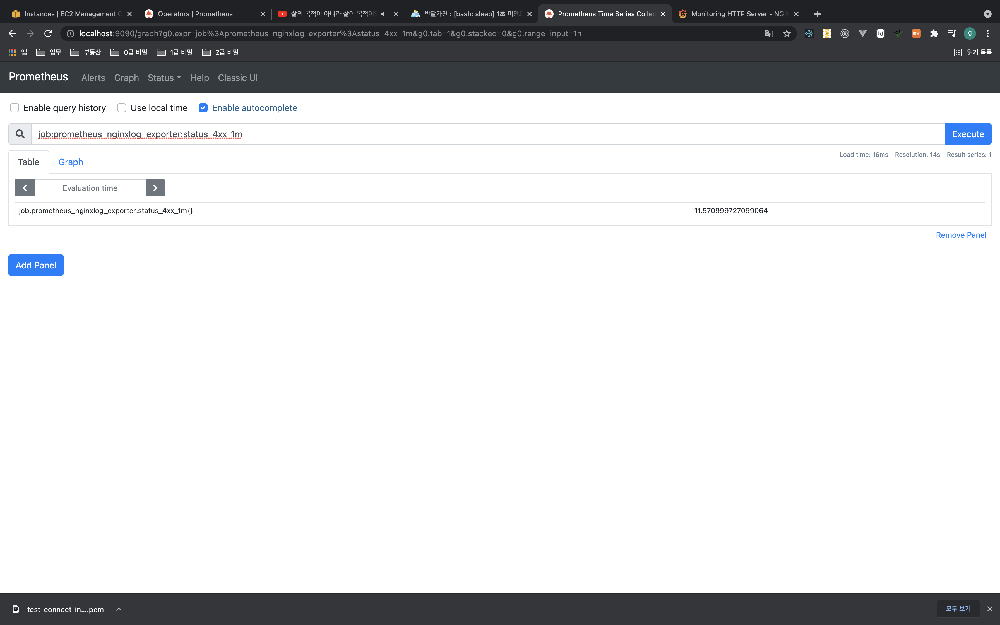

여기서 한 가지 더 중요한 점은, `Alert Rule`에서도 `Recording Rule`을 이용할 수 있다는 것이다. 쿼리 뿐 아니라 알람에도 더 높은 성능을 낼 수 있게 도와준다는 것이다. 작성된 `Alert Rule`과 `Recording Rule`은 `Prometheus` 웹 UI 상단의 "Status" > "Rules" 메뉴에서 확인할 수 있다.

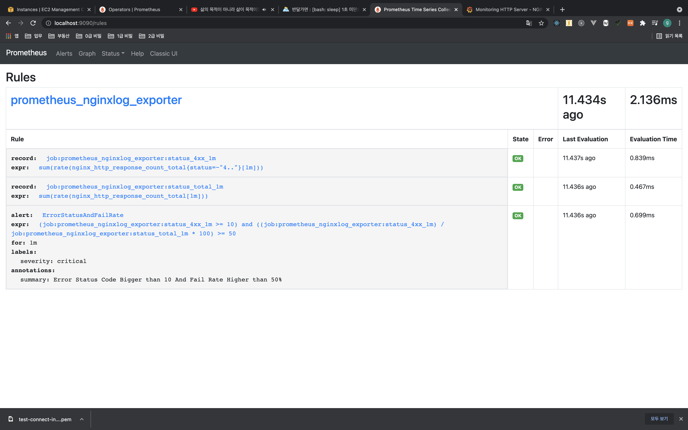

각 규칙에 대해 언제 업데이트 되었는지 얼마나 시간이 걸렸는지도 확인할 수 있다.

## 파이프라인 구축하기 (3) Alertmanager 이용해서 Slack에 알람 전송하기

이제 마지막으로 `Prometheus`에서 발생한 알람을 `Alertmanager`에 전달하여, 처리하기 전까지 매 2분동안 `Slack`에 전달해보자. `Alertmanger`의 설정 파일인 `alertmanager.yml`을 다음과 같이 설정한다. 

[part4/ch01/alertmanager/alertmanager.yml](https://github.com/gurumee92/gurumee-prometheus-code/blob/master/part4/ch01/alertmanager/alertmanager.yml)
```yml
global:
  slack_api_url: '<당신의 슬랙 Webhook URL>'

route:
  receiver: 'slack-notifications'
  repeat_interval: 2m
receivers:
  - name: 'slack-notifications'
    slack_configs:
    - channel: '#_monitoring'
      send_resolved: true 
      title: "{{ range .Alerts }}{{ .Annotations.summary }}\n{{ end }}"
      text: "{{ range .Alerts }}{{ .Annotations.description }}\n{{ end }}"
```

이 때 "slack_api_url" 이전 절 "사전 작업 (1) Slack App 만들기"에서 만들었던 `Slack App`의 웹훅 URL을 설정해준다. 서버에서 작업한다면, `alertmanager.yml`은 `Alertmanager`를 설치한 경로에 올려두어야 한다.

```
|- /home/ec2-user/apps/alertmanager
    |- alertmanager.yml
    |- alertmanager
    |- amtool
    |- ...
```

그 후 다음 명령어를 입력해서 `Alertmanager`를 재시작하면 된다.

```bash
$ sudo systemctl restart alertmanager
```

그 다음 `prometheus.yml`을 다음과 같이 수정한 후 `Prometheus`를 재시작하면 우리가 원하는 파이프라인 구축이 완료된다.

[part4/ch01/prometheus/prometheus.yml](https://github.com/gurumee92/gurumee-prometheus-code/blob/master/part4/ch01/prometheus/prometheus.yml)
```yml
# ...
rule_files:
  - 'rules/prometheus_nginx_log_exporter_rules.yml'

# alert
alerting:
  alertmanagers:
  - scheme: http
    static_configs:
    - targets:
      - "alertmanager:9093" # <alertmanager ip:port>

# ...
```

다음은 `Alertmanager` 웹 UI(http://<alertmanger ip:port>)에서 `Prometheus`에서 발생한 알람이 전달된 모습이다.

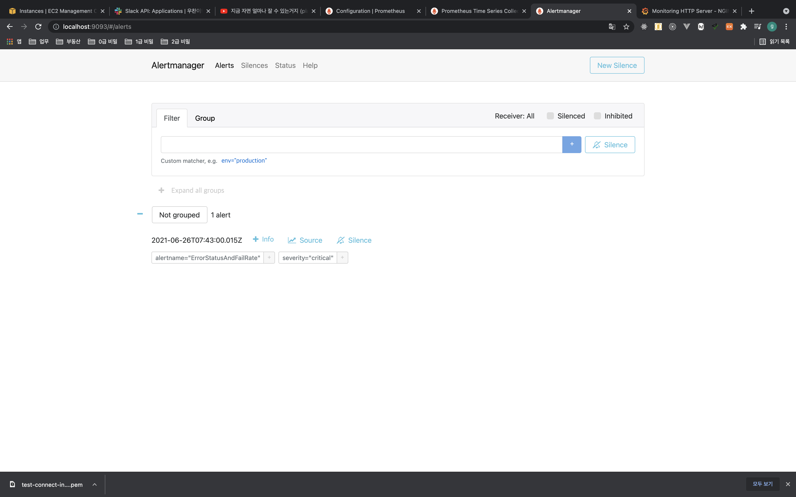

그리고 `Slack`에 전달 된 모습이다.

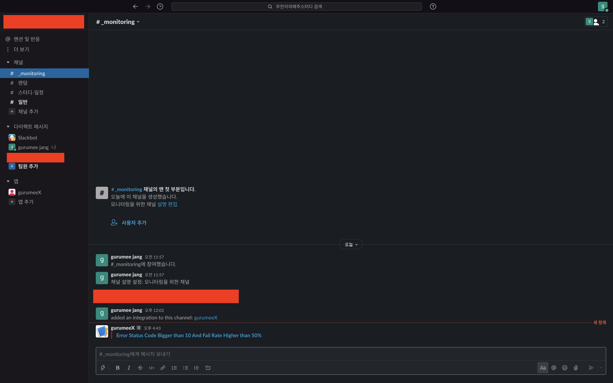

그리고 약 2분동안 처리되지 않았을 때 다시 알람이 발생된 모습이다.

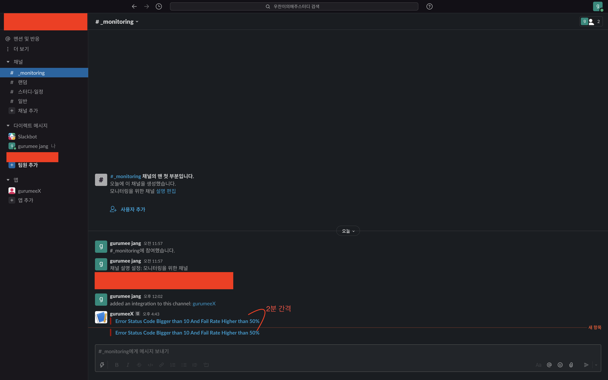

이제 알람이 해결되서 다시 복구된 모습이다. "이를 RESOLVED"되었다고 한다.

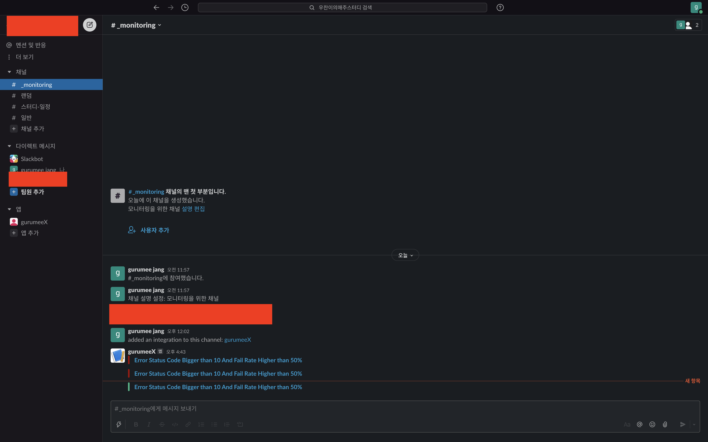